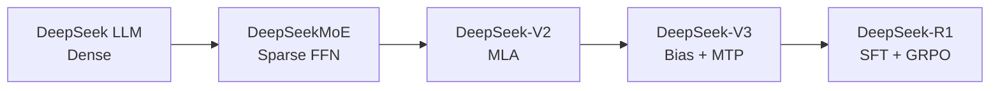
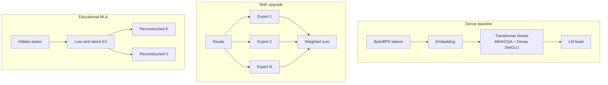

> This repository was created while studying the DeepSeek papers, as a practical aid for understanding them.

<div align="center">

# TinySeek-Lab

**Walk the DeepSeek LM research path with language models under a few hundred million parameters**

[中文说明](README_zh.md) | English

</div>

TinySeek-Lab is a bilingual, code-first course from model implementation through training and experiment reports. You write a complete Dense LM, evolve it into DeepSeekMoE, DeepSeek-V2, and DeepSeek-V3, then connect that base model to R1-style SFT and educational GRPO.

This repository is language-model-only. It excludes multimodal, vision, video, OCR, embodied, and agent tracks. The goal is to reproduce research questions and experimental method, not DeepSeek scale or final capability.

> **Start here:** [the eight-unit experiment-driven course](course/README.md) keeps model code, controlled experiments, measured results and architecture decisions in one continuous path. [中文主线](course/README_zh.md)

Keep the [Math-to-PyTorch reference](docs/24_math_to_pytorch.md) nearby when a unit introduces a new formula or tensor operation; SFT and GRPO use the separate [post-training code walkthrough](docs/19_posttraining_code_walkthrough.md).

## Experiment-Driven, Not a Component Checklist

Every architecture transition follows the same loop:

```text
previous baseline -> measurable bottleneck -> research hypothesis
-> single-variable ablation -> prewritten decision gate
-> upgrade / retain the previous stage
```

DeepSeek papers provide problems, methods, and paper-scale evidence; TinySeek provides small-model code and runnable tests. The [canonical course](course/README.md) places each code change beside its preregistered comparison and measured decision. The [four-generation architecture map](docs/20_architecture_evolution_overview.md) and [fair experiment plan](experiments/06_architecture_evolution_plan.md) remain reference documents.

## Four Generations, One Code Path

| Generation | Complete model you build | Main change | Code lesson |
| --- | --- | --- | --- |
| DeepSeek LLM | [`stage0_deepseek_llm.py`](model/stages/stage0_deepseek_llm.py) | Dense, RMSNorm, RoPE, SwiGLU, GQA | [Build the complete LM](docs/12_code_first_dense_lm.md) |
| DeepSeekMoE | [`stage1_deepseek_moe.py`](model/stages/stage1_deepseek_moe.py) | fine-grained routed and shared experts | [Dense to MoE](docs/21_from_dense_to_deepseek_moe.md) |
| DeepSeek-V2 | [`stage2_deepseek_v2.py`](model/stages/stage2_deepseek_v2.py) | MoE plus educational MLA | [MoE to V2](docs/22_from_moe_to_deepseek_v2.md) |
| DeepSeek-V3 | [`stage3_deepseek_v3.py`](model/stages/stage3_deepseek_v3.py) | auxiliary-loss-free routing bias and MTP | [V2 to V3](docs/23_from_v2_to_deepseek_v3.md) |

Start with [s01 Dense baseline](course/s01_dense_baseline/README.md). Stage files teach the code; the unified [`model/tinyseek.py`](model/tinyseek.py) runs matched formal experiments, and each course unit joins the two with actual evidence.

## Current Results: Formal RTX 4090 Suite Complete

TinySeek-Lab has completed the full training and ablation suite on one RTX 4090:

```text
TinyStories -> tiny base -> dense 35M/115M -> LR/batch sweep
-> MoE -> MLA -> SFT -> GRPO mini -> mini eval -> cost and figures
```

- [48-run, 16-config, 3-seed architecture report](experiments/architecture_lab_runs/report.md): `1.5679 GPU h`, about `3.4180 CNY`.
- [11-run formal training and post-training report](experiments/gpu_completion_runs/report.md): `0.8985 GPU h`, about `1.9588 CNY`.
- Combined tracked trainer/post-training process time: `2.4664 GPU h`, corresponding to about `5.3768 CNY`; this excludes data preparation, standalone evaluation, report generation, and idle rental time.
- GQA passes its local gate: theoretical KV/token falls from `384` to `192` without a PPL regression.
- Shared experts improve PPL over coarse MoE but run about 35% slower, so the repository keeps separate quality and throughput branches.
- Educational MLA reaches `72` theoretical KV/token but regresses PPL; bias routing also fails to beat aux=0.01. Neither is promoted in this budget.
- On five held-out additions, SFT raises reasoning-format score from `0.0` to `0.6` but still scores `0/5`; GRPO then lowers format score to `0.2`. This mini-eval provides no arithmetic-generalization evidence, and a loose reward can degrade behavior.

These are TinySeek small-model measurements, not claims about DeepSeek-scale capability.


## Three Quick Paths

| Path | Best for | Entry command |
| --- | --- | --- |
| Guided course | Learn code and experiments as one research path | [Start at s01](course/s01_dense_baseline/README.md) |
| Small GPU teaching run | Try tiny dense -> SFT -> GRPO | [Final GPU checklist](docs/18_gpu_fill_only_checklist.md) |
| RTX 4090 research run | Reproduce formal training and multi-seed architecture comparisons | [Experiment hub](experiments/README.md) |

The main route is the [eight-unit course](course/README.md). Formula, trainer and runbook documents under `docs/` are opened from the unit that needs them, so a reader does not have to assemble a second timeline by hand.

## Why "TinySeek"

DeepSeek's papers are unusually useful as a curriculum:

- DeepSeek LLM starts from training-recipe and scaling-law questions, including
  batch size and learning-rate searches.
- DeepSeekMoE explains expert specialization and load balancing.
- DeepSeek-V2 combines DeepSeekMoE with MLA for economical training and
  efficient inference.
- DeepSeek-V3 validates the MoE + MLA line at larger scale and introduces
  auxiliary-loss-free balancing and multi-token prediction.
- DeepSeek-R1 shows how a strong base model can be post-trained with cold-start
  reasoning SFT, rejection sampling, and GRPO-style rule RL.

TinySeek-Lab turns those ideas into a sequence of small experiments.

## Roadmap at a Glance



## Model Evolution



## Repository Layout

```text
TinySeek-Lab/
  course/               Canonical s01-s08 research course
  configs/              Small model and experiment configs
  dataset/              Dataset wrappers and byte tokenizer
  docs/                 Chapter-style tutorial notes
  experiments/          Sweep plans and report templates
  model/stages/         Four complete teaching models
  model/tinyseek.py     Unified formal experiment model
  scripts/              Data prep and generation helpers
  trainer/              Pretrain, SFT, sweep, and GRPO entry points
  tests/                Smoke tests
```

## Quick Start

Install dependencies first:

```bash
pip install -r requirements.txt
```

Create a toy dataset:

```bash
python scripts/prepare_toy_data.py --out data/toy_pretrain.jsonl
```

Run a tiny pretraining smoke test:

```bash
python trainer/train_pretrain.py --config configs/tiny_dense.json --data data/toy_pretrain.jsonl --max_steps 20
```

Generate from the checkpoint:

```bash
python scripts/generate.py --config configs/tiny_dense.json --ckpt out/tiny_dense_last.pt --prompt "DeepSeek is"
```

Run the LR / batch-size grid from the DeepSeek LLM-inspired chapter:

```bash
python trainer/sweep_pretrain.py --sweep experiments/01_lr_batch_grid.json
```

Track AutoDL GPU cost during a run:

```bash
# RTX 4090: 2.18 CNY/hour
python trainer/train_pretrain.py --config configs/tiny_dense.json --data data/toy_pretrain.jsonl --hourly_rate 2.18

# Summarize all run ledgers
python scripts/summarize_costs.py --input_dir out
```

Run the post-training toy path:

```bash
python scripts/prepare_toy_sft_data.py --out data/toy_sft.jsonl
python trainer/train_sft.py --config configs/tiny_sft.json --data data/toy_sft.jsonl --init_ckpt out/tiny_dense_last.pt --hourly_rate 2.18

python scripts/prepare_toy_grpo_data.py --out data/toy_grpo.jsonl
python trainer/train_grpo.py --config configs/tiny_grpo.json --data data/toy_grpo.jsonl --init_ckpt out/tiny_sft_last.pt --hourly_rate 2.18
```

The first AutoDL RTX 4090 validation report is in
[experiments/02_autodl_4090_smoke_report.md](experiments/02_autodl_4090_smoke_report.md).
The v1 pretrain -> SFT -> GRPO smoke report is in
[experiments/03_v1_pipeline_smoke_report.md](experiments/03_v1_pipeline_smoke_report.md).
The latest 3-seed architecture measurements are in
[experiments/architecture_lab_runs/report.md](experiments/architecture_lab_runs/report.md).
The formal training, sweep, and post-training results are in
[experiments/gpu_completion_runs/report.md](experiments/gpu_completion_runs/report.md).
The earlier [RTX 4090 v1 report](experiments/05_4090_v1_results.md) remains as a record of the repository's progression from smoke validation to formal experiments.
Read the code path in [docs/15_code_walkthrough.md](docs/15_code_walkthrough.md).
The preregistered paid-GPU plan that produced the formal suite is archived in
[experiments/04_formal_experiment_plan.md](experiments/04_formal_experiment_plan.md).

## First Reading Path

Read one integrated path; open reference chapters only when the unit links them:

1. [s01 Dense LM: build the whole model](course/s01_dense_baseline/README.md)
2. [s02 Training recipe: LR/batch search](course/s02_training_recipe/README.md)
3. [s03 GQA: reduce K/V state](course/s03_gqa/README.md)
4. [s04 DeepSeekMoE: sparse FFN experiments](course/s04_deepseek_moe/README.md)
5. [s05 MLA: test latent KV compression](course/s05_mla/README.md)
6. [s06 DeepSeek-V3: routing bias and MTP](course/s06_v3_routing_mtp/README.md)
7. [s07 Cold-start SFT: teach the response format](course/s07_cold_start_sft/README.md)
8. [s08 GRPO and evaluation: let evidence stop the story](course/s08_grpo_and_evaluation/README.md)

Use [`docs/README.md`](docs/README.md) as the English reference library and [`docs/zh/README.md`](docs/zh/README.md) for Chinese references. They contain the expanded formulas, full source walkthroughs, trainer internals, runbooks and historical reports.

## DeepSeek Papers Used

The local source folder is expected at:

```text
../DeepSeek-papers/chronological-pdfs
```

The tutorial uses only LM-relevant papers: DeepSeek LLM, DeepSeekMoE,
DeepSeek-V2/V3/V3.2/V4, DeepSeek-R1, DeepSeekMath/Prover, ESFT, Native Sparse
Attention, and reward-model/RL papers. Multimodal and OCR papers are excluded
from the main path.

## Philosophy

Every experiment should have:

- Hypothesis: what are we testing?
- Setup: model size, data, token budget, hardware.
- Sweep: which hyperparameters change?
- Metrics: train loss, validation loss, tokens/sec, memory, downstream mini eval.
- Takeaway: what did we learn?

TinySeek-Lab is a lab notebook disguised as a repo.

## Current Status

The current version contains four complete DeepSeek LLM/MoE/V2/V3 teaching
models, a unified configurable experiment model with routing bias and MTP,
pretraining, sweeps, SFT, educational GRPO, mini eval, GPU cost tracking,
measured formal 4090 reports, 48 multi-seed architecture runs, and eleven long-training/post-training runs. GRPO
and MLA remain educational rather than production reproductions.
