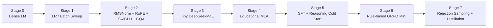
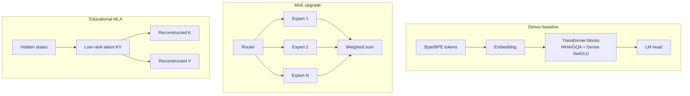

# TinySeek-Lab

[中文说明](README_zh.md) | English

TinySeek-Lab is a tutorial repository for learning language-model training by
walking through a small-scale version of DeepSeek's LM research path.

The goal is not to reproduce DeepSeek's results. The goal is to reproduce the
research moves at a scale that a learner can run:

1. Train a dense decoder-only base LM.
2. Reproduce small LR / batch-size sweeps inspired by DeepSeek LLM.
3. Upgrade the block: RMSNorm, RoPE, SwiGLU, GQA.
4. Replace dense FFN with a small DeepSeekMoE-style routed FFN.
5. Study MoE load balance, auxiliary loss, routing collapse, and specialization.
6. Add an educational MLA-style low-rank KV path for KV-cache experiments.
7. Run SFT, reasoning cold-start SFT, DPO, and rule-based GRPO mini experiments.

This repo intentionally focuses on language models only. It excludes
multimodal, vision, video, OCR, robotics, and tool-use/agent chapters from the
first roadmap.

## Why "TinySeek"

DeepSeek's papers are unusually useful as a curriculum:

- DeepSeek LLM starts from training-recipe and scaling-law questions, including
  batch size and learning-rate searches.
- DeepSeekMoE explains expert specialization and load balancing.
- DeepSeek-V2 combines DeepSeekMoE with MLA for economical training and
  efficient inference.
- DeepSeek-V3 validates the MoE + MLA line at larger scale and introduces
  auxiliary-loss-free balancing and multi-token prediction.
- DeepSeek-R1 shows how a strong base model can be post-trained with cold-start
  reasoning SFT, rejection sampling, and GRPO-style rule RL.

TinySeek-Lab turns those ideas into a sequence of small experiments.

## Roadmap at a Glance



## Model Evolution



## Repository Layout

```text
TinySeek-Lab/
  configs/              Small model and experiment configs
  dataset/              Dataset wrappers and byte tokenizer
  docs/                 Chapter-style tutorial notes
  experiments/          Sweep plans and report templates
  model/                Dense LM, MoE FFN, educational MLA path
  scripts/              Data prep and generation helpers
  trainer/              Pretrain, SFT, sweep, DPO/GRPO skeletons
  tests/                Smoke tests
```

## Quick Start

Install dependencies first:

```bash
pip install -r requirements.txt
```

Create a toy dataset:

```bash
python scripts/prepare_toy_data.py --out data/toy_pretrain.jsonl
```

Run a tiny pretraining smoke test:

```bash
python trainer/train_pretrain.py --config configs/tiny_dense.json --data data/toy_pretrain.jsonl --max_steps 20
```

Generate from the checkpoint:

```bash
python scripts/generate.py --config configs/tiny_dense.json --ckpt out/tiny_dense_last.pt --prompt "DeepSeek is"
```

Run the LR / batch-size grid from the DeepSeek LLM-inspired chapter:

```bash
python trainer/sweep_pretrain.py --sweep experiments/01_lr_batch_grid.json
```

## First Reading Path

Read these docs in order:

1. [Project Scope](docs/00_project_scope.md)
2. [DeepSeek Paper Map for LM Training](docs/01_deepseek_lm_paper_map.md)
3. [Stage 0: Dense Baseline](docs/02_stage0_dense_baseline.md)
4. [Stage 1: LR and Batch-Size Search](docs/03_stage1_lr_batch_search.md)
5. [Stage 2: MLP and Attention Upgrades](docs/04_stage2_block_upgrades.md)
6. [Stage 3: Tiny DeepSeekMoE](docs/05_stage3_moe.md)
7. [Stage 4: Educational MLA](docs/06_stage4_mla.md)
8. [Stage 5: SFT and Reasoning Cold Start](docs/07_stage5_sft_cold_start.md)
9. [Stage 6: Rule-Based GRPO Mini](docs/08_stage6_grpo_mini.md)

Chinese tutorial notes:

1. [项目范围](docs/zh/00_project_scope.md)
2. [DeepSeek 语言模型论文地图](docs/zh/01_deepseek_lm_paper_map.md)
3. [阶段路线图](docs/zh/02_training_roadmap.md)
4. [实验报告模板](docs/zh/03_experiment_report_template.md)

## DeepSeek Papers Used

The local source folder is expected at:

```text
../DeepSeek-papers/chronological-pdfs
```

The tutorial uses only LM-relevant papers: DeepSeek LLM, DeepSeekMoE,
DeepSeek-V2/V3/V3.2/V4, DeepSeek-R1, DeepSeekMath/Prover, ESFT, Native Sparse
Attention, and reward-model/RL papers. Multimodal and OCR papers are excluded
from the main path.

## Philosophy

Every experiment should have:

- Hypothesis: what are we testing?
- Setup: model size, data, token budget, hardware.
- Sweep: which hyperparameters change?
- Metrics: train loss, validation loss, tokens/sec, memory, downstream mini eval.
- Takeaway: what did we learn?

TinySeek-Lab is a lab notebook disguised as a repo.

## Current Status

v0.1 contains runnable source files for the dense/MoE/educational-MLA model,
pretraining, generation, and LR/batch sweeps. SFT and GRPO entry points are
present as roadmap placeholders and will be filled after the base training path
is stable.
