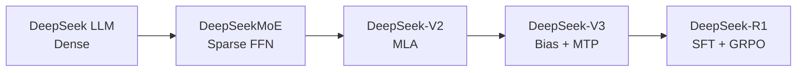
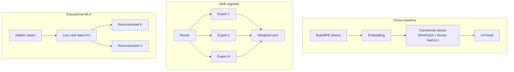

<div align="center">

# TinySeek-Lab

**Walk the DeepSeek LM research path with language models under a few hundred million parameters**

[中文说明](README_zh.md) | English

</div>

TinySeek-Lab is a bilingual, code-first course from model implementation through training and experiment reports. You write a complete Dense LM, evolve it into DeepSeekMoE, DeepSeek-V2, and DeepSeek-V3, then connect that base model to R1-style SFT and educational GRPO.

This repository is language-model-only. It excludes multimodal, vision, video, OCR, embodied, and agent tracks. The goal is to reproduce research questions and experimental method, not DeepSeek scale or final capability.

## Four Generations, One Code Path

| Generation | Complete model you build | Main change | Code lesson |
| --- | --- | --- | --- |
| DeepSeek LLM | [`stage0_deepseek_llm.py`](model/stages/stage0_deepseek_llm.py) | Dense, RMSNorm, RoPE, SwiGLU, GQA | [Build the complete LM](docs/12_code_first_dense_lm.md) |
| DeepSeekMoE | [`stage1_deepseek_moe.py`](model/stages/stage1_deepseek_moe.py) | fine-grained routed and shared experts | [Dense to MoE](docs/21_from_dense_to_deepseek_moe.md) |
| DeepSeek-V2 | [`stage2_deepseek_v2.py`](model/stages/stage2_deepseek_v2.py) | MoE plus educational MLA | [MoE to V2](docs/22_from_moe_to_deepseek_v2.md) |
| DeepSeek-V3 | [`stage3_deepseek_v3.py`](model/stages/stage3_deepseek_v3.py) | auxiliary-loss-free routing bias and MTP | [V2 to V3](docs/23_from_v2_to_deepseek_v3.md) |

Start with the [architecture evolution map](docs/20_architecture_evolution_overview.md). Stage files teach the code; the unified [`model/tinyseek.py`](model/tinyseek.py) runs matched formal experiments.

## Current Results

TinySeek-Lab has completed the first real-GPU tutorial loop:

```text
TinyStories -> tiny base -> dense 35M/115M -> LR/batch sweep
-> MoE -> MLA -> SFT -> GRPO mini -> mini eval -> cost and figures
```

- Experiment hub: [experiments/README.md](experiments/README.md)
- RTX 4090 v1 report: [experiments/05_4090_v1_results.md](experiments/05_4090_v1_results.md)
- v1 auto figures: [experiments/v1_4090_plan/auto_summary.md](experiments/v1_4090_plan/auto_summary.md)
- Total GPU time was about `0.0867 h`, or about `0.19 CNY` at `2.18 CNY/h`.
- Best sweep run: `v1_sweep_bs16_lr3e-4`, with mini-eval PPL around `1.93`.
- MoE run: `235.06M` total parameters, about `84.06M` activated parameters,
  and about `5.46 GB` peak allocated VRAM.

These results validate the tutorial loop and reporting method. They do not
claim real large-model capability.


The V3 code path is ready, while auxiliary/bias routing, MTP off/on, and MLA matched runs still require the next GPU pass. See the [fair architecture experiment plan](experiments/06_architecture_evolution_plan.md); pending cells remain explicitly pending.

## Three Quick Paths

| Path | Best for | Entry command |
| --- | --- | --- |
| CPU code course | Inspect four complete models and their shapes | `python scripts/inspect_stage_models.py` |
| Small GPU teaching run | Try tiny dense -> SFT -> GRPO | [Final GPU checklist](docs/18_gpu_fill_only_checklist.md) |
| RTX 4090 research run | Reproduce results and fill V3 comparisons | [Experiment hub](experiments/README.md) |

Recommended order: read the [architecture map](docs/20_architecture_evolution_overview.md), write the four stage models, study the [training loop](docs/16_training_loop_from_config_to_checkpoint.md), then run the [fair architecture plan](experiments/06_architecture_evolution_plan.md).

## Why "TinySeek"

DeepSeek's papers are unusually useful as a curriculum:

- DeepSeek LLM starts from training-recipe and scaling-law questions, including
  batch size and learning-rate searches.
- DeepSeekMoE explains expert specialization and load balancing.
- DeepSeek-V2 combines DeepSeekMoE with MLA for economical training and
  efficient inference.
- DeepSeek-V3 validates the MoE + MLA line at larger scale and introduces
  auxiliary-loss-free balancing and multi-token prediction.
- DeepSeek-R1 shows how a strong base model can be post-trained with cold-start
  reasoning SFT, rejection sampling, and GRPO-style rule RL.

TinySeek-Lab turns those ideas into a sequence of small experiments.

## Roadmap at a Glance



## Model Evolution



## Repository Layout

```text
TinySeek-Lab/
  configs/              Small model and experiment configs
  dataset/              Dataset wrappers and byte tokenizer
  docs/                 Chapter-style tutorial notes
  experiments/          Sweep plans and report templates
  model/stages/         Four complete teaching models
  model/tinyseek.py     Unified formal experiment model
  scripts/              Data prep and generation helpers
  trainer/              Pretrain, SFT, sweep, and GRPO entry points
  tests/                Smoke tests
```

## Quick Start

Install dependencies first:

```bash
pip install -r requirements.txt
```

Create a toy dataset:

```bash
python scripts/prepare_toy_data.py --out data/toy_pretrain.jsonl
```

Run a tiny pretraining smoke test:

```bash
python trainer/train_pretrain.py --config configs/tiny_dense.json --data data/toy_pretrain.jsonl --max_steps 20
```

Generate from the checkpoint:

```bash
python scripts/generate.py --config configs/tiny_dense.json --ckpt out/tiny_dense_last.pt --prompt "DeepSeek is"
```

Run the LR / batch-size grid from the DeepSeek LLM-inspired chapter:

```bash
python trainer/sweep_pretrain.py --sweep experiments/01_lr_batch_grid.json
```

Track AutoDL GPU cost during a run:

```bash
# RTX 4090: 2.18 CNY/hour
python trainer/train_pretrain.py --config configs/tiny_dense.json --data data/toy_pretrain.jsonl --hourly_rate 2.18

# Summarize all run ledgers
python scripts/summarize_costs.py --input_dir out
```

Run the post-training toy path:

```bash
python scripts/prepare_toy_sft_data.py --out data/toy_sft.jsonl
python trainer/train_sft.py --config configs/tiny_sft.json --data data/toy_sft.jsonl --init_ckpt out/tiny_dense_last.pt --hourly_rate 2.18

python scripts/prepare_toy_grpo_data.py --out data/toy_grpo.jsonl
python trainer/train_grpo.py --config configs/tiny_grpo.json --data data/toy_grpo.jsonl --init_ckpt out/tiny_sft_last.pt --hourly_rate 2.18
```

The first AutoDL RTX 4090 validation report is in
[experiments/02_autodl_4090_smoke_report.md](experiments/02_autodl_4090_smoke_report.md).
The v1 pretrain -> SFT -> GRPO smoke report is in
[experiments/03_v1_pipeline_smoke_report.md](experiments/03_v1_pipeline_smoke_report.md).
The first full RTX 4090 v1 results are in
[experiments/05_4090_v1_results.md](experiments/05_4090_v1_results.md).
Generated v1 tables and figures are in
[experiments/v1_4090_plan/auto_summary.md](experiments/v1_4090_plan/auto_summary.md).
Read the code path in [docs/15_code_walkthrough.md](docs/15_code_walkthrough.md)
and the next paid-GPU plan in
[experiments/04_formal_experiment_plan.md](experiments/04_formal_experiment_plan.md).

## First Reading Path

Read these docs in order, or open the full [tutorial index](docs/README.md):

1. [Project Scope](docs/00_project_scope.md)
2. [DeepSeek Paper Map for LM Training](docs/01_deepseek_lm_paper_map.md)
3. [Four-Generation Architecture Map](docs/20_architecture_evolution_overview.md)
4. [Build the DeepSeek LLM Dense Baseline](docs/12_code_first_dense_lm.md)
5. [Dense to DeepSeekMoE](docs/21_from_dense_to_deepseek_moe.md)
6. [MoE to DeepSeek-V2](docs/22_from_moe_to_deepseek_v2.md)
7. [V2 to DeepSeek-V3](docs/23_from_v2_to_deepseek_v3.md)
8. [Training Loop: From Config to Checkpoint](docs/16_training_loop_from_config_to_checkpoint.md)
9. [SFT and Reasoning Cold Start](docs/07_stage5_sft_cold_start.md)
10. [Rule-Based GRPO Mini](docs/08_stage6_grpo_mini.md)

Chinese tutorial notes:

Open the full [中文教程目录](docs/zh/README.md), or read in this order:

1. [项目范围](docs/zh/00_project_scope.md)
2. [DeepSeek 语言模型论文地图](docs/zh/01_deepseek_lm_paper_map.md)
3. [四代架构演进总览](docs/zh/20_architecture_evolution_overview.md)
4. [从零写 DeepSeek LLM Dense 基线](docs/zh/12_code_first_dense_lm.md)
5. [从 Dense 改到 DeepSeekMoE](docs/zh/21_from_dense_to_deepseek_moe.md)
6. [从 MoE 改到 DeepSeek-V2](docs/zh/22_from_moe_to_deepseek_v2.md)
7. [从 V2 改到 DeepSeek-V3](docs/zh/23_from_v2_to_deepseek_v3.md)
8. [训练主循环](docs/zh/16_training_loop_from_config_to_checkpoint.md)
9. [SFT 和 Reasoning Cold Start](docs/zh/07_stage5_sft_cold_start.md)
10. [Rule-Based GRPO Mini](docs/zh/08_stage6_grpo_mini.md)

Chinese supplements:

- [总训练路线图](docs/zh/02_training_roadmap.md)
- [当前进度](docs/zh/04_current_progress.md)

## DeepSeek Papers Used

The local source folder is expected at:

```text
../DeepSeek-papers/chronological-pdfs
```

The tutorial uses only LM-relevant papers: DeepSeek LLM, DeepSeekMoE,
DeepSeek-V2/V3/V3.2/V4, DeepSeek-R1, DeepSeekMath/Prover, ESFT, Native Sparse
Attention, and reward-model/RL papers. Multimodal and OCR papers are excluded
from the main path.

## Philosophy

Every experiment should have:

- Hypothesis: what are we testing?
- Setup: model size, data, token budget, hardware.
- Sweep: which hyperparameters change?
- Metrics: train loss, validation loss, tokens/sec, memory, downstream mini eval.
- Takeaway: what did we learn?

TinySeek-Lab is a lab notebook disguised as a repo.

## Current Status

The current version contains four complete DeepSeek LLM/MoE/V2/V3 teaching
models, a unified configurable experiment model with routing bias and MTP,
pretraining, sweeps, SFT, educational GRPO, mini eval, GPU cost tracking,
measured 4090 v1 reports, and eight matched architecture configurations. GRPO
and MLA remain educational rather than production reproductions.
