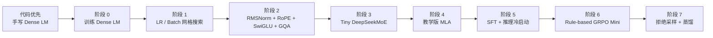
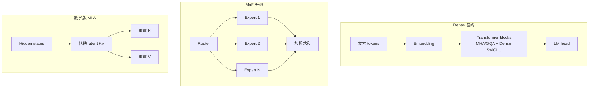

# TinySeek-Lab

中文 | [English](README.md)

TinySeek-Lab 是一个面向大模型训练入门和研究复现的教程仓库。它的主题是：

> 用几百 M 以内的小语言模型，重走 DeepSeek 的 LM 研究路线。

注意：本项目不是复现 DeepSeek 的最终效果，而是先教你写出最初的 dense 模型代码，再复现它的研究路径：

1. 从零写出 DeepSeek-style dense decoder-only LM。
2. 训练 Dense baseline。
3. 复现 DeepSeek LLM 风格的 batch size / learning rate 小规模网格搜索。
4. 升级基础 block：RMSNorm、RoPE、SwiGLU、GQA。
5. 把 Dense FFN 替换成 DeepSeekMoE 风格的 routed experts。
6. 研究 MoE 的负载均衡、辅助损失、routing collapse 和专家分化。
7. 加入教学版 MLA，理解 KV cache 压缩的动机。
8. 继续做 SFT、reasoning cold start、DPO、rule-based GRPO mini。

本项目第一阶段只关注语言模型，不碰多模态、视觉、视频、OCR、具身智能和 agent/tool-use 主线。

## 一图看懂路线



## 模型升级路线



## 仓库结构

```text
TinySeek-Lab/
  configs/              小模型和实验配置
  dataset/              数据集封装和 byte tokenizer
  docs/                 英文教程章节
  docs/zh/              中文教程章节
  experiments/          sweep 计划和实验模板
  model/                Dense LM、MoE FFN、教学版 MLA
  scripts/              数据准备和生成脚本
  trainer/              预训练、SFT、sweep、DPO/GRPO 入口
  tests/                smoke tests
```

## 快速开始

安装依赖：

```bash
pip install -r requirements.txt
```

创建 toy 数据：

```bash
python scripts/prepare_toy_data.py --out data/toy_pretrain.jsonl
```

跑一个最小预训练：

```bash
python trainer/train_pretrain.py --config configs/tiny_dense.json --data data/toy_pretrain.jsonl --max_steps 20
```

从 checkpoint 生成文本：

```bash
python scripts/generate.py --config configs/tiny_dense.json --ckpt out/tiny_dense_last.pt --prompt "DeepSeek is"
```

跑 DeepSeek LLM 启发的 LR / batch size 网格搜索：

```bash
python trainer/sweep_pretrain.py --sweep experiments/01_lr_batch_grid.json
```

## 中文阅读顺序

完整目录见：[docs/zh/README.md](docs/zh/README.md)

1. [项目范围](docs/zh/00_project_scope.md)
2. [DeepSeek 语言模型论文地图](docs/zh/01_deepseek_lm_paper_map.md)
3. [代码优先：从零写出最初的 DeepSeek-style Dense LM](docs/zh/12_code_first_dense_lm.md)
4. [阶段 0：Dense Baseline](docs/zh/02_stage0_dense_baseline.md)
5. [阶段 1：LR 和 Batch Size 搜索](docs/zh/03_stage1_lr_batch_search.md)
6. [阶段 2：MLP 和 Attention 升级](docs/zh/04_stage2_block_upgrades.md)
7. [阶段 3：Tiny DeepSeekMoE](docs/zh/05_stage3_moe.md)
8. [阶段 4：教学版 MLA](docs/zh/06_stage4_mla.md)
9. [阶段 5：SFT 和 Reasoning Cold Start](docs/zh/07_stage5_sft_cold_start.md)
10. [阶段 6：Rule-Based GRPO Mini](docs/zh/08_stage6_grpo_mini.md)
11. [仓库路线图](docs/zh/09_repository_roadmap.md)
12. [实验报告模板](docs/zh/10_experiment_report_template.md)
13. [MiniMind 风格结构说明](docs/zh/11_minimind_structure_notes.md)

补充文档：

- [总训练路线图](docs/zh/02_training_roadmap.md)
- [当前进度](docs/zh/04_current_progress.md)

英文原始章节在 [docs/](docs)。

## 当前状态

v0.1 已经包含：

- Dense / MoE / educational MLA 模型代码。
- byte-level tokenizer 和 JSONL 文本数据集。
- 预训练脚本。
- 生成脚本。
- LR / batch size sweep 入口。
- DeepSeek LM 路线相关教程文档。

SFT、cold start、DPO、GRPO 目前是路线和入口占位，后续会逐步实现。
