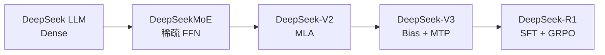
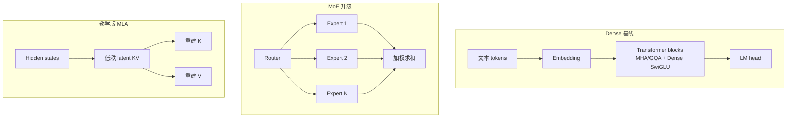

> 本仓库是笔者学习 DeepSeek 论文时，为方便理解而完成的作品。

<div align="center">

# TinySeek-Lab

**用几百 M 以内的小语言模型，重走 DeepSeek 的 LM 研究路线**

中文 | [English](README.md)

</div>

TinySeek-Lab 是一套从代码、训练到实验报告的双语教程。你不会只调用现成模型，而是先写出完整 Dense LM，再沿论文路线逐代改造成 DeepSeekMoE、DeepSeek-V2 和 DeepSeek-V3，最后进入 R1 风格的 SFT 与 GRPO 教学实验。

本仓只做语言模型，不进入多模态、视觉、视频、OCR、具身和 Agent 主线。目标是复现研究问题与实验方法，不是复现 DeepSeek 的参数规模或最终能力。

> **从这里开始：**[八单元实验驱动课程](course/README_zh.md)把模型代码、控制变量实验、实测结果和架构决定放在一条连续主线上。[English course](course/README.md)

单元中出现新公式或张量操作时，可以随时打开[数学到 PyTorch 工具箱](docs/zh/24_math_to_pytorch.md)；SFT 和 GRPO 的逐行实现另见[后训练代码细读](docs/zh/19_posttraining_code_walkthrough.md)。

## 实验驱动，而不是按版本堆组件

每次结构升级都遵循同一个闭环：

```text
上一代基线 -> 可测量瓶颈 -> 研究假设 -> 单变量消融
-> 预先写下的决策门槛 -> 升级 / 保留上一代
```

DeepSeek 论文提供问题、方法和论文规模的证据；TinySeek 提供小模型代码与可运行实验。[课程主线](course/README_zh.md)把每次代码改变、预注册对照和实测决定放在同一个单元里。[四代架构演进总览](docs/zh/20_architecture_evolution_overview.md)与[架构演进公平实验](experiments/06_architecture_evolution_plan_zh.md)保留为参考资料。

## 四代模型，一条代码主线

| 代际 | 你会写出的完整模型 | 核心变化 | 深入代码课 |
| --- | --- | --- | --- |
| DeepSeek LLM | [`stage0_deepseek_llm.py`](model/stages/stage0_deepseek_llm.py) | Dense、RMSNorm、RoPE、SwiGLU、GQA | [从零写完整 LM](docs/zh/12_code_first_dense_lm.md) |
| DeepSeekMoE | [`stage1_deepseek_moe.py`](model/stages/stage1_deepseek_moe.py) | 细粒度 routed experts + shared experts | [Dense -> MoE](docs/zh/21_from_dense_to_deepseek_moe.md) |
| DeepSeek-V2 | [`stage2_deepseek_v2.py`](model/stages/stage2_deepseek_v2.py) | MoE + 教学版 MLA | [MoE -> V2](docs/zh/22_from_moe_to_deepseek_v2.md) |
| DeepSeek-V3 | [`stage3_deepseek_v3.py`](model/stages/stage3_deepseek_v3.py) | 无辅助损失路由 bias + MTP | [V2 -> V3](docs/zh/23_from_v2_to_deepseek_v3.md) |

从 [s01 Dense 基线](course/s01_dense_baseline/README_zh.md) 开始。阶段文件负责教学，统一模型 [`model/tinyseek.py`](model/tinyseek.py) 负责公平实验，每个课程单元负责用真实证据把两者连起来。

## 当前成果：正式 4090 实验已完成

TinySeek-Lab 已在一张 RTX 4090 上跑完整套训练与消融：

```text
TinyStories -> tiny base -> dense 35M/115M -> LR/batch sweep
-> MoE -> MLA -> SFT -> GRPO mini -> mini eval -> 成本和图表
```

- [48 次、16 配置、3 seed 架构报告](experiments/architecture_lab_runs/report_zh.md)：`1.5679 GPU h`，约 `3.4180 元`。
- [11 组正式训练与后训练报告](experiments/gpu_completion_runs/report_zh.md)：`0.8985 GPU h`，约 `1.9588 元`。
- 本轮账本合计记录 `2.4664 GPU h` 的训练/后训练进程，对应约 `5.3768 元`；不含数据准备、独立评测、报告生成和租卡空闲时间。
- GQA 在理论 KV/token 从 `384` 降到 `192` 的同时，PPL 没有退化，本预算下通过升级门槛。
- shared expert 路线 PPL 优于 coarse MoE，但吞吐约低 35%，因此保留“质量分支”和“速度分支”，不写成单一赢家。
- 教学版 MLA 把理论 KV/token 从 `192` 降到 `72`，但 PPL 明显变差；bias routing 也没有击败 aux=0.01；两者当前都不升级。
- 在 5 道留出加法题上，SFT 把推理格式分从 `0.0` 提到 `0.6`，但仍是 `0/5`；后续 GRPO 又把格式分降到 `0.2`。这组 mini-eval 没有提供算术泛化证据，宽松奖励还会带来退化。

这些是 TinySeek 小模型上的实测结论，不外推到 DeepSeek 原始规模。


## 三档快速路径

| 路径 | 适合谁 | 命令入口 |
| --- | --- | --- |
| 引导课程 | 想把代码与实验连成一条研究路线 | [从 s01 开始](course/s01_dense_baseline/README_zh.md) |
| 小 GPU 教学 run | 想体验 tiny dense -> SFT -> GRPO | [上卡前最终 Checklist](docs/zh/18_gpu_fill_only_checklist.md) |
| RTX 4090 研究 run | 想复现完整训练与多 seed 架构对照 | [实验报告中心](experiments/README_zh.md) |

推荐入口是[八单元课程主线](course/README_zh.md)。公式、训练器和 runbook 文档会在需要它们的单元中自然出现，读者不再需要自己拼第二条时间线。

## 一图看懂路线



## 模型升级路线



## 仓库结构

```text
TinySeek-Lab/
  course/               s01-s08 唯一推荐课程主线
  configs/              小模型和实验配置
  dataset/              数据集封装和 byte tokenizer
  docs/                 英文教程章节
  docs/zh/              中文教程章节
  experiments/          sweep 计划和实验模板
  model/stages/         四代完整教学模型
  model/tinyseek.py     正式实验统一模型
  scripts/              数据准备和生成脚本
  trainer/              预训练、SFT、sweep、GRPO 入口
  tests/                smoke tests
```

## 快速开始

安装依赖：

```bash
pip install -r requirements.txt
```

创建 toy 数据：

```bash
python scripts/prepare_toy_data.py --out data/toy_pretrain.jsonl
```

跑一个最小预训练：

```bash
python trainer/train_pretrain.py --config configs/tiny_dense.json --data data/toy_pretrain.jsonl --max_steps 20
```

从 checkpoint 生成文本：

```bash
python scripts/generate.py --config configs/tiny_dense.json --ckpt out/tiny_dense_last.pt --prompt "DeepSeek is"
```

跑 DeepSeek LLM 启发的 LR / batch size 网格搜索：

```bash
python trainer/sweep_pretrain.py --sweep experiments/01_lr_batch_grid.json
```

训练时记录 AutoDL GPU 成本：

```bash
# RTX 4090：2.18 元/小时
python trainer/train_pretrain.py --config configs/tiny_dense.json --data data/toy_pretrain.jsonl --hourly_rate 2.18

# 汇总所有实验账本
python scripts/summarize_costs.py --input_dir out
```

跑后训练 toy 主线：

```bash
python scripts/prepare_toy_sft_data.py --out data/toy_sft.jsonl
python trainer/train_sft.py --config configs/tiny_sft.json --data data/toy_sft.jsonl --init_ckpt out/tiny_dense_last.pt --hourly_rate 2.18

python scripts/prepare_toy_grpo_data.py --out data/toy_grpo.jsonl
python trainer/train_grpo.py --config configs/tiny_grpo.json --data data/toy_grpo.jsonl --init_ckpt out/tiny_sft_last.pt --hourly_rate 2.18
```

第一次 AutoDL RTX 4090 实测报告见：
[experiments/02_autodl_4090_smoke_report_zh.md](experiments/02_autodl_4090_smoke_report_zh.md)。
v1 预训练 -> SFT -> GRPO 链路实测报告见：
[experiments/03_v1_pipeline_smoke_report_zh.md](experiments/03_v1_pipeline_smoke_report_zh.md)。
最新 3-seed 架构实验见：
[experiments/architecture_lab_runs/report_zh.md](experiments/architecture_lab_runs/report_zh.md)。
正式训练、sweep 与后训练报告见：
[experiments/gpu_completion_runs/report_zh.md](experiments/gpu_completion_runs/report_zh.md)。
早期 v1 结果仍保留在 [experiments/05_4090_v1_results_zh.md](experiments/05_4090_v1_results_zh.md)，用于展示仓库如何从 smoke 逐步升级为正式实验。
代码阅读路线见：[docs/zh/15_code_walkthrough.md](docs/zh/15_code_walkthrough.md)。
本轮正式套件执行前写下的实验计划归档在：
[experiments/04_formal_experiment_plan_zh.md](experiments/04_formal_experiment_plan_zh.md)。

## 中文阅读顺序

只沿一条综合主线阅读，需要时再打开单元中的参考链接：

1. [s01 Dense LM：写出完整模型](course/s01_dense_baseline/README_zh.md)
2. [s02 训练配方：LR/batch 搜索](course/s02_training_recipe/README_zh.md)
3. [s03 GQA：减少 K/V 状态](course/s03_gqa/README_zh.md)
4. [s04 DeepSeekMoE：稀疏 FFN 实验](course/s04_deepseek_moe/README_zh.md)
5. [s05 MLA：验证 latent KV 压缩](course/s05_mla/README_zh.md)
6. [s06 DeepSeek-V3：路由 bias 与 MTP](course/s06_v3_routing_mtp/README_zh.md)
7. [s07 Cold-start SFT：先教回答格式](course/s07_cold_start_sft/README_zh.md)
8. [s08 GRPO 与评测：让证据决定故事在哪里停下](course/s08_grpo_and_evaluation/README_zh.md)

[`docs/zh/README.md`](docs/zh/README.md) 现在是中文参考手册入口，[`docs/README.md`](docs/README.md) 是英文参考手册入口；其中保留展开公式、完整代码走读、训练器内部、runbook 和历史报告。

## 当前状态

当前版本已经包含：

- DeepSeek LLM / DeepSeekMoE / V2 / V3 四份完整教学模型。
- 统一模型中的细粒度 expert、aux/bias 路由和 MTP 开关。
- byte-level tokenizer 和 JSONL 文本数据集。
- 预训练脚本。
- 生成脚本。
- LR / batch size sweep 入口。
- SFT、rule-based GRPO mini 和 mini eval。
- GPU 成本、显存、token、粗略 FLOPs 记录。
- RTX 4090 完整编排脚本、48 次多 seed 架构实测、11 组正式训练/后训练、原始结果和自动图表。
- DeepSeek LM 路线相关双语教程文档。
- 16 份架构实验配置，覆盖 MoE 演进、aux 权重、路由 bias、低秩 KV、MLA 与 MTP，并已完成 3 seed 实测与决策回填。

GRPO 当前仍是教学版，用来讲清算法形状；它不是严肃 RL 性能复现。
