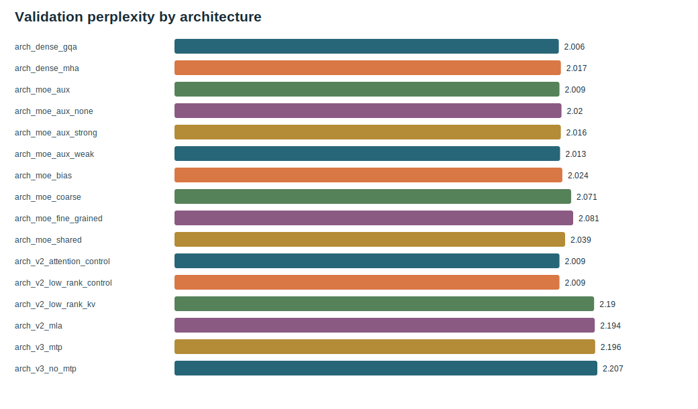

# s01 Dense LM：先写出完整模型

中文 | [English](README.md) | [课程目录](../README_zh.md)

## 研究问题

在讨论 MoE 或 MLA 前，我们能否写出一个完整的 next-token 语言模型，并让它的外部接口稳定、内部结构可读？

## 论文线索

DeepSeek LLM 适合作为起点，因为它把基座训练配方讲得很清楚：decoder-only LM、现代归一化和位置编码、SwiGLU，以及分组注意力。TinySeek 保留教学版并缩小规模，不声称论文的全规模配方可以原样复制。

## 代码改变

从 [`model/stages/stage0_deepseek_llm.py`](../../model/stages/stage0_deepseek_llm.py) 开始，沿着完整数据流读：

```text
input_ids [B,T] -> Embedding [B,T,D] -> N 个 Block
-> RMSNorm -> 绑定权重的 LM head [B,T,V] -> shift 后的交叉熵
```

公式到 API 的逐项对应见 [`docs/zh/24_math_to_pytorch.md`](../../docs/zh/24_math_to_pytorch.md)，完整代码走读见 [`docs/zh/12_code_first_dense_lm.md`](../../docs/zh/12_code_first_dense_lm.md)。

最重要的是接口契约：每个 block 都返回 `[B,T,D]`，只有最后的 head 把最后一维变成 `V`。后面每一代才能只替换一个子层，而不破坏整条数据流。

## 先跑再改

```bash
python tests/stage_models_test.py
python scripts/inspect_stage_models.py
python trainer/train_pretrain.py --config configs/tiny_dense.json --data data/toy_pretrain.jsonl --max_steps 20
```

## 实验卡片

| 项目 | TinySeek 选择 |
| --- | --- |
| 基线 | `dense_gqa` |
| 主要指标 | validation LM loss/PPL、tokens/s、峰值显存 |
| 不变量 | logits `[B,T,V]`、causal shift、checkpoint 接口稳定 |
| 门槛 | 这条路径能训练且指标被记录后，才比较下一代架构 |

## 决策

本单元不试图证明新结构，只建立对照组。之后所有结果必须使用相同的数据、token budget、评测代码和计算量账本，否则“升级”可能只是实验条件变了。



## 代码练习

在配置里只改一个维度，运行前先预测所有会变化的 shape。然后按 `RMSNorm.forward`、`Attention.forward`、`SwiGLU.forward`、`Block.forward`、`DenseCausalLM.forward` 的顺序阅读。不要先背类名，要先追张量契约。

## 下一章

模型已经能跑，但训练配方仍是混杂因素。先用 [s02 训练配方](../s02_training_recipe/README_zh.md) 选择可复现的 LR 和 batch-size 区间。

<!-- tinyseek-nav -->

上一篇：[课程目录](../README_zh.md) | 下一篇：[s02 训练配方](../s02_training_recipe/README_zh.md)
