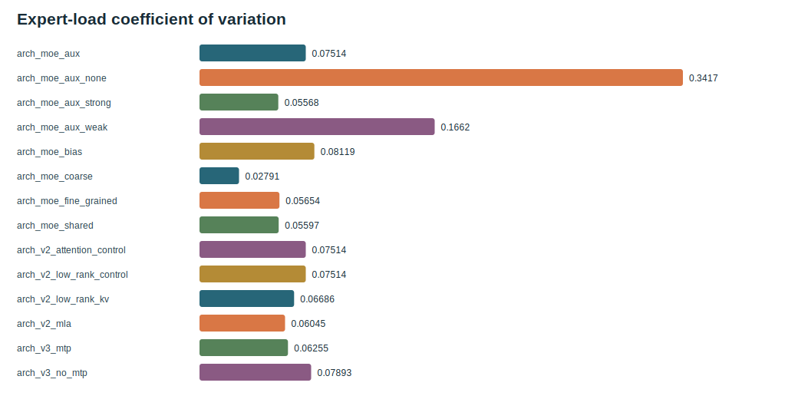

# s04 DeepSeekMoE: Make the FFN a Research Experiment

[中文](README_zh.md) | English | [Course index](../README.md)

## Bottleneck

Increasing a dense FFN increases both stored capacity and per-token compute. MoE tries to decouple them: store more experts, route each token through only a few.

## Paper Clue

DeepSeekMoE emphasizes fine-grained expert segmentation and shared expert isolation. The public paper gives the motivation; TinySeek implements a readable single-device dispatch loop, not expert parallel all-to-all infrastructure.

## Code Diff

The model's outer path does not change. In [`model/stages/stage1_deepseek_moe.py`](../../model/stages/stage1_deepseek_moe.py), replace the block's dense `SwiGLU` with `FineGrainedMoE`:

```python
router_probs = F.softmax(self.router(flat), dim=-1)
top_weights, top_indices = torch.topk(router_probs, k=top_k, dim=-1)
expert_out = expert(flat[token_indices])
out[token_indices] += expert_out * weight.unsqueeze(-1)
```

The detailed formula, shapes and dispatch explanation is in [`docs/21_from_dense_to_deepseek_moe.md`](../../docs/21_from_dense_to_deepseek_moe.md).

## Experiment Card

Do not mix two questions:

1. coarse/fine/shared topology: does the DeepSeekMoE idea help when major FFN capacity and activation width are matched?
2. aux-loss/bias routing: which balancing mechanism is useful after the topology is chosen?

Run configs in [`configs/architecture_lab/`](../../configs/architecture_lab/) and inspect the 3-seed report.

| Question | Evidence | Decision |
| --- | --- | --- |
| coarse -> fine/shared | PPL `2.071/2.081/2.039`; fine/shared are slower | fine alone rejected; shared is a quality branch, coarse a speed branch |
| no aux -> aux | load CV `0.342 -> 0.075`, PPL `2.020 -> 2.009` | keep `aux=0.01` for the next controlled branch |



## Decision Boundary

Total parameters, activated parameters, router load, PPL and tokens/s must be reported together. “More experts” is not evidence of an upgrade. A single seed is not enough to promote a topology.

## Code Exercise

For `B=2,T=128,E=8,K=2`, predict the shapes of `router_probs`, `top_indices`, `token_indices`, and the final `out`. Then verify `sum(expert_counts) == B*T*K`.

## Next

MoE reduces FFN activation, but attention still carries historical K/V. [s05 MLA](../s05_mla/README.md) tests whether a low-rank path can reduce that state further.

<!-- tinyseek-nav -->

Previous: [s03 GQA](../s03_gqa/README.md) | [Course index](../README.md) | Next: [s05 MLA](../s05_mla/README.md)
