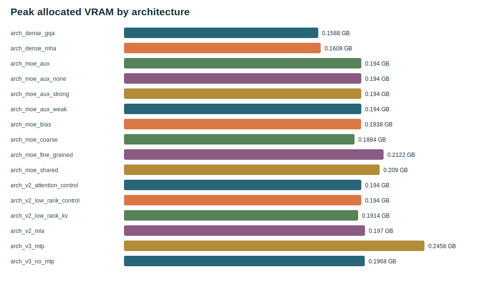

# s06 DeepSeek-V3：路由 Bias 与多 Token 预测

中文 | [English](README.md) | [课程目录](../README_zh.md)

## 两个新冲突

1. 辅助路由损失可以改善 expert 均衡，却会干扰语言模型主目标。
2. Next-token prediction 每个位置只有一个目标；MTP 要验证额外未来 token 是否提供有效训练信号。

这是两个独立假设，必须分别消融。

## 论文线索

DeepSeek-V3 引入基于 expert selection bias 的 auxiliary-loss-free load balancing，并在训练时使用 multi-token prediction。TinySeek 在 [`model/stages/stage3_deepseek_v3.py`](../../model/stages/stage3_deepseek_v3.py) 和统一正式模型 [`model/tinyseek.py`](../../model/tinyseek.py) 中保留了易读版本。

## 代码差异 A：Selection Bias

选择 expert 时使用 router affinity 加一个不参与梯度的 bias；真正混合 expert 输出的权重仍来自原 affinity。optimizer 更新后，负载不足的 expert 增加 bias，过载 expert 减少 bias。

这个区别非常重要：改变离散选择，不等于改变可微的混合权重。公式和 `torch.no_grad` 更新见 [`docs/zh/23_from_v2_to_deepseek_v3.md`](../../docs/zh/23_from_v2_to_deepseek_v3.md)。

## 代码差异 B：MTP

额外 head 要把较早 hidden state 与更远 future target 对齐。它不只是“把 label 多 shift 一次”；序列长度和 target 位置必须精确匹配。主 loss 始终保留：

```text
total loss = LM loss + routing term + mtp_loss_weight * MTP loss
```

## 实验卡片

| 假设 | 对照 | 候选 | 门槛 |
| --- | --- | --- | --- |
| bias routing | `moe_aux` | `moe_bias` | 不使用 aux loss 时，PPL 可比且负载更均衡 |
| MTP | `v3_no_mtp` | `v3_mtp` | 稳定的主任务收益足以抵消额外显存和计算 |

## 证据与决定

- Bias routing：PPL `2.009 -> 2.024`，load CV `0.075 -> 0.081`。当前超参下未通过；保留 `aux=0.01`，下一轮先 sweep bias update rate。
- MTP：PPL `2.207 +/- 0.017` 对 `2.196 +/- 0.034`，峰值显存 `0.197 -> 0.246 GB`。结论不确定，而且只在已经被否决的 MLA-style 分支上测量。它**不能**决定晋级的 GQA+aux 分支是否应该启用 MTP。



## 研究方法结论

实验可以帮助理解一个创新，但不保证它在所有规模都成立。不要把不同拓扑组中的胜者和败者拼成一条虚构的“最强模型”；必须标明每个结果来自哪条分支。

## 下一章

架构路线得到 pretrained base 后，DeepSeek-R1 改的是训练 pipeline，而不是替换 Transformer block。继续 [s07 Cold-start SFT](../s07_cold_start_sft/README_zh.md)。

<!-- tinyseek-nav -->

上一篇：[s05 MLA](../s05_mla/README_zh.md) | [课程目录](../README_zh.md) | 下一篇：[s07 Cold-start SFT](../s07_cold_start_sft/README_zh.md)
