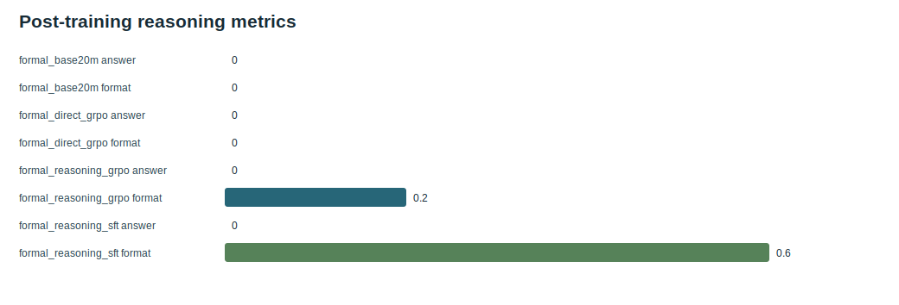

# s07 Cold-Start SFT: Teach the Format Before RL

[中文](README_zh.md) | English | [Course index](../README.md)

## Bottleneck

A pretrained LM predicts plausible text; it does not automatically produce a stable, readable reasoning-and-answer format. Applying a loose RL reward directly can exploit accidental patterns before the model learns the desired interface.

## Paper Clue

DeepSeek-R1-Zero starts from a pretrained base with RL, while the full R1 pipeline adds cold-start reasoning data before the first reasoning-oriented RL stage. In this course, cold start means a small supervised stage, not a claim that SFT alone creates reasoning ability.

## Code Path

Read [`trainer/train_sft.py`](../../trainer/train_sft.py) and [`docs/19_posttraining_code_walkthrough.md`](../../docs/19_posttraining_code_walkthrough.md). The central implementation issue is masking:

```text
prompt tokens      -> labels = -100 -> no supervised loss
response tokens    -> labels = token id -> supervised next-token loss
padding             -> labels = -100
```

`F.cross_entropy(..., ignore_index=-100)` therefore trains only the target response region. The architecture is unchanged; we update the same base model weights with a narrower data distribution.

## Experiment Card

| Control | Candidate | Metrics |
| --- | --- | --- |
| `formal_base20m` | `formal_reasoning_sft` | held-out answer accuracy, format score, TinyStories sample PPL |

The evaluation must separate format obedience from answer correctness. A well-formed wrong answer is not reasoning success.

## Evidence and Decision

On five held-out additions, answer accuracy stays `0/5`, while format score changes `0.000 -> 0.600`. TinyStories sample PPL changes `1.718 -> 12.670` after narrow-domain SFT.

Decision: SFT provides a useful format cold start, but offers no arithmetic-generalization evidence and significantly shifts the base distribution. Promote it only as the initialization for the educational RL lesson, not as a successful reasoning model.



## Code Exercise

Take one prompt/response pair and write its `input_ids` and `labels` rows by hand. Verify that the first response token is predicted from the last prompt position, and that no prompt or pad token contributes to the loss.

## Next

The model now sometimes follows the target format. [s08 GRPO + evaluation](../s08_grpo_and_evaluation/README.md) asks whether the rule reward improves or damages that behavior.

<!-- tinyseek-nav -->

Previous: [s06 V3 routing + MTP](../s06_v3_routing_mtp/README.md) | [Course index](../README.md) | Next: [s08 GRPO + evaluation](../s08_grpo_and_evaluation/README.md)
