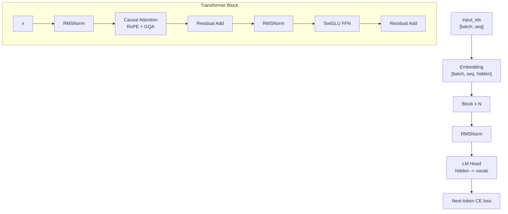

# 12. Code First: Build the Initial DeepSeek-Style Dense LM

This chapter is the code-first path. Before running MoE, MLA, SFT, or GRPO, we
write the first dense language model by hand and use it as the experimental
baseline.

Code file:

- [`model/tinyseek_dense.py`](../model/tinyseek_dense.py)

The full research model lives in:

- [`model/tinyseek.py`](../model/tinyseek.py)

Think of `tinyseek_dense.py` as the teaching version and `tinyseek.py` as the
experiment version.

## Architecture



## Step 1: Config

`DenseConfig` keeps every dimension explicit:

- `vocab_size`: tokenizer vocabulary.
- `max_seq_len`: training context length.
- `hidden_size`: model width.
- `num_layers`: number of Transformer blocks.
- `num_heads`: query heads.
- `num_kv_heads`: key/value heads for GQA.
- `ffn_multiplier`: FFN hidden size multiplier.

The first lesson: architecture is mostly tensor shape bookkeeping.

## Step 2: RMSNorm

RMSNorm rescales each hidden vector by its root mean square:

```python
scale = torch.rsqrt(x.pow(2).mean(dim=-1, keepdim=True) + eps)
return weight * x * scale
```

DeepSeek LLM uses a modern pre-norm Transformer style. In code, each block does:

```text
x = x + attention(norm(x))
x = x + ffn(norm(x))
```

## Step 3: RoPE

RoPE injects position information into Q and K. The dense teaching file splits
it into three pieces:

- `precompute_rope`: build cos/sin tables.
- `rotate_half`: pairwise rotate hidden dimensions.
- `apply_rope`: apply cos/sin to Q/K.

The important shape:

```text
q, k: [batch, heads, seq, head_dim]
cos:  [seq, head_dim]
```

## Step 4: Attention

The attention module:

1. projects hidden states to Q/K/V;
2. reshapes to multi-head format;
3. applies RoPE to Q/K;
4. repeats K/V if using GQA;
5. calls causal scaled dot-product attention;
6. projects the result back to hidden size.

This is the first DeepSeek-style baseline attention. MLA comes later as an
upgrade, not as the first thing to learn.

## Step 5: SwiGLU FFN

The FFN is:

```text
down(silu(gate(x)) * up(x))
```

This is the dense MLP that MoE will later replace with routed experts.

## Step 6: Causal LM Loss

The model predicts the next token:

```python
loss = cross_entropy(logits[:, :-1], labels[:, 1:])
```

This one-line shift is easy to miss and is the heart of pretraining.

## Step 7: Experiments Start Here

Once the dense model works, experiments become meaningful:

1. Sweep LR and batch size.
2. Change block components.
3. Replace dense FFN with MoE.
4. Replace normal K/V projection with educational MLA.
5. Add SFT and RL stages.

The learning order should be:

```text
write dense code -> train dense baseline -> run recipe sweep -> upgrade model
```
