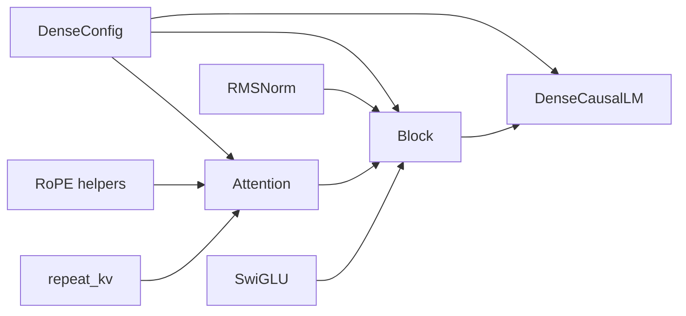
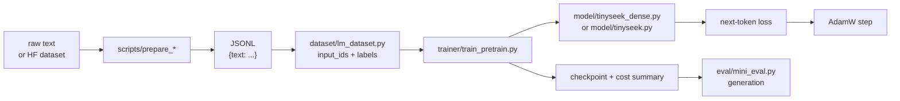
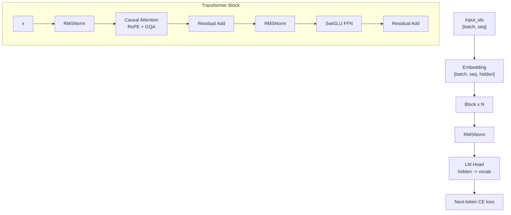

# 12. Code First: Build the Initial DeepSeek-Style Dense LM

This chapter is the code-first path. Before running MoE, MLA, SFT, or GRPO, we
write the first dense language model by hand and use it as the experimental
baseline.

Code file:

- [`model/tinyseek_dense.py`](../model/tinyseek_dense.py)

The full research model lives in:

- [`model/tinyseek.py`](../model/tinyseek.py)

Think of `tinyseek_dense.py` as the teaching version and `tinyseek.py` as the
experiment version.

## Whole-File Structure

`tinyseek_dense.py` is not just a list of components. It is organized from small
building blocks to the complete language model:

```text
DenseConfig
RMSNorm
RoPE helpers: precompute_rope / rotate_half / apply_rope
repeat_kv
Attention
SwiGLU
Block
DenseCausalLM
```

The dependency direction is:



This is the first whole-code lesson: helper math sits at the top, reusable
layers sit in the middle, and the full model class sits at the bottom.

At the repository level, the first training path is:



So the first goal is not "memorize every component". The first goal is to see
one complete loop:

```text
text -> token ids -> model forward -> shifted CE loss -> optimizer step
```

## Architecture



## Step 1: Config

`DenseConfig` keeps every dimension explicit:

- `vocab_size`: tokenizer vocabulary.
- `max_seq_len`: training context length.
- `hidden_size`: model width.
- `num_layers`: number of Transformer blocks.
- `num_heads`: query heads.
- `num_kv_heads`: key/value heads for GQA.
- `ffn_multiplier`: FFN hidden size multiplier.

The first lesson: architecture is mostly tensor shape bookkeeping.

With the default teaching config:

```text
hidden_size = 192
num_heads = 4
head_dim = hidden_size / num_heads = 48
num_layers = 4
```

So every token becomes a 192-dimensional vector, and each attention head works
on a 48-dimensional slice.

## Step 2: RMSNorm

For one token vector $x=(x_1,\ldots,x_D)$, RMSNorm is:

$$
\operatorname{RMS}(x)=\sqrt{\frac{1}{D}\sum_{i=1}^{D}x_i^2+\epsilon},
\qquad y_i=\gamma_i\frac{x_i}{\operatorname{RMS}(x)}.
$$

$D$ is hidden size, $\epsilon$ prevents division by zero, and
$\gamma\in\mathbb{R}^D$ is learnable. Unlike LayerNorm, RMSNorm does not
subtract the mean. The code is a term-by-term translation:

```python
scale = torch.rsqrt(x.pow(2).mean(dim=-1, keepdim=True) + eps)
return weight * x * scale
```

| Formula term | PyTorch | Shape |
| --- | --- | --- |
| $x_i^2$ | `x.pow(2)` | `[B,T,D]` |
| $D^{-1}\sum_i x_i^2$ | `.mean(dim=-1, keepdim=True)` | `[B,T,1]` |
| $1/\sqrt{\cdot}$ | `torch.rsqrt(...)` | `[B,T,1]` |
| $\gamma$ | `nn.Parameter(torch.ones(D))` | `[D]` |
| output scaling | `weight * x * scale` | `[B,T,D]` |

`dim=-1` normalizes each token over hidden features. `keepdim=True` preserves a
length-one axis for broadcasting. `nn.Parameter` registers `weight` with the
optimizer. For $x=[3,4]$ and $\gamma=[1,1]$, ignoring epsilon gives
$\operatorname{RMS}(x)=\sqrt{12.5}$ and output about `[0.8485,1.1314]`.

DeepSeek LLM uses a modern pre-norm Transformer style. In code, each block does:

```text
x = x + attention(norm(x))
x = x + ffn(norm(x))
```

See [Math to PyTorch](24_math_to_pytorch.md) for the broadcasting, parameter,
and buffer rules used throughout the repository.

## Step 3: RoPE

RoPE injects position information into Q and K. The dense teaching file splits
it into three pieces:

- `precompute_rope`: build cos/sin tables.
- `rotate_half`: pairwise rotate hidden dimensions.
- `apply_rope`: apply cos/sin to Q/K.

For one 2D pair at position $m$:

$$
\begin{bmatrix}x'_1\\x'_2\end{bmatrix}=
\begin{bmatrix}\cos(m\theta)&-\sin(m\theta)\\
\sin(m\theta)&\cos(m\theta)\end{bmatrix}
\begin{bmatrix}x_1\\x_2\end{bmatrix}.
$$

`x * cos + rotate_half(x) * sin` applies all pairs in parallel. Two
`unsqueeze(0)` calls turn `[T,d_h]` into `[1,1,T,d_h]` for batch/head
broadcasting; `.to(x.device,x.dtype)` aligns device and numeric type.

The frequencies come from the repository's actual code:

```python
inv_freq = 1.0 / (base ** (torch.arange(0, head_dim, 2).float() / head_dim))
positions = torch.arange(max_seq_len).float()
freqs = torch.outer(positions, inv_freq)
freqs = torch.cat((freqs, freqs), dim=-1)
return freqs.cos(), freqs.sin()
```

Frequency $j$ is $\theta_j=base^{-2j/d_h}$ and position $m$ uses $m\theta_j$.
`arange(0,d_h,2)` creates even indices; `torch.outer([T],[d_h/2])` builds every
position-frequency product; `torch.cat` duplicates to `[T,d_h]` to match this
implementation's front-half/back-half `chunk(2,dim=-1)` pairing. Cosine and sine
are elementwise. `register_buffer(...,persistent=False)` moves the tables with
the model without training or checkpointing them.

The important shape:

```text
q, k: [batch, heads, seq, head_dim]
cos:  [seq, head_dim]
```

## Step 4: Attention

The attention module:

1. projects hidden states to Q/K/V;
2. reshapes to multi-head format;
3. applies RoPE to Q/K;
4. repeats K/V if using GQA;
5. calls causal scaled dot-product attention;
6. projects the result back to hidden size.

The equations are:

$$Q=XW_Q^T,\quad K=XW_K^T,\quad V=XW_V^T,$$

$$
\operatorname{Attention}(Q,K,V)=
\operatorname{softmax}\left(\frac{QK^T}{\sqrt{d_h}}+M_{causal}\right)V.
$$

Here $W_Q,W_K,W_V$ denote stored `nn.Linear.weight` tensors with shape
`[D_out,D_in]`, hence the transpose. `nn.Linear` transforms the final axis.
`view` separates the
head dimension and `transpose(1,2)` creates `[B,H,T,d_h]`.

This is the first DeepSeek-style baseline attention. MLA comes later as an
upgrade, not as the first thing to learn.

Read `Attention.forward` as a shape story:

```python
bsz, seq_len, _ = x.shape
q = self.q_proj(x).view(bsz, seq_len, self.num_heads, self.head_dim).transpose(1, 2)
k = self.k_proj(x).view(bsz, seq_len, self.num_kv_heads, self.head_dim).transpose(1, 2)
v = self.v_proj(x).view(bsz, seq_len, self.num_kv_heads, self.head_dim).transpose(1, 2)
```

The input is:

```text
x: [batch, seq, hidden]
```

After projection and reshape:

```text
q: [batch, num_heads, seq, head_dim]
k: [batch, num_kv_heads, seq, head_dim]
v: [batch, num_kv_heads, seq, head_dim]
```

When `num_kv_heads < num_heads`, `repeat_kv` expands K/V so every query head has
something to attend to. When they are equal, `repeat_kv` is a no-op.

`repeat_kv` inserts a repeat axis, uses `expand` for a broadcasted view, and
merges KV-head and repeat axes with `reshape`. GQA shares K/V parameters and
cache; it does not remove query heads. TinySeek then calls:

```python
F.scaled_dot_product_attention(q, k, v, is_causal=True, dropout_p=...)
```

This fused API still performs scaling, causal masking, softmax, dropout, and
value aggregation. It does not infer module train/eval state, so evaluation
explicitly uses `dropout_p=0.0`.

After attention, the tensor is reshaped back:

```python
y = y.transpose(1, 2).contiguous().view(bsz, seq_len, -1)
return self.o_proj(y)
```

The output is again `[batch, seq, hidden]`. That shape invariant is what lets
the next Transformer block consume it.

## Step 5: SwiGLU FFN

The FFN is:

```text
down(silu(gate(x)) * up(x))
```

In equations:

$$
g=XW_g^T,\quad u=XW_u^T,\quad
\operatorname{SwiGLU}(X)=\left(\operatorname{SiLU}(g)\odot u\right)W_d^T.
$$

The exact code is:

```python
return self.down(F.silu(self.gate(x)) * self.up(x))
```

Shapes are `[B,T,D] -> two [B,T,D_ff] branches -> [B,T,D_ff] -> [B,T,D]`.
`F.silu` has no parameters; the three linear layers do. `*` is elementwise and
cannot be replaced with matrix multiplication `@`.

This is the dense MLP that MoE will later replace with routed experts.

MoE does not replace the whole model. In this tutorial route, MoE first replaces
the FFN sublayer:

```text
Dense block: attention + dense SwiGLU FFN
MoE block:   attention + routed SwiGLU experts
```

## Step 6: Block

`Block` is where the components become a Transformer layer:

```python
x = x + self.attn(self.attn_norm(x))
x = x + self.ffn(self.ffn_norm(x))
return x
```

This is pre-norm residual structure. The shape is unchanged:

```text
[batch, seq, hidden] -> [batch, seq, hidden]
```

A block changes the information inside each token vector, but it keeps the
outer shape stable. That is why `DenseCausalLM` can stack many blocks in a loop.

## Step 7: DenseCausalLM

`DenseCausalLM` is the full model. It owns:

```python
self.embed = nn.Embedding(config.vocab_size, config.hidden_size)
self.blocks = nn.ModuleList([Block(config) for _ in range(config.num_layers)])
self.norm = RMSNorm(config.hidden_size)
self.lm_head = nn.Linear(config.hidden_size, config.vocab_size, bias=False)
```

The complete forward pass is short because every submodule has already done its
job:

```python
x = self.embed(input_ids)
for block in self.blocks:
    x = block(x)
logits = self.lm_head(self.norm(x))
```

Read it line by line:

1. `input_ids` are integer token IDs, not vectors yet.
2. `self.embed(input_ids)` turns every token ID into a learnable hidden vector.
3. The `for block in self.blocks` loop repeatedly mixes context through
   attention and transforms each token vector through the FFN.
4. The final `RMSNorm` stabilizes the last hidden states before prediction.
5. `lm_head` maps hidden vectors back to vocabulary scores.

End-to-end shapes:

```text
input_ids: [batch, seq]
embedding output: [batch, seq, hidden]
block output: [batch, seq, hidden]
logits: [batch, seq, vocab]
```

For a tiny example with `batch=2`, `seq=128`, `hidden=192`, and `vocab=260`:

```text
input_ids: [2, 128]
x after embedding: [2, 128, 192]
x after every block: [2, 128, 192]
logits: [2, 128, 260]
```

The model does not output a single answer during pretraining. It outputs one
vocabulary distribution at every sequence position.

This line ties the output head to the input embedding table:

```python
self.lm_head.weight = self.embed.weight
```

Weight tying saves parameters and makes the same token table serve both input
lookup and output prediction.
It aliases one `Parameter` rather than copying values, so gradients from both
paths accumulate into the same matrix.

## Step 8: Causal LM Loss

The model predicts the next token:

```python
loss = cross_entropy(logits[:, :-1], labels[:, 1:])
```

For one position:

$$
\mathcal{L}_t=-\log\frac{\exp z_{t,y_{t+1}}}
{\sum_{v=1}^{V}\exp z_{t,v}}.
$$

The implementation flattens token positions:

```python
shift_logits = logits[:, :-1].reshape(-1, logits.size(-1))
shift_labels = labels[:, 1:].reshape(-1)
loss = F.cross_entropy(shift_logits, shift_labels, ignore_index=-100)
```

Inputs are `[B*(T-1),V]` logits and `[B*(T-1)]` integer class IDs.
`F.cross_entropy` already contains a stable log-softmax plus negative
log-likelihood, so do not apply softmax first.

This one-line shift is easy to miss and is the heart of pretraining.

The shift means:

```text
logits at position 0 predict label at position 1
logits at position 1 predict label at position 2
...
```

Pad labels are `-100`, so PyTorch cross entropy ignores them.
For `[BOS,A,B,EOS]`, the pairs are `BOS -> A`, `A -> B`, and `B -> EOS`; the
final logit has no next token and is removed by `[:, :-1]`.

## Step 9: How the Trainer Uses the Model

The trainer only relies on a small contract:

```python
out = model(input_ids, labels)
loss = out["loss"]
loss.backward()
optimizer.step()
```

The real training script has AMP, gradient accumulation, validation,
checkpointing, and cost logging. But the conceptual core is just:

```python
for input_ids, labels in loader:
    input_ids = input_ids.to(device)
    labels = labels.to(device)

    out = model(input_ids, labels)
    loss = out["loss"]

    optimizer.zero_grad(set_to_none=True)
    loss.backward()
    optimizer.step()
```

Everything else in `trainer/train_pretrain.py` makes this loop practical:

- cosine learning-rate schedule changes `lr` every step;
- AMP reduces memory and speeds up training on NVIDIA GPUs;
- gradient clipping prevents unstable spikes;
- validation checks whether training loss improvement transfers to held-out
  text;
- cost logging records GPU time, peak memory, token count, and rough FLOPs.

This separation matters:

- `model/tinyseek_dense.py` defines the math.
- `dataset/lm_dataset.py` builds `input_ids` and `labels`.
- `trainer/train_pretrain.py` handles optimization, AMP, checkpointing, and
  cost logging.

Once this contract works, the internals can evolve: dense FFN to MoE, normal
KV to MLA, pretraining data to SFT data.

## Step 10: Experiments Start Here

Once the dense model works, experiments become meaningful:

1. Sweep LR and batch size.
2. Change block components.
3. Replace dense FFN with MoE.
4. Replace normal K/V projection with educational MLA.
5. Add SFT and RL stages.

The learning order should be:

```text
write dense code -> train dense baseline -> run recipe sweep -> upgrade model
```

<!-- tinyseek-nav -->

---

Previous: [Math to PyTorch](24_math_to_pytorch.md) | [Tutorial Index](README.md) | Next: [Dense to DeepSeekMoE](21_from_dense_to_deepseek_moe.md)
