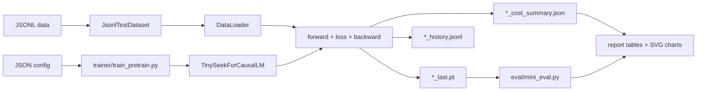

# 16. Training Loop: From Config to Checkpoint

This chapter explains the whole training program, not only the model
components. The goal is to understand how a TinySeek experiment starts from a
JSON config and ends as a checkpoint, an eval file, and a cost report.

Main files:

- [`configs/tiny_dense.json`](../configs/tiny_dense.json)
- [`dataset/lm_dataset.py`](../dataset/lm_dataset.py)
- [`trainer/train_pretrain.py`](../trainer/train_pretrain.py)
- [`trainer/train_sft.py`](../trainer/train_sft.py)
- [`trainer/train_grpo.py`](../trainer/train_grpo.py)
- [`scripts/generate_v1_report_assets.py`](../scripts/generate_v1_report_assets.py)

## Whole Program Flow



This is the main contract of the repository:

```text
config + JSONL data -> training script -> checkpoint + history + cost summary
checkpoint + JSONL data -> mini eval -> report assets
```

Once this contract is stable, every chapter can change one thing at a time:
model size, LR, batch size, MoE, MLA, SFT data, or GRPO reward.

## Step 1: The Config Is the Experiment Card

A config has two blocks:

```json
{
  "run_name": "tiny_dense",
  "model": {
    "max_seq_len": 128,
    "hidden_size": 192,
    "num_layers": 4
  },
  "train": {
    "batch_size": 16,
    "learning_rate": 0.0006,
    "max_steps": 200,
    "out_dir": "out"
  }
}
```

`model` answers: what architecture are we training?

`train` answers: how are we optimizing it?

DeepSeek-style experiments become readable because each run has a small
experiment card. For a batch/LR sweep, only `batch_size` and `learning_rate`
change. For MoE, `use_moe`, `num_experts`, and `top_k` change. For MLA,
`attention_impl` changes.

## Step 2: JSONL Keeps Data Auditable

Pretraining uses:

```json
{"text": "A plain text sample."}
```

SFT uses:

```json
{"prompt": "Explain RMSNorm.", "response": "RMSNorm rescales hidden states by their root mean square."}
```

GRPO mini uses:

```json
{"prompt": "12+9", "answer": "21"}
```

The repository intentionally starts with JSONL instead of a complex packed-data
pipeline. That keeps the first learning target focused on model and training
code. A production data pipeline can come later.

## Step 3: Dataset Builds `input_ids` and `labels`

For pretraining, `JsonlTextDataset.__getitem__` does:

```text
text -> byte token ids -> pad/truncate -> input_ids
labels = input_ids with pad labels changed to -100
```

The model itself shifts the labels:

```text
logits[:, :-1] predict labels[:, 1:]
```

For SFT, `JsonlInstructionDataset` masks prompt tokens:

```text
### Instruction
prompt

### Response
response
```

Only response tokens contribute to loss. This is why cold-start data can teach a
response format without training the model to copy the prompt.

## Step 4: The Trainer Builds the Runtime Objects

`trainer/train_pretrain.py` follows a fixed order:

1. Load config.
2. Set random seed.
3. Pick `cuda` if available.
4. Create tokenizer.
5. Build `TinySeekConfig`.
6. Create `TinySeekForCausalLM`.
7. Resolve AMP dtype.
8. Build dataset and validation split.
9. Build optimizer.
10. Prepare output paths.

This setup is deliberately boring. Most training bugs happen when this part is
implicit. TinySeek keeps it visible so readers can modify experiments safely.

## Step 5: The Optimization Step

The core loop is:

```python
out = model(input_ids, labels)
loss = out["loss"] + out["aux_loss"]
scaled_loss = loss / grad_accum_steps
scaler.scale(scaled_loss).backward()
```

Then, after enough accumulation steps:

```python
scaler.unscale_(optimizer)
torch.nn.utils.clip_grad_norm_(model.parameters(), grad_clip)
scaler.step(optimizer)
scaler.update()
optimizer.zero_grad(set_to_none=True)
```

The important detail is `aux_loss`. Dense runs have zero auxiliary loss. MoE
runs add a routing-balance term. This lets the same trainer handle dense and
MoE experiments.

## Step 6: Learning Rate Is Part of the Experiment

Every step calls:

```python
lr = cosine_lr(step, max_steps, learning_rate, warmup_steps, min_lr_ratio)
```

This matters for the DeepSeek LLM-inspired sweep: comparing LR values only
makes sense when the schedule is controlled and recorded.

## Step 7: Validation, History, and Checkpointing

At `eval_interval`, the trainer writes one JSONL row to:

```text
out/<run_name>_history.jsonl
```

Example row:

```json
{"run_name": "v1_dense35", "step": 200, "train_loss": 1.01, "val_loss": 0.99, "learning_rate": 0.00006}
```

At `save_interval`, the trainer writes:

```text
out/<run_name>_last.pt
```

The checkpoint contains:

- config,
- model state dict,
- current step.

The history file is for charts. The checkpoint is for generation, SFT, GRPO,
and eval.

## Step 8: Cost and FLOPs Accounting

Every training script writes:

```text
out/<run_name>_cost_summary.json
```

The summary includes:

- GPU name and total memory,
- elapsed seconds and GPU hours,
- hourly rental rate,
- estimated cost,
- total parameters,
- activated-parameter estimate,
- peak allocated/reserved VRAM,
- estimated tokens and rough training FLOPs when available.

This is not a perfect profiler. It is a consistent lab notebook. The point is
to teach readers to attach cost to every training claim.

## Step 9: Mini Eval Turns Checkpoints into Comparable Rows

`eval/mini_eval.py` reads a checkpoint and reports:

- perplexity on held-out JSONL text,
- addition exact-match accuracy,
- format-following score.

This eval is tiny, but it catches common mistakes:

- training loss goes down while held-out PPL gets worse;
- SFT teaches format but hurts base-text perplexity;
- GRPO produces reward without solving the target task.

## Step 10: Report Assets

After training and eval, run:

```bash
python scripts/generate_v1_report_assets.py --run_dir experiments/v1_4090_plan
```

It merges:

- `cost_summary.csv`,
- `eval_*.json`.

It writes:

- `auto_summary.md`,
- `auto_summary_zh.md`,
- SVG charts for PPL, VRAM, cost, sweep loss, and VRAM-vs-PPL.

This makes the GitHub tutorial visual without adding a plotting dependency.

## How This Supports the Main Roadmap

The training program stays stable while the research question changes:

| Stage | What changes | What stays fixed |
| --- | --- | --- |
| Dense baseline | model size | JSONL, trainer, eval, cost report |
| LR/batch sweep | LR and batch size | model, data, eval |
| MoE | FFN implementation | trainer contract |
| MLA | attention implementation | trainer contract |
| SFT | dataset and label masking | model loading, optimizer |
| GRPO mini | objective and reward | checkpoint/eval/report habit |

That is the core teaching idea: do not make every axis move at once. Change one
axis, measure it, then move to the next chapter.

## Next Chapter

Continue to [Code Walkthrough](15_code_walkthrough.md), or return to the
[Tutorial Index](README.md).

<!-- tinyseek-nav -->

---

Previous: [DeepSeek-V2 to DeepSeek-V3](23_from_v2_to_deepseek_v3.md) | [Tutorial Index](README.md) | Next: [Code Walkthrough](15_code_walkthrough.md)
