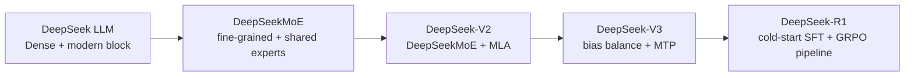

# 20. DeepSeek Architecture Evolution as One Code Path

This chapter is the map for the code-first course. The next chapters keep one decoder-only language model intact and change only the subsystem introduced by each paper. Input IDs, embeddings, residual connections, the LM head, and next-token loss remain visible throughout.

## What You Will Build

| Generation | Complete teaching model | Only new change | Problem addressed |
| --- | --- | --- | --- |
| DeepSeek LLM | [`stage0_deepseek_llm.py`](../model/stages/stage0_deepseek_llm.py) | starting point | a stable Dense decoder-only LM |
| DeepSeekMoE | [`stage1_deepseek_moe.py`](../model/stages/stage1_deepseek_moe.py) | Dense FFN to routed and shared experts | grow capacity without activating every parameter |
| DeepSeek-V2 | [`stage2_deepseek_v2.py`](../model/stages/stage2_deepseek_v2.py) | MHA/GQA to educational MLA | compress the growing KV cache |
| DeepSeek-V3 | [`stage3_deepseek_v3.py`](../model/stages/stage3_deepseek_v3.py) | routing bias and MTP | reduce balance-loss interference and add future-token supervision |

Formal experiments still use [`model/tinyseek.py`](../model/tinyseek.py). Stage files teach the complete code path; the unified model provides configuration-controlled comparisons.

## The Backbone That Does Not Change

```text
input_ids [B, T]
  -> token embedding [B, T, D]
  -> N x Transformer block [B, T, D]
  -> final RMSNorm [B, T, D]
  -> tied LM head [B, T, V]
  -> shifted next-token cross entropy
```

When comparing adjacent stages, ask three questions: did attention change, did the FFN change, or did the training objective change? Everything else should remain stable.

## Actual Research Order



R1 is primarily a training-pipeline evolution, not a new Transformer block. R1-Zero applies RL directly to a pretrained base model. The full R1 route adds cold-start SFT, RL, rejection sampling, another SFT stage, and later RL. See [`19_posttraining_code_walkthrough.md`](19_posttraining_code_walkthrough.md).

## Why Each Generation Appeared

### DeepSeek LLM

The first public DeepSeek LLM already uses a modern LLaMA-style design: Pre-Norm, RMSNorm, RoPE, SwiGLU, and GQA for the 67B model. Its paper also studies batch size, learning rate, and compute scaling. It is the Dense baseline, not an intentionally outdated Transformer.

### DeepSeekMoE

A Dense FFN activates the same parameters for every token. MoE stores more FFNs but routes each token to only a few. DeepSeekMoE further emphasizes fine-grained experts and shared-expert isolation so common knowledge and routed specialization have different paths.

### DeepSeek-V2

Autoregressive decoding caches K/V states for all previous tokens. MLA compresses cacheable information into a low-rank latent, reconstructs content K/V for attention, and treats the RoPE position path separately.

### DeepSeek-V3

A strong auxiliary balance loss can compete with the language-model objective. V3 instead adjusts expert selection with a bias that does not change affinity weights. It also adds Multi-Token Prediction modules to supervise farther future tokens.

## Three Levels of Evidence

| Level | Meaning |
| --- | --- |
| Paper result | measured by DeepSeek at its data, model, and infrastructure scale |
| TinySeek implementation | code path, shapes, losses, and statistics are runnable |
| TinySeek measured or pending | this repository's own comparison; missing runs stay explicitly pending |

Implementing an equation is not reproducing paper performance. Educational MLA demonstrates the latent path and theoretical cache accounting, but it is not a production cached-decoding kernel.

## Inspect All Four Models

With PyTorch installed:

```bash
python tests/stage_models_test.py
python scripts/inspect_stage_models.py --out out/stage_model_inspection.json
```

The inspection reports logits shape, total and activated parameters, theoretical per-layer KV-cache elements, and available loss fields. For quality and cost comparisons, use [`configs/architecture_lab/`](../configs/architecture_lab/) and the [architecture experiment plan](../experiments/06_architecture_evolution_plan.md).

## Learning Loop

For every generation:

1. Run the previous stage and record shapes.
2. Read the new config fields.
3. Locate the replaced sublayer and new outputs.
4. Run a matched configuration that changes one variable.
5. Record benefit, cost, and failure cases together.

The next code chapter starts with the FFN: how one token reaches two experts, and why total parameters are not the same as activated parameters.

<!-- tinyseek-nav -->

---

Previous: [DeepSeek LM Paper Map](01_deepseek_lm_paper_map.md) | [Tutorial Index](README.md) | Next: [Code First Dense LM](12_code_first_dense_lm.md)
