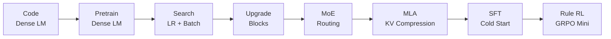

# Tutorial Index

[中文目录](zh/README.md) | English

TinySeek-Lab keeps English notes in `docs/` and Chinese notes in `docs/zh/`.
The two versions follow the same training path, while the Chinese version is
written as a more explanatory tutorial for local readers.

## Core Path

1. [Project Scope](00_project_scope.md)
2. [DeepSeek Paper Map for LM Training](01_deepseek_lm_paper_map.md)
3. [Code First: Build the Initial DeepSeek-Style Dense LM](12_code_first_dense_lm.md)
4. [Stage 0: Dense Baseline](02_stage0_dense_baseline.md)
5. [Stage 1: LR and Batch-Size Search](03_stage1_lr_batch_search.md)
6. [Stage 2: MLP and Attention Upgrades](04_stage2_block_upgrades.md)
7. [Stage 3: Tiny DeepSeekMoE](05_stage3_moe.md)
8. [Stage 4: Educational MLA](06_stage4_mla.md)
9. [Stage 5: SFT and Reasoning Cold Start](07_stage5_sft_cold_start.md)
10. [Stage 6: Rule-Based GRPO Mini](08_stage6_grpo_mini.md)
11. [Repository Roadmap](09_repository_roadmap.md)
12. [Experiment Report Template](10_experiment_report_template.md)
13. [MiniMind-Inspired Structure Notes](11_minimind_structure_notes.md)

## Visual Roadmap

