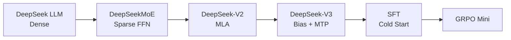

# Tutorial Index

[中文目录](zh/README.md) | English

TinySeek-Lab keeps English notes in `docs/` and Chinese notes in `docs/zh/`.
The two versions follow the same training path, while the Chinese version is
written as a more explanatory tutorial for local readers.

## Core Path

1. [Project Scope](00_project_scope.md)
2. [DeepSeek Paper Map for LM Training](01_deepseek_lm_paper_map.md)
3. [Four-Generation Architecture Map](20_architecture_evolution_overview.md)
4. [Code First: Build the DeepSeek LLM Dense Baseline](12_code_first_dense_lm.md)
5. [Dense LM to DeepSeekMoE](21_from_dense_to_deepseek_moe.md)
6. [DeepSeekMoE to DeepSeek-V2](22_from_moe_to_deepseek_v2.md)
7. [DeepSeek-V2 to DeepSeek-V3](23_from_v2_to_deepseek_v3.md)
8. [Training Loop: From Config to Checkpoint](16_training_loop_from_config_to_checkpoint.md)
9. [Code Walkthrough](15_code_walkthrough.md)
10. [Stage 0: Train the Dense Baseline](02_stage0_dense_baseline.md)
11. [Stage 1: LR and Batch-Size Search](03_stage1_lr_batch_search.md)
12. [Component Ablations: MLP and Attention](04_stage2_block_upgrades.md)
13. [MoE Experiment Lab](05_stage3_moe.md)
14. [MLA Experiment Lab](06_stage4_mla.md)
15. [SFT and Reasoning Cold Start](07_stage5_sft_cold_start.md)
16. [Rule-Based GRPO Mini](08_stage6_grpo_mini.md)
17. [Post-Training Code Walkthrough](19_posttraining_code_walkthrough.md)
18. [Repository Roadmap](09_repository_roadmap.md)
19. [Experiment Report Template](10_experiment_report_template.md)
20. [MiniMind-Inspired Structure Notes](11_minimind_structure_notes.md)
21. [GPU Choice and Cost Tracking](13_gpu_cost_tracking.md)
22. [v1 Training Runbook](14_v1_training_runbook.md)
23. [What TinySeek-Lab Learns from MiniMind](17_minimind_quality_notes.md)
24. [Final Checklist Before Renting a GPU](18_gpu_fill_only_checklist.md)

## Experiment Reports

- [RTX 4090 v1 Results](../experiments/05_4090_v1_results.md)
- [Auto-generated v1 Tables and Figures](../experiments/v1_4090_plan/auto_summary.md)
- [Experiment Report Hub](../experiments/README.md)
- [Fair DeepSeek Architecture Experiment Plan](../experiments/06_architecture_evolution_plan.md)

## Visual Roadmap

