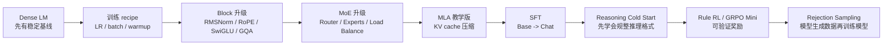

# 02. 阶段路线图

## 总体路线

## 阶段 0：Dense Baseline

先训练最普通的 decoder-only LM。目标不是效果惊艳，而是训练曲线稳定、loss 正常下降、能生成基本文本。

对应代码：

- `configs/tiny_dense.json`
- `model/tinyseek.py`
- `trainer/train_pretrain.py`

## 阶段 1：LR / Batch Size Search

对应 DeepSeek LLM 论文中的训练 recipe 搜索思想。

实验问题：

- 固定 token budget 时，哪个 batch size 更稳定？
- learning rate 太大会不会 loss 抖动？
- warmup 长短对小模型是否明显？

对应代码：

- `experiments/01_lr_batch_grid.json`
- `trainer/sweep_pretrain.py`

## 阶段 2：Block 升级

逐步加入现代 LM 常见组件：

- RMSNorm。
- RoPE。
- SwiGLU。
- GQA。

## 阶段 3：MoE

把 Dense FFN 替换成 routed experts。

实验问题：

- activated params 相近时，MoE 是否更好？
- top-1 和 top-2 routing 有什么差别？
- auxiliary loss 是否能缓解 routing collapse？

## 阶段 4：MLA

第一版只做 educational MLA，不追求完全复刻 DeepSeek-V2 的工程细节。重点是理解：

- 为什么 KV cache 会成为推理瓶颈。
- 为什么低秩 latent KV 可能节省 cache。
- 这种改动为什么需要训练适配。

## 阶段 5-6：SFT / Cold Start / GRPO

对应 DeepSeek-R1：

- R1-Zero：从 pretrained base 直接 RL。
- R1：先 cold-start reasoning SFT，再 RL。

TinySeek 会做小规模可验证任务，例如数学答案匹配、格式奖励、重复惩罚等。
