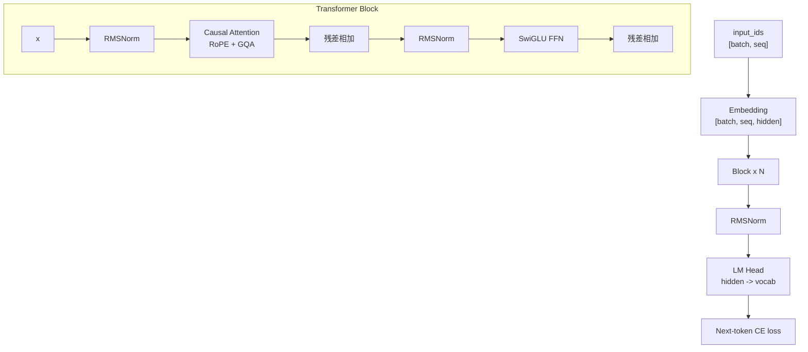

# 12. 代码优先：从零写出最初的 DeepSeek-style Dense LM

这一章是新的代码主线。先不要急着做 MoE、MLA、SFT、GRPO。我们先手写一个最初的 dense language model，把每一块代码和张量形状讲清楚，然后再拿它做实验和升级。

教学版代码：

- [`model/tinyseek_dense.py`](../../model/tinyseek_dense.py)

实验版代码：

- [`model/tinyseek.py`](../../model/tinyseek.py)

你可以这样理解：

- `tinyseek_dense.py`：为了教学，结构更干净，只保留 Dense LM。
- `tinyseek.py`：为了实验，加入 MoE、educational MLA 等可切换结构。

## 总体结构



## 第 1 步：Config

`DenseConfig` 把所有维度集中写出来：

- `vocab_size`：词表大小。
- `max_seq_len`：训练上下文长度。
- `hidden_size`：模型宽度。
- `num_layers`：Transformer block 数量。
- `num_heads`：query heads 数量。
- `num_kv_heads`：key/value heads 数量，也就是 GQA 的关键。
- `ffn_multiplier`：FFN 中间层相对 hidden size 的倍率。

第一课：模型结构很大一部分就是张量形状管理。

## 第 2 步：RMSNorm

RMSNorm 对每个 token 的 hidden vector 做缩放：

```python
scale = torch.rsqrt(x.pow(2).mean(dim=-1, keepdim=True) + eps)
return weight * x * scale
```

DeepSeek LLM 这类现代 decoder-only LM 通常使用 pre-norm：

```text
x = x + attention(norm(x))
x = x + ffn(norm(x))
```

这种写法训练更稳定，也更容易堆深。

## 第 3 步：RoPE

RoPE 负责把位置信息注入 Q/K。教学版代码拆成三步：

- `precompute_rope`：预先构造 cos/sin 表。
- `rotate_half`：对 hidden 维度做成对旋转。
- `apply_rope`：把 cos/sin 应用到 Q/K 上。

关键张量形状：

```text
q, k: [batch, heads, seq, head_dim]
cos:  [seq, head_dim]
```

如果你能把这里的形状想清楚，后面看 GQA、MLA 都会轻松很多。

## 第 4 步：Attention

`Attention` 做的事情是：

1. 把 hidden states 投影成 Q/K/V。
2. reshape 成多头格式。
3. 对 Q/K 应用 RoPE。
4. 如果使用 GQA，就重复 K/V，让它们和 query heads 对齐。
5. 调用 causal scaled dot-product attention。
6. 再投影回 hidden size。

这就是最初的 DeepSeek-style dense baseline attention。MLA 是后面的升级，不应该一开始就上。

## 第 5 步：SwiGLU FFN

Dense FFN 使用 SwiGLU：

```text
down(silu(gate(x)) * up(x))
```

这里的 Dense FFN 后面会被 MoE 替换成多个 expert。也就是说，MoE 不是凭空出现的，它首先是替换 FFN 子层。

## 第 6 步：Causal LM Loss

语言模型预训练就是 next-token prediction：

```python
loss = cross_entropy(logits[:, :-1], labels[:, 1:])
```

这个右移非常重要。模型看到第 `t` 个 token 之前的上下文，预测第 `t+1` 个 token。

## 第 7 步：从代码到实验

Dense 模型跑通以后，实验才有意义：

1. 先扫 LR 和 batch size。
2. 再升级 RMSNorm/RoPE/SwiGLU/GQA 的设置。
3. 再把 Dense FFN 升级成 MoE。
4. 再把普通 K/V 投影升级成 educational MLA。
5. 最后做 SFT、cold start 和 rule RL。

本仓库的学习顺序应该变成：

```text
先写 Dense 代码 -> 训练 Dense baseline -> 做 recipe sweep -> 按 DeepSeek 路线升级模型
```

这条线比“直接运行脚本”更适合真正理解大模型训练。
