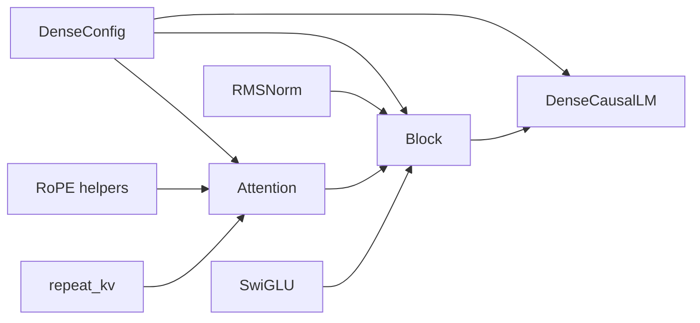
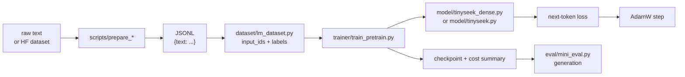
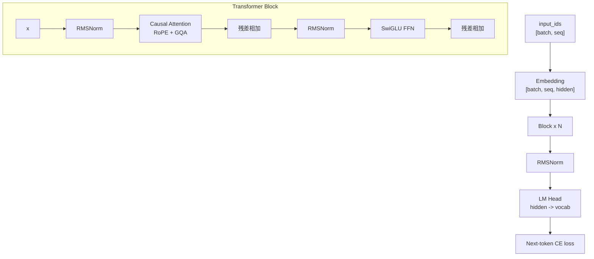

# 12. 代码优先：从零写出最初的 DeepSeek-style Dense LM

这一章是新的代码主线。先不要急着做 MoE、MLA、SFT、GRPO。我们先手写一个最初的 dense language model，把每一块代码和张量形状讲清楚，然后再拿它做实验和升级。

教学版代码：

- [`model/tinyseek_dense.py`](../../model/tinyseek_dense.py)

实验版代码：

- [`model/tinyseek.py`](../../model/tinyseek.py)

你可以这样理解：

- `tinyseek_dense.py`：为了教学，结构更干净，只保留 Dense LM。
- `tinyseek.py`：为了实验，加入 MoE、educational MLA 等可切换结构。

## 整个文件怎么组织

`tinyseek_dense.py` 不是一串零散组件，而是从小积木一路搭到完整语言模型：

```text
DenseConfig
RMSNorm
RoPE helpers: precompute_rope / rotate_half / apply_rope
repeat_kv
Attention
SwiGLU
Block
DenseCausalLM
```

依赖方向是：



这是第一条整体代码经验：数学工具函数在上面，可复用 layer 在中间，完整 model class 在最下面。

放到整个仓库里，第一条训练路径是：



所以第一目标不是“背下每个组件”，而是先看懂一个完整闭环：

```text
文本 -> token ids -> model forward -> 右移 CE loss -> optimizer step
```

## 总体结构



## 第 1 步：Config

`DenseConfig` 把所有维度集中写出来：

- `vocab_size`：词表大小。
- `max_seq_len`：训练上下文长度。
- `hidden_size`：模型宽度。
- `num_layers`：Transformer block 数量。
- `num_heads`：query heads 数量。
- `num_kv_heads`：key/value heads 数量，也就是 GQA 的关键。
- `ffn_multiplier`：FFN 中间层相对 hidden size 的倍率。

第一课：模型结构很大一部分就是张量形状管理。

按默认教学配置：

```text
hidden_size = 192
num_heads = 4
head_dim = hidden_size / num_heads = 48
num_layers = 4
```

所以每个 token 会变成 192 维向量，每个 attention head 处理其中 48 维。

## 第 2 步：RMSNorm

对一个 token 的 hidden vector $x=(x_1,\ldots,x_D)$，RMSNorm 是：

$$
\mathrm{RMS}(x)=\sqrt{\frac{1}{D}\sum_{i=1}^{D}x_i^2+\epsilon},
\qquad y_i=\gamma_i\frac{x_i}{\mathrm{RMS}(x)}.
$$

$D$ 是 hidden size，$\epsilon$ 防止除零，$\gamma\in\mathbb{R}^{D}$ 是可学习
缩放。RMSNorm 不减均值，这是它和 LayerNorm 在公式上的主要区别。

仓库代码就是公式的逐项翻译：

```python
scale = torch.rsqrt(x.pow(2).mean(dim=-1, keepdim=True) + eps)
return weight * x * scale
```

| 数学项 | PyTorch | shape |
| --- | --- | --- |
| $x_i^2$ | `x.pow(2)` | `[B,T,D]` |
| $D^{-1}\sum_i x_i^2$ | `.mean(dim=-1, keepdim=True)` | `[B,T,1]` |
| $1/\sqrt{\cdot}$ | `torch.rsqrt(...)` | `[B,T,1]` |
| $\gamma$ | `nn.Parameter(torch.ones(D))` | `[D]` |
| 最终缩放 | `weight * x * scale` | `[B,T,D]` |

`pow(2)` 是逐元素平方；`dim=-1` 表示每个 token 独立沿 hidden 维求均值；
`keepdim=True` 保留 `[B,T,1]` 以便广播；`nn.Parameter` 让 `weight` 进入
optimizer。以 $x=[3,4]$、$\gamma=[1,1]$ 为例，忽略 epsilon 时
$\mathrm{RMS}(x)=\sqrt{12.5}\approx3.5355$，输出约为
`[0.8485,1.1314]`。

DeepSeek LLM 这类现代 decoder-only LM 通常使用 pre-norm：

```text
x = x + attention(norm(x))
x = x + ffn(norm(x))
```

这种写法训练更稳定，也更容易堆深。

广播、parameter 和 buffer 的通用规则见
[数学到 PyTorch 工具箱](24_math_to_pytorch.md)。

## 第 3 步：RoPE

RoPE 负责把位置信息注入 Q/K。教学版代码拆成三步：

- `precompute_rope`：预先构造 cos/sin 表。
- `rotate_half`：对 hidden 维度做成对旋转。
- `apply_rope`：把 cos/sin 应用到 Q/K 上。

二维向量在位置 $m$ 的旋转公式是：

$$
\begin{bmatrix}x'_1\\x'_2\end{bmatrix}=
\begin{bmatrix}\cos(m\theta)&-\sin(m\theta)\\
\sin(m\theta)&\cos(m\theta)\end{bmatrix}
\begin{bmatrix}x_1\\x_2\end{bmatrix}.
$$

代码用 `x * cos + rotate_half(x) * sin` 并行完成所有二维旋转。
`unsqueeze(0)` 两次把 `[T,d_h]` 变成 `[1,1,T,d_h]`，让同一张位置表广播给
所有 batch 和 head；`.to(x.device, x.dtype)` 则对齐设备和数值类型。

旋转角来自仓库的真实预计算代码：

```python
inv_freq = 1.0 / (base ** (torch.arange(0, head_dim, 2).float() / head_dim))
positions = torch.arange(max_seq_len).float()
freqs = torch.outer(positions, inv_freq)
freqs = torch.cat((freqs, freqs), dim=-1)
return freqs.cos(), freqs.sin()
```

第 $j$ 组频率是 $\theta_j=base^{-2j/d_h}$，位置 $m$ 的角度是 $m\theta_j$。
`torch.arange(0,d_h,2)` 生成偶数维索引；`torch.outer([T],[d_h/2])` 得到所有
位置与频率的外积；`torch.cat` 复制到 `[T,d_h]`，匹配本实现
`x.chunk(2,dim=-1)` 的前后半维配对布局；`.cos()`、`.sin()` 是逐元素函数。
`register_buffer(...,persistent=False)` 让表随模型移动到 GPU，但不训练、不写
checkpoint。

关键张量形状：

```text
q, k: [batch, heads, seq, head_dim]
cos:  [seq, head_dim]
```

如果你能把这里的形状想清楚，后面看 GQA、MLA 都会轻松很多。

## 第 4 步：Attention

`Attention` 做的事情是：

1. 把 hidden states 投影成 Q/K/V。
2. reshape 成多头格式。
3. 对 Q/K 应用 RoPE。
4. 如果使用 GQA，就重复 K/V，让它们和 query heads 对齐。
5. 调用 causal scaled dot-product attention。
6. 再投影回 hidden size。

对应数学公式：

$$Q=XW_Q^T,\quad K=XW_K^T,\quad V=XW_V^T,$$

$$
\mathrm{Attention}(Q,K,V)=
\mathrm{softmax}\left(\frac{QK^T}{\sqrt{d_h}}+M_{causal}\right)V.
$$

这里 $W_Q,W_K,W_V$ 指 `nn.Linear.weight`，PyTorch 保存为 `[D_{out},D_{in}]`，
所以公式带转置。`nn.Linear` 只改变最后一维；`view` 拆出 head 维，
`transpose(1,2)` 再得到 attention API 使用的 `[B,H,T,d_h]`。

这就是最初的 DeepSeek-style dense baseline attention。MLA 是后面的升级，不应该一开始就上。

读 `Attention.forward` 的时候，要按 shape 读：

```python
bsz, seq_len, _ = x.shape
q = self.q_proj(x).view(bsz, seq_len, self.num_heads, self.head_dim).transpose(1, 2)
k = self.k_proj(x).view(bsz, seq_len, self.num_kv_heads, self.head_dim).transpose(1, 2)
v = self.v_proj(x).view(bsz, seq_len, self.num_kv_heads, self.head_dim).transpose(1, 2)
```

输入是：

```text
x: [batch, seq, hidden]
```

投影和 reshape 之后：

```text
q: [batch, num_heads, seq, head_dim]
k: [batch, num_kv_heads, seq, head_dim]
v: [batch, num_kv_heads, seq, head_dim]
```

当 `num_kv_heads < num_heads` 时，`repeat_kv` 会复制 K/V，让每个 query head 都能 attend 到对应的 K/V。如果二者相等，`repeat_kv` 什么都不做。

`repeat_kv` 先用 `None` 插入重复轴，再用 `expand` 创建广播视图，最后用
`reshape` 合并 KV head 与重复轴。GQA 共享的是 K/V 参数和缓存，不会减少 query
head。仓库随后调用：

```python
F.scaled_dot_product_attention(q, k, v, is_causal=True, dropout_p=...)
```

这个 fused API 仍然完成缩放、causal mask、softmax、dropout 和乘 $V$，只是可在
GPU 上选择融合内核。`is_causal=True` 阻止位置 $t$ 看到未来 token。该函数不会
自动读取 module 的 train/eval 状态，因此评测时代码显式把 `dropout_p` 设为 0。

attention 之后再变回：

```python
y = y.transpose(1, 2).contiguous().view(bsz, seq_len, -1)
return self.o_proj(y)
```

输出重新回到 `[batch, seq, hidden]`。这个 shape 不变量让下一个 Transformer block 可以继续处理它。

## 第 5 步：SwiGLU FFN

Dense FFN 使用 SwiGLU：

```text
down(silu(gate(x)) * up(x))
```

公式是：

$$
g=XW_g^T,\quad u=XW_u^T,\quad
\mathrm{SwiGLU}(X)=\left(\mathrm{SiLU}(g)\odot u\right)W_d^T,
$$

其中 $\mathrm{SiLU}(z)=z\sigma(z)$，$\odot$ 是逐元素乘法。对应代码：

```python
return self.down(F.silu(self.gate(x)) * self.up(x))
```

shape 是 `[B,T,D] -> 两个 [B,T,D_ff] -> [B,T,D_ff] -> [B,T,D]`。
`F.silu` 没有参数，三个 `nn.Linear` 才有；星号不能换成矩阵乘法 `@`。

这里的 Dense FFN 后面会被 MoE 替换成多个 expert。也就是说，MoE 不是凭空出现的，它首先是替换 FFN 子层。

MoE 不是替换整个模型。在这条教程路线里，MoE 首先替换的是 FFN 子层：

```text
Dense block: attention + dense SwiGLU FFN
MoE block:   attention + routed SwiGLU experts
```

## 第 6 步：Block

`Block` 是组件第一次组成 Transformer layer 的地方：

```python
x = x + self.attn(self.attn_norm(x))
x = x + self.ffn(self.ffn_norm(x))
return x
```

这是 pre-norm residual 结构。shape 不变：

```text
[batch, seq, hidden] -> [batch, seq, hidden]
```

一个 block 会改变 token 向量内部的信息，但保持外部 shape 稳定。正因为这样，`DenseCausalLM` 才能用循环堆很多层。

## 第 7 步：DenseCausalLM

`DenseCausalLM` 是完整模型。它拥有：

```python
self.embed = nn.Embedding(config.vocab_size, config.hidden_size)
self.blocks = nn.ModuleList([Block(config) for _ in range(config.num_layers)])
self.norm = RMSNorm(config.hidden_size)
self.lm_head = nn.Linear(config.hidden_size, config.vocab_size, bias=False)
```

完整 forward 很短，因为每个子模块已经把自己的事情封装好了：

```python
x = self.embed(input_ids)
for block in self.blocks:
    x = block(x)
logits = self.lm_head(self.norm(x))
```

逐行读就是：

1. `input_ids` 是整数 token ID，还不是向量。
2. `self.embed(input_ids)` 把每个 token ID 变成一个可学习的 hidden vector。
3. `for block in self.blocks` 循环不断用 attention 混合上下文，再用 FFN 改造每个 token vector。
4. 最后的 `RMSNorm` 在预测前稳定 hidden states。
5. `lm_head` 把 hidden vector 映射回词表分数。

端到端 shape：

```text
input_ids: [batch, seq]
embedding output: [batch, seq, hidden]
block output: [batch, seq, hidden]
logits: [batch, seq, vocab]
```

如果取一个小例子，`batch=2`、`seq=128`、`hidden=192`、`vocab=260`：

```text
input_ids: [2, 128]
x after embedding: [2, 128, 192]
x after every block: [2, 128, 192]
logits: [2, 128, 260]
```

预训练时，模型不是只输出一个答案。它会在序列中每个位置都输出一个词表分布。

这一行是权重绑定：

```python
self.lm_head.weight = self.embed.weight
```

权重绑定可以节省参数，也让同一张 token 表同时负责输入查表和输出预测。
它不是复制数值，而是让两个属性引用同一个 `Parameter`，因此输入 embedding 与
输出 head 两条路径的梯度会累加到同一张矩阵上。

## 第 8 步：Causal LM Loss

语言模型预训练就是 next-token prediction：

```python
loss = cross_entropy(logits[:, :-1], labels[:, 1:])
```

单个位置的公式是：

$$
\mathcal{L}_t=-\log\frac{\exp z_{t,y_{t+1}}}
{\sum_{v=1}^{V}\exp z_{t,v}}.
$$

真实代码把 token 位置展平：

```python
shift_logits = logits[:, :-1].reshape(-1, logits.size(-1))  # [B*(T-1),V]
shift_labels = labels[:, 1:].reshape(-1)                    # [B*(T-1)]
loss = F.cross_entropy(shift_logits, shift_labels, ignore_index=-100)
```

`reshape(-1,V)` 让 PyTorch 推导第一维；target 是整数类别 id，不是 one-hot。
`F.cross_entropy` 已经融合稳定的 log-softmax 与 negative log likelihood，前面
不要再做 softmax。

这个右移非常重要。模型看到第 `t` 个 token 之前的上下文，预测第 `t+1` 个 token。

右移的含义是：

```text
position 0 的 logits 预测 position 1 的 label
position 1 的 logits 预测 position 2 的 label
...
```

pad label 是 `-100`，PyTorch cross entropy 会忽略它们。
例如 `[BOS,A,B,EOS]` 产生 `BOS -> A`、`A -> B`、`B -> EOS` 三个监督配对；
最后一个 logit 没有下一个 token，所以被 `[:, :-1]` 去掉。

## 第 9 步：训练脚本如何使用模型

训练器只依赖一个很小的接口：

```python
out = model(input_ids, labels)
loss = out["loss"]
loss.backward()
optimizer.step()
```

真实训练脚本里还有 AMP、梯度累积、验证、checkpoint 和成本记录。但概念核心就是：

```python
for input_ids, labels in loader:
    input_ids = input_ids.to(device)
    labels = labels.to(device)

    out = model(input_ids, labels)
    loss = out["loss"]

    optimizer.zero_grad(set_to_none=True)
    loss.backward()
    optimizer.step()
```

`trainer/train_pretrain.py` 里多出来的部分，是为了让这个循环真正可用：

- cosine learning-rate schedule 会每一步调整 `lr`。
- AMP 在 NVIDIA GPU 上减少显存、提升速度。
- gradient clipping 防止训练中出现不稳定尖峰。
- validation 用 held-out text 检查训练 loss 的下降能不能迁移。
- cost logging 记录 GPU 时间、峰值显存、token 数和粗略 FLOPs。

这种分离很重要：

- `model/tinyseek_dense.py` 定义数学结构。
- `dataset/lm_dataset.py` 构造 `input_ids` 和 `labels`。
- `trainer/train_pretrain.py` 负责优化、AMP、checkpoint 和成本记录。

只要这个接口跑通，内部就可以继续升级：dense FFN 换 MoE，普通 KV 换 MLA，预训练数据换 SFT 数据。

## 第 10 步：从代码到实验

Dense 模型跑通以后，实验才有意义：

1. 先扫 LR 和 batch size。
2. 再升级 RMSNorm/RoPE/SwiGLU/GQA 的设置。
3. 再把 Dense FFN 升级成 MoE。
4. 再把普通 K/V 投影升级成 educational MLA。
5. 最后做 SFT、cold start 和 rule RL。

本仓库的学习顺序应该变成：

```text
先写 Dense 代码 -> 训练 Dense baseline -> 做 recipe sweep -> 按 DeepSeek 路线升级模型
```

这条线比“直接运行脚本”更适合真正理解大模型训练。

<!-- tinyseek-nav -->

---

上一篇: [数学到 PyTorch](24_math_to_pytorch.md) | [教程目录](README.md) | 下一篇: [Dense 到 DeepSeekMoE](21_from_dense_to_deepseek_moe.md)
