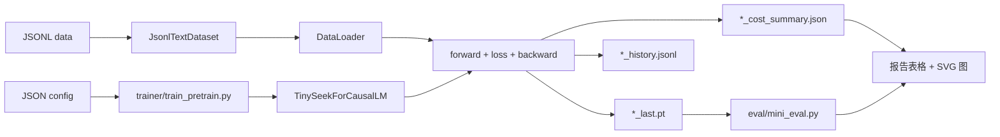

# 16. 训练主循环：从 Config 到 Checkpoint

这一章讲完整训练程序，不只讲模型组件。目标是看懂一个 TinySeek 实验如何从
JSON config 开始，最后变成 checkpoint、eval 文件和成本报告。

主要文件：

- [`configs/tiny_dense.json`](../../configs/tiny_dense.json)
- [`dataset/lm_dataset.py`](../../dataset/lm_dataset.py)
- [`trainer/train_pretrain.py`](../../trainer/train_pretrain.py)
- [`trainer/train_sft.py`](../../trainer/train_sft.py)
- [`trainer/train_grpo.py`](../../trainer/train_grpo.py)
- [`scripts/generate_v1_report_assets.py`](../../scripts/generate_v1_report_assets.py)

## 整体程序流



本仓最核心的契约是：

```text
config + JSONL data -> training script -> checkpoint + history + cost summary
checkpoint + JSONL data -> mini eval -> report assets
```

这个契约稳定以后，每章只改一个变量：模型大小、LR、batch size、MoE、MLA、
SFT 数据，或者 GRPO reward。

## Step 1：Config 就是实验卡片

一个 config 分两块：

```json
{
  "run_name": "tiny_dense",
  "model": {
    "max_seq_len": 128,
    "hidden_size": 192,
    "num_layers": 4
  },
  "train": {
    "batch_size": 16,
    "learning_rate": 0.0006,
    "max_steps": 200,
    "out_dir": "out"
  }
}
```

`model` 回答：我们训练什么结构？

`train` 回答：我们怎么优化它？

DeepSeek-style 实验之所以能被读懂，是因为每次 run 都有一张小实验卡。做
batch/LR sweep 时，只改 `batch_size` 和 `learning_rate`。做 MoE 时，主要改
`use_moe`、`num_experts`、`top_k`。做 MLA 时，主要改 `attention_impl`。

## Step 2：JSONL 让数据可审计

预训练使用：

```json
{"text": "A plain text sample."}
```

SFT 使用：

```json
{"prompt": "Explain RMSNorm.", "response": "RMSNorm rescales hidden states by their root mean square."}
```

GRPO mini 使用：

```json
{"prompt": "12+9", "answer": "21"}
```

本仓一开始故意不用复杂 packed-data pipeline，而是先用 JSONL。这样第一阶段
学习重点会落在模型代码和训练代码上。生产级数据流水线可以后面再补。

## Step 3：Dataset 产出 `input_ids` 和 `labels`

预训练里，`JsonlTextDataset.__getitem__` 做的是：

```text
text -> byte token ids -> pad/truncate -> input_ids
labels = input_ids，并把 pad label 改成 -100
```

模型内部再做 shift：

```text
logits[:, :-1] 预测 labels[:, 1:]
```

SFT 里，`JsonlInstructionDataset` 会把样本格式化成：

```text
### Instruction
prompt

### Response
response
```

prompt token 会被 mask 掉，只有 response token 参与 loss。这就是“冷启动数据
先让模型学会更规整推理/回答格式”的代码含义：不是让模型继续预测 prompt，
而是让它学会在这个格式下生成 response。

## Step 4：Trainer 构建运行时对象

`trainer/train_pretrain.py` 的顺序很固定：

1. 读取 config。
2. 设置随机种子。
3. 如果可用就选择 `cuda`。
4. 创建 tokenizer。
5. 构建 `TinySeekConfig`。
6. 创建 `TinySeekForCausalLM`。
7. 解析 AMP dtype。
8. 构建 dataset 和 validation split。
9. 构建 optimizer。
10. 准备输出路径。

这部分故意写得朴素。很多训练 bug 都来自这部分太隐式。TinySeek 把它摊开，
读者才能放心改实验。

## Step 5：一次优化步骤

核心 loop 是：

```python
out = model(input_ids, labels)
loss = out["loss"] + out["aux_loss"]
scaled_loss = loss / grad_accum_steps
scaler.scale(scaled_loss).backward()
```

累计到足够步数后：

```python
scaler.unscale_(optimizer)
torch.nn.utils.clip_grad_norm_(model.parameters(), grad_clip)
scaler.step(optimizer)
scaler.update()
optimizer.zero_grad(set_to_none=True)
```

### 公式对应：梯度累积

设一次有效 batch 被拆成 $G$ 个 micro-batch，每个 loss 是 $L_g$。我们希望优化：

$$L=\frac{1}{G}\sum_{g=1}^{G}L_g,$$

所以每个 micro-batch 都执行：

```python
scaled_loss = loss / grad_accum_steps
scaler.scale(scaled_loss).backward()
```

PyTorch 的 `.backward()` 默认把梯度**累加**到 parameter 的 `.grad`，不会覆盖旧值，
因此前 $G-1$ 次不能 `zero_grad()`。除以 $G$ 只有在各 micro-batch 权重相同（包括
未被忽略的 target token 数相同）时，才严格等于大 batch 的样本均值。若有效 token
数是 $n_g$，精确 token 加权目标应为：

$$L=\frac{\sum_g n_gL_g}{\sum_g n_g}.$$

TinySeek 使用更简单的 micro-batch mean 再平均；固定长度预训练时是实用近似，但
padding 与 SFT mask 会让它和“所有有效 token 的统一均值”略有不同。
训练器把 `accum_count = 0` 放在外层 `while` 之前，因此一个 DataLoader 尾部不足
$G$ 个的 micro-batch 会在下一轮继续累计；不会丢失尾部梯度或让小数据集卡住。

### 公式对应：AMP 与梯度裁剪

float16 下很小的梯度可能下溢。`GradScaler` 先计算 $sL$ 的梯度：

$$\nabla_\theta(sL)=s\nabla_\theta L,$$

再由 `scaler.unscale_(optimizer)` 除回 $s$。必须先 unscale 再裁剪，否则
`clip_grad_norm_` 看到的是人为放大的梯度。

若所有参数梯度的总范数为 $\lVert g\rVert_2$，裁剪近似执行：

$$g\leftarrow g\cdot\min\left(1,\frac{c}{\lVert g\rVert_2}\right),$$

其中 $c=grad\_clip$。`clip_grad_norm_` 末尾有下划线，表示原地修改 `.grad`。
`scaler.step(optimizer)` 在检测到 inf/NaN 时可以跳过参数更新，`scaler.update()`
再调整下一步 scale。最后 `zero_grad(set_to_none=True)` 把 `.grad` 设为 `None`，
避免下一次 optimizer step 混入上一批梯度并减少填零开销。

正确顺序必须是：

```text
autocast forward -> scaled backward -> unscale -> clip -> optimizer step
-> scaler update -> router-bias feedback -> zero grad
```

`autocast_context` 只改变适合混合精度的算子 dtype；模型参数仍由 optimizer 管理，
loss 和敏感归约也不应被手动全部强制成 float16。

这里的重点是 `aux_loss`。Dense run 的 auxiliary loss 是 0。MoE run 会额外加
routing balance loss。这样同一个 trainer 就能训练 dense 和 MoE。

## Step 6：Learning Rate 也是实验的一部分

每一步都会调用：

```python
lr = cosine_lr(step, max_steps, learning_rate, warmup_steps, min_lr_ratio)
```

这对 DeepSeek LLM 风格的 LR/batch sweep 很重要：比较不同 LR 时，schedule
必须可控、可记录。

## Step 7：Validation、History 和 Checkpoint

到 `eval_interval` 时，trainer 会写一行 JSONL 到：

```text
out/<run_name>_history.jsonl
```

示例：

```json
{"run_name": "v1_dense35", "step": 200, "train_loss": 1.01, "val_loss": 0.99, "learning_rate": 0.00006}
```

到 `save_interval` 时，trainer 会写：

```text
out/<run_name>_last.pt
```

checkpoint 里有：

- config；
- model state dict；
- 当前 step。

history 文件用于画曲线。checkpoint 用于生成、SFT、GRPO 和 eval。

## Step 8：成本和 FLOPs 账本

每个训练脚本都会写：

```text
out/<run_name>_cost_summary.json
```

里面包括：

- GPU 名称和总显存；
- elapsed seconds 和 GPU hours；
- 租卡单价；
- 估算费用；
- 总参数量；
- 激活参数量估计；
- 峰值 allocated/reserved 显存；
- 可用时记录估算 tokens 和粗略训练 FLOPs。

这不是完美 profiler，而是稳定的实验账本。核心是让每个训练结论都带着成本。

## Step 9：Mini Eval 把 Checkpoint 变成可比较结果

`eval/mini_eval.py` 读取 checkpoint，输出：

- held-out JSONL 文本上的 perplexity；
- 加法 exact-match accuracy；
- 格式遵循分数。

这个 eval 很小，但能抓住常见现象：

- train loss 降了，但 held-out PPL 变差；
- SFT 学到了格式，但损害 base text perplexity；
- GRPO 有 reward，但没真正解出目标任务。

## Step 10：报告资产

训练和 eval 之后运行：

```bash
python scripts/generate_v1_report_assets.py --run_dir experiments/v1_4090_plan
```

它会合并：

- `cost_summary.csv`；
- `eval_*.json`。

然后生成：

- `auto_summary.md`；
- `auto_summary_zh.md`；
- PPL、显存、成本、sweep loss、VRAM-vs-PPL 的 SVG 图。

这样 GitHub 教程有图，但不需要额外安装绘图库。

## 它如何支撑主线

训练程序稳定，研究问题逐章变化：

| 阶段 | 改什么 | 保持什么 |
| --- | --- | --- |
| Dense baseline | 模型规模 | JSONL、trainer、eval、成本报告 |
| LR/batch sweep | LR 和 batch size | 模型、数据、eval |
| MoE | FFN 实现 | trainer 契约 |
| MLA | attention 实现 | trainer 契约 |
| SFT | 数据集和 label masking | 模型加载、优化器 |
| GRPO mini | objective 和 reward | checkpoint/eval/report 习惯 |

这就是本教程的核心教学法：不要一次移动所有变量。一次只改一个轴，测清楚，
再进入下一章。

## 下一章

继续阅读：[代码导读](15_code_walkthrough.md)，或回到
[教程目录](README.md)。

<!-- tinyseek-nav -->

---

上一篇: [DeepSeek-V2 到 DeepSeek-V3](23_from_v2_to_deepseek_v3.md) | [教程目录](README.md) | 下一篇: [代码导读](15_code_walkthrough.md)
