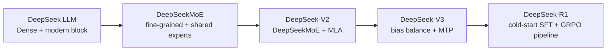
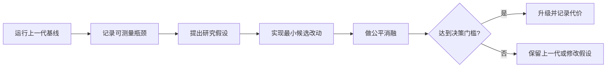

# 20. 一条代码主线看懂 DeepSeek 架构演进

这一章先给你一张地图。后面三章不会突然扔出几个孤立组件，而是持续改造同一个 decoder-only language model：输入、Embedding、残差连接、LM Head 和 next-token loss 始终都在，只替换需要升级的子层。

## 你最终会写出什么

| 代际 | 完整教学代码 | 相比上一代只改什么 | 主要问题 |
| --- | --- | --- | --- |
| DeepSeek LLM | [`stage0_deepseek_llm.py`](../../model/stages/stage0_deepseek_llm.py) | 起点 | 写出稳定的 Dense decoder-only LM |
| DeepSeekMoE | [`stage1_deepseek_moe.py`](../../model/stages/stage1_deepseek_moe.py) | Dense FFN -> routed + shared experts | 增加参数容量，不让每个 token 激活全部参数 |
| DeepSeek-V2 | [`stage2_deepseek_v2.py`](../../model/stages/stage2_deepseek_v2.py) | GQA/MHA -> educational MLA | 压缩生成时不断增长的 KV cache |
| DeepSeek-V3 | [`stage3_deepseek_v3.py`](../../model/stages/stage3_deepseek_v3.py) | 路由 bias + MTP | 减少平衡损失干扰，增加未来 token 训练信号 |

正式训练继续使用 [`model/tinyseek.py`](../../model/tinyseek.py)。四个 stage 文件负责“把代码教明白”，统一模型负责“用配置做公平实验”。

## 不变的骨架

四代模型始终遵守同一个外部数据流：

```text
input_ids [B, T]
  -> token embedding [B, T, D]
  -> N x Transformer block [B, T, D]
  -> final RMSNorm [B, T, D]
  -> tied LM head [B, T, V]
  -> shifted next-token cross entropy
```

因此阅读相邻阶段时，不要重新从第一行背到最后一行。先问：`Block` 里的 attention 变了吗？FFN 变了吗？训练目标多了什么？其余代码应当保持稳定。

## 真正的论文时间线



这里有一个很容易混淆的点：R1 主要是训练路线升级，不是把 Transformer block 换成另一种骨架。R1-Zero 从 pretrained base 直接做 RL；完整 R1 则增加 cold-start SFT、RL、rejection sampling、再次 SFT 和后续 RL。仓库的后训练代码见 [`19_posttraining_code_walkthrough.md`](19_posttraining_code_walkthrough.md)。

## 从“论文目录”改成“实验驱动升级”

本教程不会把下一代结构预设成必然正确。每次升级都按同一条研究闭环推进：



这里必须保持历史严谨：公开论文能说明 DeepSeek 针对哪些问题提出了方法、做了哪些消融，却通常不能证明团队内部一定先看到某一张公开表格才产生某个想法。因此本仓复现的是一种**可检验的研究路径**，不是虚构 DeepSeek 未公开的发明过程。

## 四代研究卡

| 阶段 | 可测量瓶颈 | 研究假设 | 公平实验 | 决策门槛 | 证据状态 |
| --- | --- | --- | --- | --- | --- |
| Dense recipe | 相同 token budget 下 loss 对 LR/batch 很敏感 | 先找到稳定 recipe，结构对照才有意义 | LR x batch sweep | 选 validation LM loss 最低且训练稳定的区域 | v1 已实测；正式多 seed 仍可补 |
| Dense -> DeepSeekMoE | 扩宽 Dense FFN 时容量和每 token 计算一起增长 | 细粒度 routed experts 增加组合，共享专家承接共通知识 | 粗粒度 MoE -> 细粒度 MoE -> shared isolation | 主 LM loss 不明显退化、无 routing collapse，且容量/激活量账本符合设计 | 配置与代码完成，GPU 待验证 |
| MoE -> V2 | GQA cache 仍随层数、序列和 batch 线性增长 | 低秩 KV latent 加解耦 RoPE 可减少应缓存元素 | GQA -> 朴素低秩 KV -> educational MLA | 理论 cache 明显下降且 validation PPL 不显著恶化；真实吞吐结论必须等 cached decoding | 理论量可验证，质量对照待 GPU，真实 cache kernel 未实现 |
| V2 -> V3 | aux loss 可能干扰 LM；单步预测信号有限 | selection bias 可控负载而不直接改 affinity；MTP 提供更远监督 | aux vs bias；MTP off vs on | 专家负载不塌缩，主 LM/PPL 至少不劣，新增成本可接受 | 代码与实验设计完成，GPU 待验证 |

“决策门槛”必须在运行前写下。否则看到结果后再改成功标准，很容易把任何数字都解释成支持升级。单个 seed 的结果只用于排错和形成下一轮假设；正式结论至少报告多个 seed 的均值和波动。

## 每代为什么出现

### DeepSeek LLM：先把 Dense 基座和 recipe 做稳

第一代公开 DeepSeek LLM 大体沿用 LLaMA 风格：Pre-Norm、RMSNorm、RoPE、SwiGLU，67B 使用 GQA。论文还系统研究 batch size、learning rate 和 compute 的关系。它不是一个“老式 Transformer”，而是后续升级的现代 Dense 基座。

### DeepSeekMoE：参数容量和每 token 计算量不必一起增长

Dense FFN 对每个 token 都运行同一组参数。MoE 放入更多 FFN expert，但 router 只选择少数几个。DeepSeekMoE 进一步强调细粒度专家和 shared expert isolation，希望通用知识走共享路径、可分化知识走 routed experts。

### DeepSeek-V2：训练算得动，还要生成得动

自回归生成会缓存历史 token 的 K/V。上下文越长、batch 越大，KV cache 越容易成为瓶颈。MLA 把可缓存的 KV 信息压到低秩 latent，再在计算 attention 时重建 content K/V，并把 RoPE 位置路径单独处理。

### DeepSeek-V3：平衡路由和主任务不应互相拉扯

较强的 auxiliary balance loss 会迫使 router 均匀，但它也可能偏离语言建模目标。V3 使用不参与 affinity 权重的 selection bias 调整专家选择；同时加入 Multi-Token Prediction，让一个位置除预测下一个 token 外，还通过额外模块学习更远的未来 token。

## 论文、代码和实验是三层证据

每章都会把结论拆成三栏：

| 层级 | 含义 |
| --- | --- |
| 论文原结论 | DeepSeek 在论文规模、数据和基础设施下得到的结果 |
| TinySeek 已实现 | 代码路径、shape、loss 和统计已经可运行 |
| TinySeek 已实测/待上卡 | 本仓自己的对照数字；没有跑就明确写“待上卡” |

不要把“实现了公式形状”写成“复现了论文性能”。尤其是 MLA：当前训练 forward 展示了 latent 路径与理论缓存，但还没有生产级 cached decoding kernel。

## 先运行四阶段体检

安装 PyTorch 后运行：

```bash
python tests/stage_models_test.py
python scripts/inspect_stage_models.py --out out/stage_model_inspection.json
```

第二条命令会逐代打印：

- logits shape；
- total / activated parameters；
- 每层每 token 的理论 KV cache 元素数；
- `loss`、`aux_loss`、`mtp_loss` 等字段。

它只证明代码接口成立。要比较质量和成本，请使用 [`configs/architecture_lab/`](../../configs/architecture_lab/) 和[架构演进实验计划](../../experiments/06_architecture_evolution_plan_zh.md)。

## 推荐学习动作

每代都按这五步走：

1. 先跑上一代，记住输入输出 shape。
2. 阅读新一代的 `Config`，找出新增字段。
3. 找到被替换的子层和新的返回值。
4. 跑 matched config，只改变一个变量。
5. 在实验报告中同时记录收益、代价和失败案例。

下一章先从 Dense FFN 开刀：你会看到一个 token 如何被 router 分给两个专家，以及为什么“总参数很多”不等于“每次计算都很贵”。

<!-- tinyseek-nav -->

---

上一篇: [DeepSeek 语言模型论文地图](01_deepseek_lm_paper_map.md) | [教程目录](README.md) | 下一篇: [代码优先 Dense LM](12_code_first_dense_lm.md)
