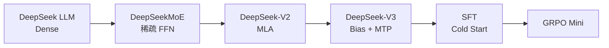

# 教程目录

中文 | [English](../README.md)

TinySeek-Lab 的英文教程放在 `docs/`，中文教程放在 `docs/zh/`。两套文档走同一条训练路线，但中文版本会写得更像讲义，解释会更展开一些。

## 主线阅读顺序

1. [项目范围](00_project_scope.md)
2. [DeepSeek 语言模型论文地图](01_deepseek_lm_paper_map.md)
3. [四代架构演进总览](20_architecture_evolution_overview.md)
4. [代码优先：从零写 DeepSeek LLM Dense 基线](12_code_first_dense_lm.md)
5. [从 Dense LM 改到 DeepSeekMoE](21_from_dense_to_deepseek_moe.md)
6. [从 DeepSeekMoE 改到 DeepSeek-V2](22_from_moe_to_deepseek_v2.md)
7. [从 DeepSeek-V2 改到 DeepSeek-V3](23_from_v2_to_deepseek_v3.md)
8. [训练主循环：从 Config 到 Checkpoint](16_training_loop_from_config_to_checkpoint.md)
9. [代码导读](15_code_walkthrough.md)
10. [阶段 0：训练 Dense Baseline](02_stage0_dense_baseline.md)
11. [阶段 1：LR 和 Batch Size 搜索](03_stage1_lr_batch_search.md)
12. [组件消融：MLP 和 Attention](04_stage2_block_upgrades.md)
13. [MoE 实验课](05_stage3_moe.md)
14. [MLA 实验课](06_stage4_mla.md)
15. [SFT 和 Reasoning Cold Start](07_stage5_sft_cold_start.md)
16. [Rule-Based GRPO Mini](08_stage6_grpo_mini.md)
17. [后训练代码细读](19_posttraining_code_walkthrough.md)
18. [仓库路线图](09_repository_roadmap.md)
19. [实验报告模板](10_experiment_report_template.md)
20. [MiniMind 风格结构说明](11_minimind_structure_notes.md)
21. [GPU 选择与成本记录](13_gpu_cost_tracking.md)
22. [v1 训练执行手册](14_v1_training_runbook.md)
23. [向 MiniMind 学什么](17_minimind_quality_notes.md)
24. [上卡前最终 Checklist](18_gpu_fill_only_checklist.md)

补充文档：

- [总训练路线图](02_training_roadmap.md)
- [当前进度](04_current_progress.md)

## 实验报告

- [3-seed 架构实测与决策](../../experiments/architecture_lab_runs/report_zh.md)
- [正式训练与后训练报告](../../experiments/gpu_completion_runs/report_zh.md)
- [RTX 4090 v1 正式结果](../../experiments/05_4090_v1_results_zh.md)
- [v1 自动汇总表和图表](../../experiments/v1_4090_plan/auto_summary_zh.md)
- [实验报告中心](../../experiments/README_zh.md)
- [DeepSeek 架构演进公平实验计划与门槛](../../experiments/06_architecture_evolution_plan_zh.md)

## 一图看懂

