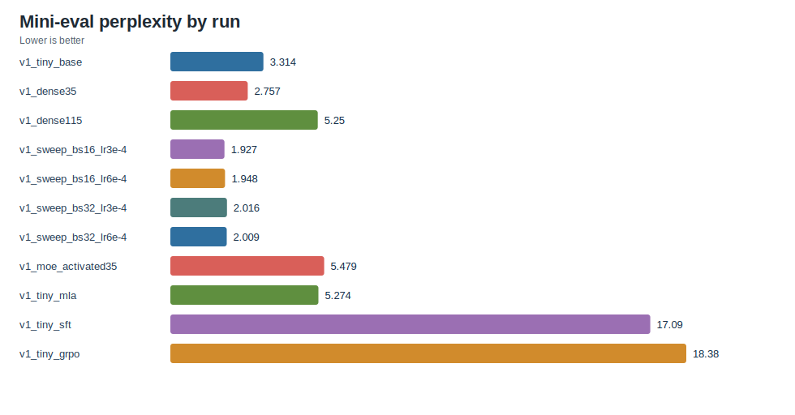
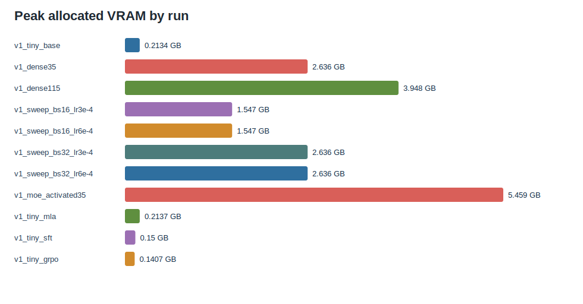
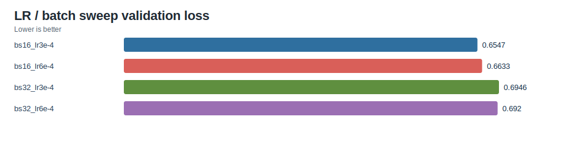
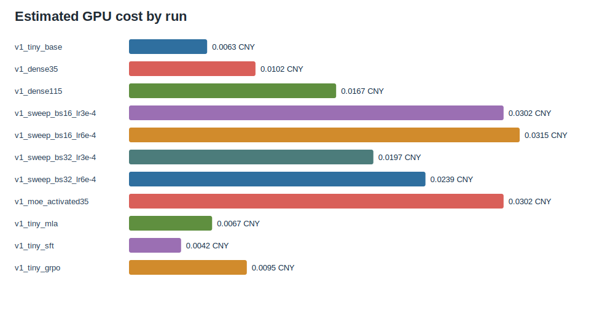
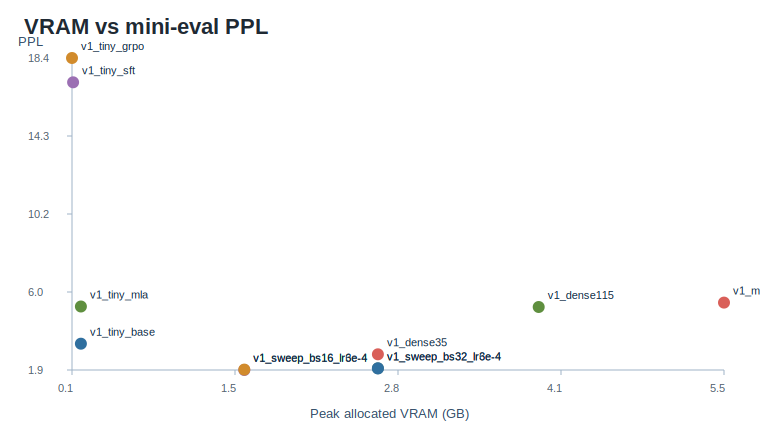

# RTX 4090 v1 Results

This is the first full TinySeek-Lab v1 run on a paid RTX 4090 instance.

The goal was not model quality. The goal was to verify that the repository can
run the complete tutorial path end to end on real text data:

```text
TinyStories -> tiny base -> dense 35M/115M -> LR/batch sweep
-> MoE -> MLA -> SFT -> GRPO mini -> mini eval -> cost summary
```

## Environment

| Item | Value |
| --- | --- |
| Date | 2026-07-08 |
| GPU | NVIDIA GeForce RTX 4090, 24 GB |
| Driver / CUDA | Driver 580.76.05, CUDA 13.0 |
| PyTorch | 2.8.0+cu128 |
| Data | `roneneldan/TinyStories`, 50,000 JSONL rows |
| Dataset access note | `huggingface.co` was unreachable; `HF_ENDPOINT=https://hf-mirror.com` worked |
| Hourly rate | 2.18 CNY/hour |

Run command:

```bash
python scripts/run_4090_v1.py --execute --skip_data_prepare --hourly_rate 2.18
```

The data-preparation step was run separately through the Hugging Face mirror.

## Cost Summary

| Run | Steps | Params | Activated Params | Tokens | Peak GB | GPU Hours | Cost | Val Loss |
| --- | ---: | ---: | ---: | ---: | ---: | ---: | ---: | ---: |
| `v1_tiny_base` | 200 | 2.41M | 2.41M | 0.41M | 0.21 | 0.0029 | 0.0063 CNY | 1.1739 |
| `v1_dense35` | 200 | 33.70M | 33.70M | 1.64M | 2.64 | 0.0047 | 0.0102 CNY | 0.9962 |
| `v1_dense115` | 100 | 113.47M | 113.47M | 0.41M | 3.95 | 0.0076 | 0.0167 CNY | 1.6393 |
| `v1_sweep_bs16_lr3e-4` | 1221 | 33.70M | 33.70M | 5.00M | 1.55 | 0.0138 | 0.0302 CNY | 0.6547 |
| `v1_sweep_bs16_lr6e-4` | 1221 | 33.70M | 33.70M | 5.00M | 1.55 | 0.0144 | 0.0315 CNY | 0.6633 |
| `v1_sweep_bs32_lr3e-4` | 611 | 33.70M | 33.70M | 5.01M | 2.64 | 0.0090 | 0.0197 CNY | 0.6946 |
| `v1_sweep_bs32_lr6e-4` | 611 | 33.70M | 33.70M | 5.01M | 2.64 | 0.0110 | 0.0239 CNY | 0.6920 |
| `v1_moe_activated35` | 100 | 235.06M | 84.06M | 0.41M | 5.46 | 0.0138 | 0.0302 CNY | 1.6796 |
| `v1_tiny_mla` | 200 | 2.26M | 2.26M | 0.41M | 0.21 | 0.0031 | 0.0067 CNY | 1.6156 |
| `v1_tiny_sft` | 120 | 2.41M | 2.41M | 0.37M | 0.15 | 0.0019 | 0.0042 CNY | 0.1999 |
| `v1_tiny_grpo` | 30 | 2.41M | 2.41M | 0 | 0.14 | 0.0044 | 0.0095 CNY | N/A |

Total:

- GPU hours: 0.0867
- Estimated cost: 0.19 CNY

Full machine-readable files are in [`experiments/v1_4090_plan`](v1_4090_plan/).
Auto-generated tables and figures are in
[`experiments/v1_4090_plan/auto_summary.md`](v1_4090_plan/auto_summary.md).

## Figures











## Mini Eval

| Run | Eval Loss | PPL | Addition Acc | Format Score |
| --- | ---: | ---: | ---: | ---: |
| `v1_tiny_base` | 1.1981 | 3.3137 | 0.0 | 1.0 |
| `v1_dense35` | 1.0142 | 2.7572 | 0.0 | 1.0 |
| `v1_dense115` | 1.6582 | 5.2500 | 0.0 | 1.0 |
| `v1_sweep_bs16_lr3e-4` | 0.6560 | 1.9270 | 0.0 | 1.0 |
| `v1_sweep_bs16_lr6e-4` | 0.6669 | 1.9482 | 0.0 | 1.0 |
| `v1_sweep_bs32_lr3e-4` | 0.7010 | 2.0157 | 0.0 | 1.0 |
| `v1_sweep_bs32_lr6e-4` | 0.6978 | 2.0093 | 0.0 | 1.0 |
| `v1_moe_activated35` | 1.7009 | 5.4791 | 0.0 | 1.0 |
| `v1_tiny_mla` | 1.6628 | 5.2741 | 0.0 | 1.0 |
| `v1_tiny_sft` | 2.8388 | 17.0945 | 0.0 | 1.0 |
| `v1_tiny_grpo` | 2.9111 | 18.3771 | 0.0 | 1.0 |

## Takeaways

1. The full repository pipeline now runs end to end on an RTX 4090.
2. At a fixed 5M-token budget, `bs16_lr3e-4` was the best sweep run by
   validation loss and mini-eval perplexity.
3. The 35M dense run beat the short 115M dense run because the 115M run had a
   much smaller token budget. This is a useful teaching result: larger models do
   not automatically look better under too little training.
4. The MoE model fit easily on a 4090. It had 235M total parameters and about
   84M activated parameters, peaking at 5.46 GB allocated VRAM.
5. The educational MLA path ran successfully, but its result is not a faithful
   DeepSeek-V2 MLA reproduction. It is a teaching baseline for KV-latent ideas.
6. SFT improved the toy SFT validation loss, but worsened general TinyStories
   perplexity. This is expected because the SFT dataset is tiny and format-heavy.
7. GRPO mini produced non-zero reward (`mean_reward` reached 0.15), but it did
   not solve the arithmetic mini eval. It should be presented as algorithm-shape
   teaching, not serious RL performance.

## Next Actions

- Add a stronger small arithmetic SFT dataset before running GRPO.
- Add a report generator that merges `cost_summary.csv` and `eval_*.json`
  automatically. Done in `scripts/generate_v1_report_assets.py`.
- Add MoE routing histograms and expert-load summaries.
- Run a longer 35M dense baseline if we want a more stable tutorial checkpoint.
