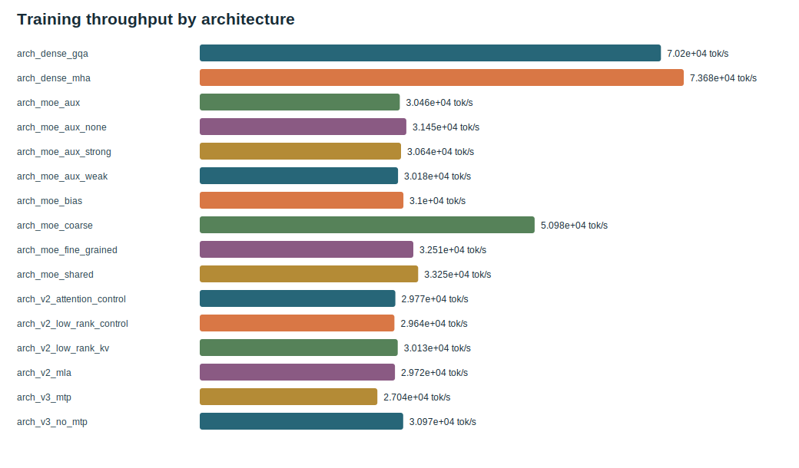

# TinySeek-Lab Experiment Reports

[中文](README_zh.md) | English

This directory is the experiment-report hub for TinySeek-Lab. The tutorial path
is to revisit DeepSeek's language-model research route at a small scale, so each
report should answer:

> Read results in context through the [integrated course](../course/README.md). This directory preserves full tables, raw evidence and reproduction details; the course explains which model change each experiment accepts or rejects.

- What changed: architecture, recipe, data, post-training objective, or eval?
- What did it cost: GPU, GPU hours, rental cost, peak VRAM, rough FLOPs?
- What moved: validation loss, PPL, mini eval, expert load?
- What did we learn, and what should not be overclaimed?

## Main Reports

| Report | Status | What it shows |
| --- | --- | --- |
| [3-seed Architecture Report](architecture_lab_runs/report.md) | Done | 48 runs over 16 configs with mean/std, PPL, throughput, memory, expert load, and stage decisions |
| [Formal Training and Post-Training Report](gpu_completion_runs/report.md) | Done | 35M/115M/MoE runs, LR/batch sweep, direct GRPO, SFT -> GRPO, mini eval, and cost |
| [RTX 4090 v1 Results](05_4090_v1_results.md) | Done | End-to-end TinyStories run through dense, sweep, MoE, MLA, SFT, and GRPO mini |
| [v1 Auto Summary and Figures](v1_4090_plan/auto_summary.md) | Done | PPL, VRAM, cost, sweep loss, and generated SVG figures |
| [v1 Pipeline Smoke Report](03_v1_pipeline_smoke_report.md) | Done | Pretrain -> SFT -> GRPO mini pipeline sanity check |
| [AutoDL 4090 Smoke Report](02_autodl_4090_smoke_report.md) | Done | RTX 4090 environment and minimal training validation |
| [Formal Experiment Plan](04_formal_experiment_plan.md) | Executed; E5 superseded | Preregistered longer-run, MoE, and GRPO comparisons; MLA moved to the matched architecture suite |
| [Fair DeepSeek Architecture Experiments](06_architecture_evolution_plan.md) | 3 seeds done | experiment-driven gates for coarse/fine/shared MoE, aux weights, bias routing, low-rank KV, GQA/MLA, and MTP |
| [GPU Reproduction Runbook](../docs/18_gpu_fill_only_checklist.md) | Verified | Resumable commands from data preparation through report generation |

## Formal Headline

```text
TinyStories -> tiny base -> dense 35M/115M -> LR/batch sweep
-> MoE -> MLA -> SFT -> GRPO mini -> mini eval -> cost and figures
```

- The ledgers total `2.4664 GPU h` of training/post-training process time and `5.3768 CNY`, excluding data preparation, standalone evaluation, reporting, and idle rental time.
- `bs16_lr6e-4` wins the four-point sweep, but only as a recipe for this token budget, not a scaling law.
- GQA passes its local gate; shared experts expose a quality/throughput trade-off; aux=0.01 is the best measured load/quality compromise.
- Educational MLA and bias routing fail their quality gates. MTP is inconclusive only on that rejected V3-style branch; it was not tested on the promoted GQA+aux recipe.
- SFT partially learns format but scores `0/5` on held-out additions. GRPO raises its proxy reward without improving those five answers and damages format, giving a concrete reward-misalignment failure case.

## Latest Figures





## MiniMind-Inspired Improvements

MiniMind is strong because the repository immediately tells readers the cost,
time, complete pipeline, data access, evaluation path, and deployment options.
TinySeek-Lab should keep moving in that direction:

| Area | Now | Optional extension |
| --- | --- | --- |
| Results entrance | README, report hub, and chapters link formal results | Publish a release or static docs site |
| Data | 50,000 TinyStories rows with line/byte/SHA256 manifest | Add a BPE and packed-data branch |
| Eval | PPL, addition, copy, QA, and answer/format separation | Add a stronger compact benchmark |
| Post-training | Direct GRPO and SFT -> GRPO measured | Add strict rewards and full GRPO ratios |
| MoE analysis | Three-seed expert-load CV and SVG archived | Add CUDA/distributed expert dispatch |
| Cost story | GPU hours, price, cost, memory, and throughput published | Compare the same suite across GPUs |
| Code teaching | Eight integrated units join model diffs, gates and measured decisions | Recheck stability at a larger token budget |

## Regenerate Figures

```bash
python scripts/generate_v1_report_assets.py --run_dir experiments/v1_4090_plan
python scripts/generate_moe_routing_report.py --input_dir out --out experiments/moe_routing_report.md
python scripts/generate_architecture_report.py
python scripts/generate_gpu_completion_report.py
```

The v1 asset generator reads:

- `experiments/v1_4090_plan/cost_summary.csv`
- `experiments/v1_4090_plan/eval_*.json`

It writes:

- `experiments/v1_4090_plan/auto_summary.md`
- `experiments/v1_4090_plan/auto_summary_zh.md`
- `experiments/v1_4090_plan/figures/*.svg`
- `experiments/moe_routing_report.md`

The formal generators read `out/architecture_lab/*_cost_summary.json` and `out/gpu_completion/*_cost_summary.json`, then write the archived `architecture_lab_runs/` and `gpu_completion_runs/` tables, raw ledgers, manifests, reports, and figures.

## Report Template

Each formal report should include:

- `Environment`: GPU, CUDA/PyTorch, dataset, hourly rate.
- `Commands`: reproducible train/eval commands.
- `Cost`: GPU hours, cost, peak VRAM, tokens, rough FLOPs.
- `Metrics`: validation loss, PPL, task scores.
- `Figures`: at least loss/PPL, VRAM, and cost.
- `Takeaways`: what the result supports, and what it does not prove.
