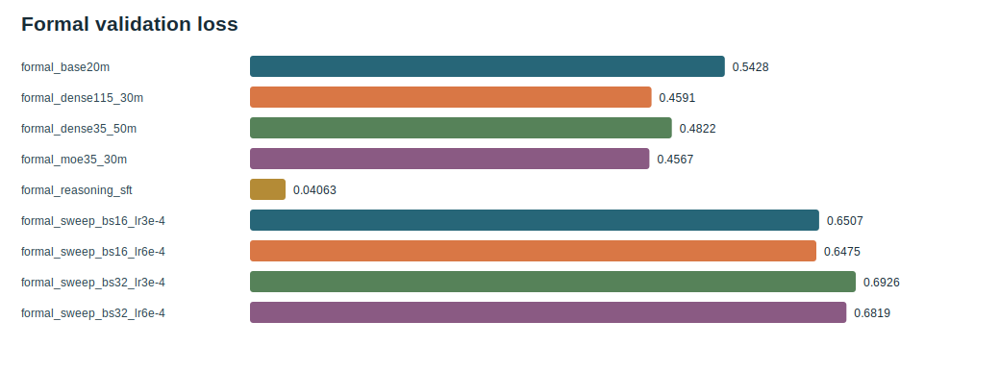
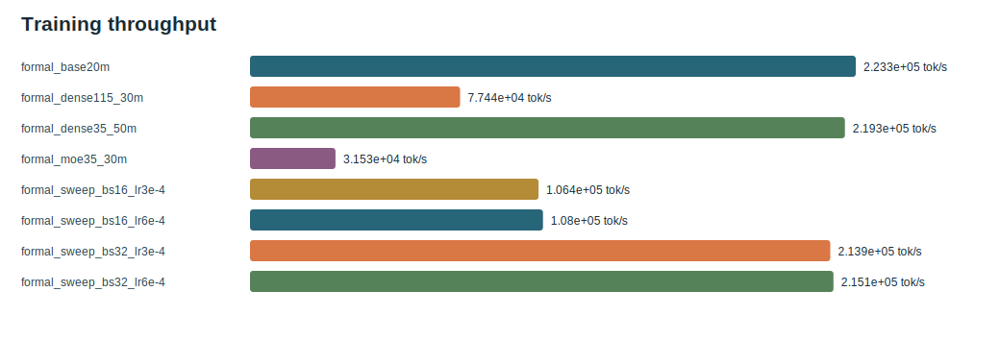
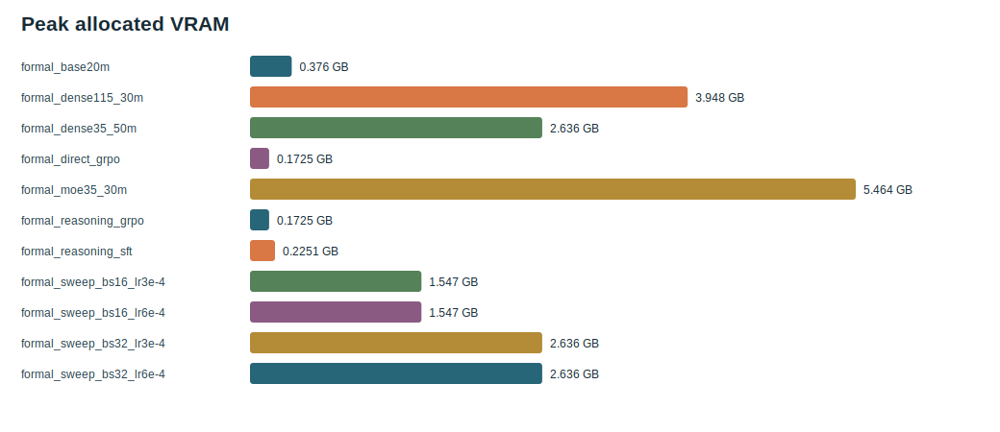
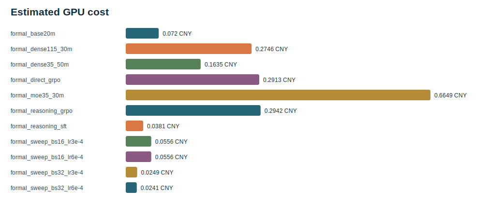

# TinySeek Complete GPU Training and Post-Training Report

These tables come from real RTX 4090 runs. Language-model PPL and post-training reasoning metrics are reported separately.

- Tracked training/post-training process time: `0.8985 h`
- Corresponding estimate at 2.18 CNY/h: `1.9588 CNY`
- Best LR/batch sweep: `formal_sweep_bs16_lr6e-4`

## Environment and Data

- GPU: `NVIDIA GeForce RTX 4090`; PyTorch: `2.8.0+cu128`; CUDA: `12.8`.
- Rate: `2.18 CNY/h`. The ledger covers training/post-training processes and excludes data preparation, standalone evaluation, report generation, and idle rental time; estimated cost is not the platform invoice.
- Data: `data/tinystories.jsonl`, `50000` lines, `47726046` bytes, SHA256 `fa16741c6cefdf24c361c6cd75c74f8e6ab500c6bde7adc942bb6afbf8b69814`.
- Data: `data/reasoning_grpo.jsonl`, `1000` lines, `135336` bytes, SHA256 `fb0e41066e678112d99a3a9ed55d50b4fafbc0870c6b3f24ab68dff4b8f06bd7`.
- Data: `data/reasoning_sft.jsonl`, `5000` lines, `1016508` bytes, SHA256 `2cc3dff35dd9477dd9783c0accf7052f77e79dcc0c45858893fcf07bbbeea164`.
- Full data manifest: [`dataset_manifests.json`](dataset_manifests.json).
- Per-run configs are in [`configs/`](configs/); raw cost and history ledgers are in [`raw/`](raw/).

## Reproduce

```bash
python scripts/prepare_hf_dataset.py --dataset_name roneneldan/TinyStories --split train --text_field text --max_samples 50000 --min_chars 80 --out data/tinystories.jsonl
python scripts/run_gpu_completion.py --data data/tinystories.jsonl --hourly_rate 2.18 --currency CNY
python scripts/generate_gpu_completion_report.py
```

## Measured Findings

| Question | RTX 4090 observation | Current decision |
| --- | --- | --- |
| Small LR/batch grid | `formal_sweep_bs16_lr6e-4` has the lowest validation loss, `0.6475`. | Use it as the recipe for this budget, not as a scaling law. |
| Capacity pilots | 35M/50M-token loss `0.4822`; 115M/30M-token `0.4591`; MoE/30M-token `0.4567`. | Token budgets differ, so this is a cost and feasibility pilot, not an architecture ranking. |
| Cold start and GRPO | Base/direct-GRPO/SFT/SFT+GRPO held-out scores are `0/5, 0/5, 0/5, 0/5` (n=`5` each); reasoning-format scores are `0.000/0.000/0.600/0.200`. | All answers are wrong, so this mini-eval provides no arithmetic-generalization evidence; the loose GRPO reward also damages format. |
| Distribution cost | PPL on the first `100` TinyStories rows rises from `1.718` at base to `12.670` after SFT and `12.306` after SFT+GRPO. | Narrow post-training trades pretraining-distribution quality for format behavior; report answer, format, and PPL separately. |

## Training and Cost

`val PPL = exp(val loss)` uses each stage's own validation data and is comparable only within the same stage/data; `sample PPL` is the shared distribution probe over the first 100 TinyStories rows.

| Run | Stage | Steps | Params | Activated | val loss | val PPL | sample PPL | tok/s | peak GB | GPU h | cost CNY |
| --- | --- | ---: | ---: | ---: | ---: | ---: | ---: | ---: | ---: | ---: | ---: |
| `formal_base20m` | pretrain | 3256 | 2.41M | 2.41M | 0.5428 | 1.721 | 1.718 | 223296 | 0.376 | 0.0330 | 0.0720 |
| `formal_dense115_30m` | pretrain | 7325 | 113.47M | 113.47M | 0.4591 | 1.583 | N/A | 77436 | 3.948 | 0.1260 | 0.2746 |
| `formal_dense35_50m` | pretrain | 6104 | 33.70M | 33.70M | 0.4822 | 1.620 | N/A | 219298 | 2.636 | 0.0750 | 0.1635 |
| `formal_direct_grpo` | grpo_mini | 300 | 2.41M | 2.41M | N/A | N/A | 1.995 | N/A | 0.172 | 0.1336 | 0.2913 |
| `formal_moe35_30m` | pretrain | 7325 | 235.06M | 84.06M | 0.4567 | 1.579 | N/A | 31526 | 5.464 | 0.3050 | 0.6649 |
| `formal_reasoning_grpo` | grpo_mini | 300 | 2.41M | 2.41M | N/A | N/A | 12.306 | N/A | 0.172 | 0.1350 | 0.2942 |
| `formal_reasoning_sft` | sft | 2000 | 2.41M | 2.41M | 0.0406 | 1.041 | 12.670 | N/A | 0.225 | 0.0175 | 0.0381 |
| `formal_sweep_bs16_lr3e-4` | pretrain | 1221 | 33.70M | 33.70M | 0.6507 | 1.917 | N/A | 106372 | 1.547 | 0.0255 | 0.0556 |
| `formal_sweep_bs16_lr6e-4` | pretrain | 1221 | 33.70M | 33.70M | 0.6475 | 1.911 | N/A | 108009 | 1.547 | 0.0255 | 0.0556 |
| `formal_sweep_bs32_lr3e-4` | pretrain | 611 | 33.70M | 33.70M | 0.6926 | 1.999 | N/A | 213906 | 2.636 | 0.0114 | 0.0249 |
| `formal_sweep_bs32_lr6e-4` | pretrain | 611 | 33.70M | 33.70M | 0.6819 | 1.978 | N/A | 215064 | 2.636 | 0.0111 | 0.0241 |

## Compute Ledger

| Run | Train tokens | Rough FLOPs |
| --- | ---: | ---: |
| `formal_base20m` | 20,004,864 | 2.894e+14 |
| `formal_dense115_30m` | 30,003,200 | 2.043e+16 |
| `formal_dense35_50m` | 50,003,968 | 1.011e+16 |
| `formal_direct_grpo` | N/A | N/A |
| `formal_moe35_30m` | 30,003,200 | 1.513e+16 |
| `formal_reasoning_grpo` | N/A | N/A |
| `formal_reasoning_sft` | 6,144,000 | 8.888e+13 |
| `formal_sweep_bs16_lr3e-4` | 5,001,216 | 1.011e+15 |
| `formal_sweep_bs16_lr6e-4` | 5,001,216 | 1.011e+15 |
| `formal_sweep_bs32_lr3e-4` | 5,005,312 | 1.012e+15 |
| `formal_sweep_bs32_lr6e-4` | 5,005,312 | 1.012e+15 |

## Post-Training Reasoning Answer and Format

| Checkpoint | Answer accuracy | Format score | GRPO mean reward |
| --- | ---: | ---: | ---: |
| `formal_base20m` | 0.000 | 0.000 | N/A |
| `formal_direct_grpo` | 0.000 | 0.000 | 0.100 |
| `formal_reasoning_grpo` | 0.000 | 0.200 | 0.200 |
| `formal_reasoning_sft` | 0.000 | 0.600 | N/A |

## Held-Out Failure Examples

| Checkpoint | Prompt | Target | Prediction | Format | Completion excerpt |
| --- | --- | ---: | ---: | --- | --- |
| `formal_reasoning_grpo` | `2+3` | 5 | N/A | False | <think>Add the numbers: 2 + 3 = 8.</think><br><answer>83.</answer> |
| `formal_reasoning_grpo` | `7+8` | 15 | 12 | True | <think>Add the numbers: 7 + 8 = 12.</think><br><answer>12</answer> |
| `formal_reasoning_sft` | `2+3` | 5 | 9 | True | <think>Add the numbers: 2 + 3 = 9.</think><br><answer>9</answer> |
| `formal_reasoning_sft` | `7+8` | 15 | 12 | True | <think>Add the numbers: 7 + 8 = 12.</think><br><answer>12</answer> |

## Evidence Boundary

Results support conclusions only for this repository's small models, data, and token budgets; they do not extrapolate to DeepSeek scale. Held-out reasoning counts are 5; sample PPL uses the first 100 TinyStories JSONL rows, not a fixed held-out split.

## Figures










