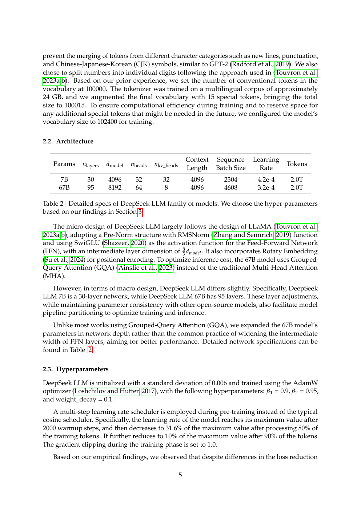
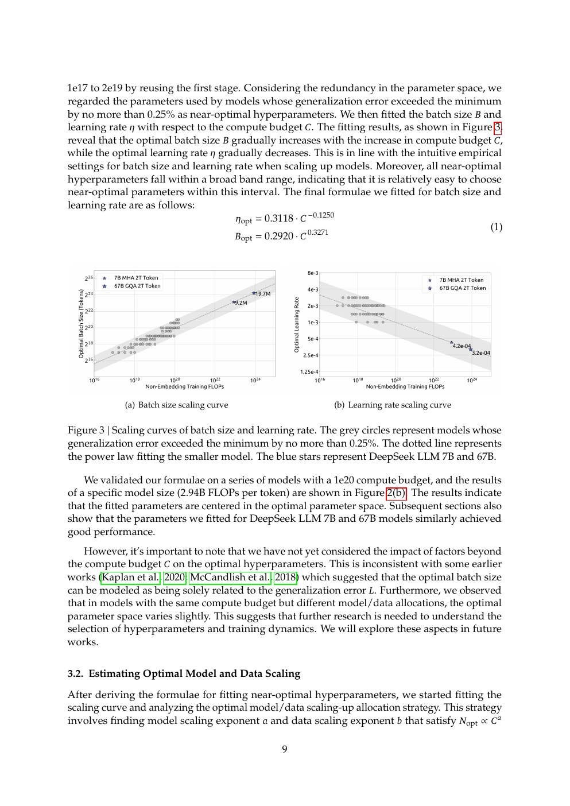
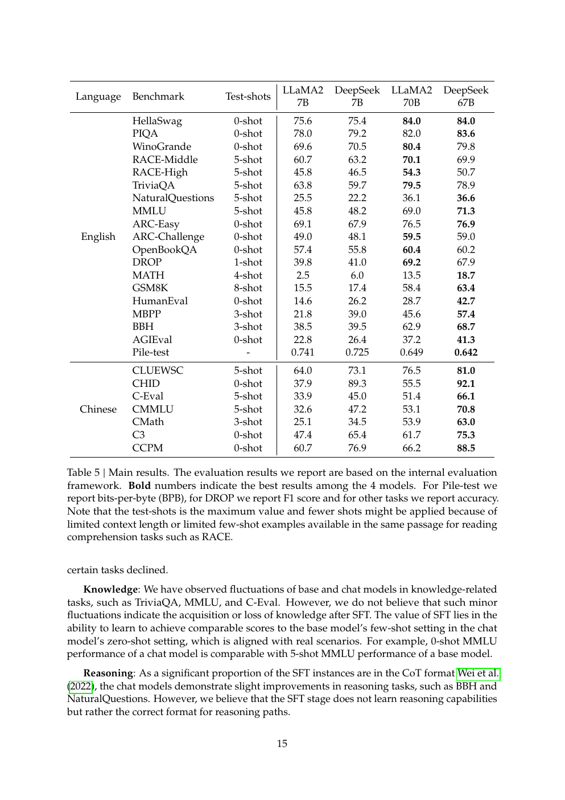

# DeepSeek LLM: ask the training questions first

English | [中文](README_zh.md) | [Paper route](../README.md)

Paper: *DeepSeek LLM: Scaling Open-Source Language Models with Longtermism* (2024, [arXiv:2401.02954](https://arxiv.org/abs/2401.02954)). The paper treats scaling behavior, not just a fixed model checkpoint, as the research problem.

## 1. Position

DeepSeek LLM studies batch-size and learning-rate scaling, model/data allocation under compute, and the effect of data quality. It applies those findings to 7B and 67B models, using a LLaMA-like decoder architecture, GQA at the larger scale, 2T tokens, and SFT/DPO for chat models.

## 2. What changed

The paper combines aggressive deduplication and filtering, a BBPE tokenizer, Pre-Norm RMSNorm/SwiGLU/RoPE blocks, GQA, and a multi-step learning-rate schedule. It uses IsoFLOP profiles and non-embedding FLOPs/token rather than parameter count alone. TinySeek turns this into a small recipe sweep and a readable Dense/GQA baseline.

## 3. Method

The data pipeline has deduplication, quality filtering and domain remixing. The architecture is decoder-only next-token prediction with RMSNorm, SwiGLU and RoPE. The 67B model uses 64 query heads and 8 KV heads. AdamW, warmup, multi-step decay, clipping and bf16/fp32 accumulation are part of the recipe. The scaling analysis first studies hyperparameters, then fits model/data allocation and warns that data quality changes the fitted law.

## 4. Paper experiments

The paper concludes that recipe optimization is necessary for fair scaling comparisons, non-embedding compute is a useful model-scale representation, and better data shifts the preferred allocation toward larger models.

## 5. TinySeek implementation

See [`stage0_deepseek_llm.py`](../../model/stages/stage0_deepseek_llm.py), [`s02`](../../course/s02_training_recipe/README.md), [`s03`](../../course/s03_gqa/README.md), and [`24_math_to_pytorch.md`](../../docs/24_math_to_pytorch.md). TinySeek does not reproduce HAI-LLM, ZeRO, FlashAttention or 2T-token training.

## 6. TinySeek supplemental evidence

The existing 4090 sweep selected `bs16_lr6e-4` locally. The three-seed GQA comparison reduced theoretical KV elements/token from `384` to `192` while PPL moved `2.017 -> 2.006`.

This is **directionally consistent: supplemental check** for the recipe-first method and the GQA cache direction, not a scaling-law or large-model reproduction.

## 7. Claim/evidence table

| Paper claim | Paper evidence | TinySeek evidence | Relation | Boundary |
| --- | --- | --- | --- | --- |
| Study batch size and LR with compute | Figure 3 and scaling section | Four-point sweep | Directionally consistent: supplemental check | No universal law is fitted |
| GQA reduces inference state | Table 2 and architecture section | `384 -> 192` theoretical KV/token | Directionally consistent: supplemental check | No production latency/kernel evidence |
| Data quality changes allocation | Cross-dataset scaling experiments | One TinyStories source | Paper-only | No local data-quality ablation |
| Large benchmark superiority | Table 5 | Toy/mini evaluations | Paper-only | No capability extrapolation |

## 8. Conclusion

DeepSeek LLM establishes the recipe and scaling foundation. TinySeek supports the experimental habit and the local GQA direction, while remaining explicit about scale boundaries.

## 9. Sources and next paper

Paper: [arXiv:2401.02954](https://arxiv.org/abs/2401.02954). Continue to [DeepSeekMoE](../02-deepseek-moe/README.md).
