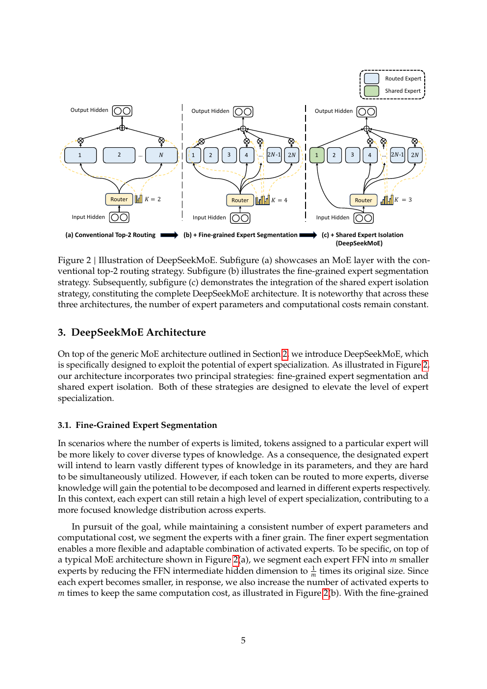
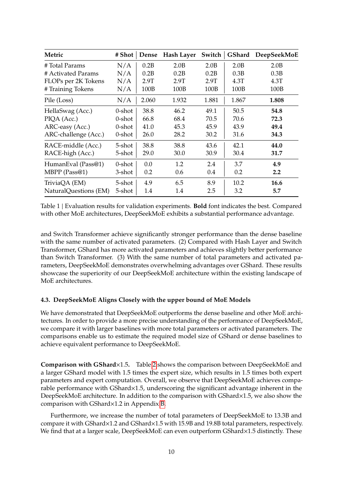
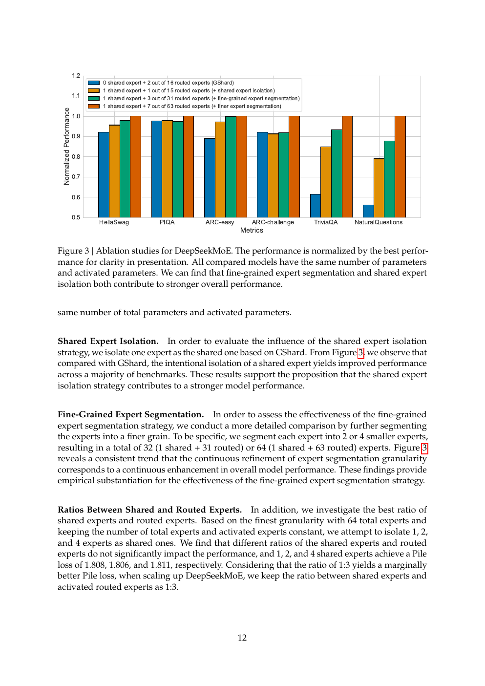
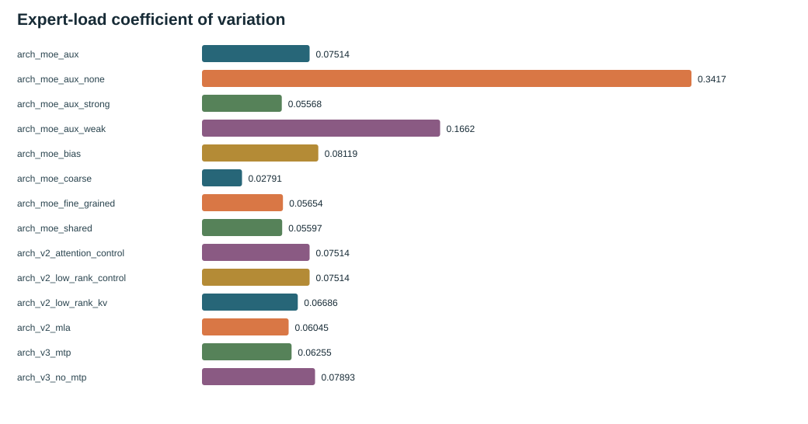

# DeepSeekMoE: separate capacity from activated compute

English | [中文](README_zh.md) | [Previous: DeepSeek LLM](../01-deepseek-llm/README.md) | [Paper route](../README.md)

Paper: *DeepSeekMoE: Towards Ultimate Expert Specialization in Mixture-of-Experts Language Models* (2024, [arXiv:2401.06066](https://arxiv.org/abs/2401.06066)).

## 1. Position

The paper asks whether a model can store many more FFN parameters while activating only a few for each token. Its two central ideas are fine-grained expert segmentation and shared expert isolation.

## 2. Architecture transition

Dense FFN uses one large SwiGLU for every token. DeepSeekMoE splits it into many narrow routed experts, selects top-k experts with a router, and adds shared experts for common knowledge. Total parameters can grow without forcing every token through every expert; routing imbalance, communication and token dropping become new systems problems.

## 3. Method

Fine-grained segmentation increases the number of composable experts at a matched activated width. Shared experts are always active and keep routed experts from relearning generic patterns. The paper studies auxiliary balancing, device-limited routing and token dropping. V3 later changes the balancing mechanism, so this paper is the conceptual prerequisite.

## 4. Paper experiments

The validation and ablation results support finer specialization and shared experts under the paper's matched conditions; comparisons with dense and GShard models support the capacity/activated-compute trade-off.

## 5. TinySeek implementation

See [`stage1_deepseek_moe.py`](../../model/stages/stage1_deepseek_moe.py), [`s04`](../../course/s04_deepseek_moe/README.md), and [`21_from_dense_to_deepseek_moe.md`](../../docs/21_from_dense_to_deepseek_moe.md). The code is a readable single-device dispatch loop, not distributed expert parallelism.

## 6. TinySeek supplemental evidence

The existing three-seed suite compares coarse, fine and shared variants. Shared experts improve PPL over coarse MoE but cost about 35% throughput; `aux=0.01` has load CV about `0.075` versus `0.342` without auxiliary loss.

This is **directionally consistent: supplemental check** with the paper's specialization/balance story, with a local quality/throughput trade-off.

## 7. Claim/evidence table

| Paper claim | Paper evidence | TinySeek evidence | Relation | Boundary |
| --- | --- | --- | --- | --- |
| Fine-grained experts increase specialization | Figure 2/3 and validation ablation | Coarse/fine/shared comparison | Directionally consistent: supplemental check | Tiny scale and budget |
| Shared experts isolate common knowledge | Figure 2 and ablation | Better local PPL, slower throughput | Directionally consistent: supplemental check | No paper-scale communication |
| MoE stores capacity with sparse activation | Tables 1/2 | Parameter and activation ledger | Directionally consistent: supplemental check | Activated count is not distributed cost |
| One auxiliary weight is universally best | Paper-local setting | `aux=0.01` local compromise | Insufficient/incomparable | No universal hyperparameter claim |

## 8. Conclusion

DeepSeekMoE is a separation of capacity, activation and specialization, not a blind copy of a Dense FFN. TinySeek supports the direction while preserving the engineering trade-off.

## 9. Sources and next paper

Paper: [arXiv:2401.06066](https://arxiv.org/abs/2401.06066). Continue to [DeepSeek-V2](../03-deepseek-v2/README.md).
