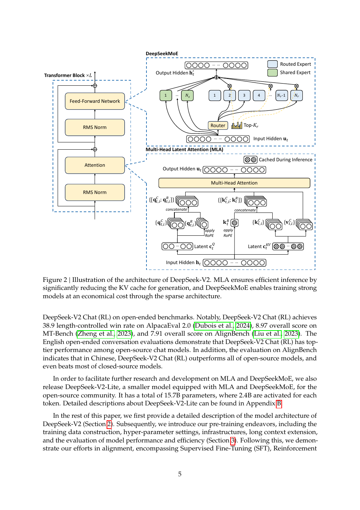
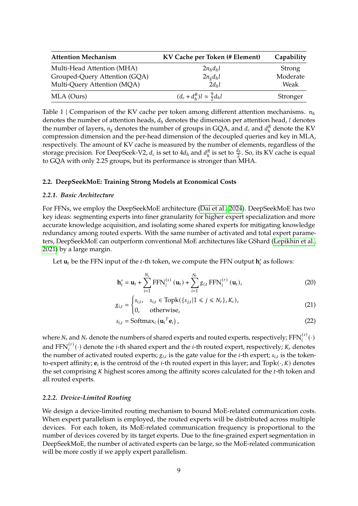
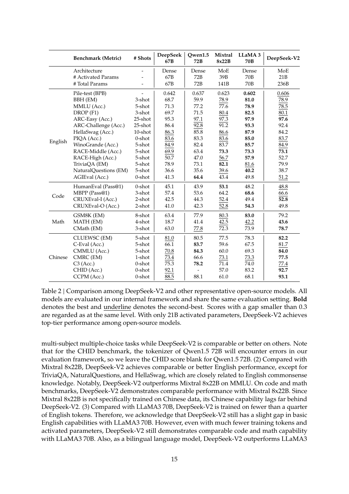
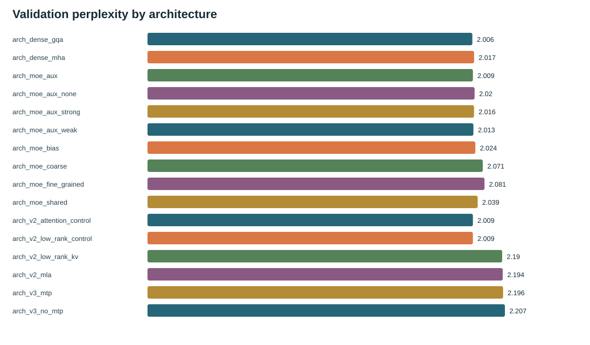

# DeepSeek-V2：用 MLA 压缩推理状态

中文 | [English](README.md) | [上一篇：DeepSeekMoE](../02-deepseek-moe/README_zh.md) | [主线](../README_zh.md)

论文：*DeepSeek-V2: A Strong Mixture-of-Experts Language Model*（2024， [arXiv:2405.04434](https://arxiv.org/abs/2405.04434)）。V2 把 DeepSeekMoE 的稀疏 FFN 与 Multi-head Latent Attention（MLA）结合：前者控制激活计算，后者控制自回归推理的 KV cache。

## 1. 论文定位

论文的核心问题是：在保持模型表达能力的同时，能否把每个历史 token 需要缓存的 K/V 表示压缩到一个低维 latent？DeepSeek-V2 的答案是 MLA：联合压缩 key/value content，并把 RoPE 相关的位置表示拆成 decoupled path。论文还把 DeepSeekMoE、device-limited routing、token dropping、长上下文和训练/推理效率放在同一个系统设计中。

## 2. 从 MoE 到 V2

| 瓶颈 | V2 的改变 | 论文要看的指标 |
| --- | --- | --- |
| Dense FFN 每 token 激活过多 | 继承 DeepSeekMoE | activated parameters、训练成本 |
| MHA/GQA cache 随序列增长 | MLA 低秩 KV joint compression | KV cache/token、吞吐、显存 |
| RoPE 与压缩表示耦合 | content path + decoupled RoPE path | 长上下文质量与可缓存性 |

### MLA 的最小数学图景

输入 hidden state `h_t` 先经下投影得到 latent `c_t^{KV}`。K/V content 由不同上投影从同一 latent 重建；query 也有自己的低秩路径。因为 RoPE 直接作用在低秩 content 上会破坏可合并的 cache 结构，MLA 额外保留一小段 decoupled RoPE key/query。推理时缓存 latent content 和 RoPE 相关的小表示，而不是完整每个 head 的 K/V。

## 3. 方法详解

### DeepSeekMoE 基础

V2 的 FFN 仍使用 routed experts、shared experts 和 top-k。论文还讨论 device-limited routing：限制一个 device 上可接收的 token/expert，避免 all-to-all 成为瓶颈；token dropping 允许在容量不足时保持训练可行。

### KV cache 账本

标准 MHA 每 token 每层要保存 `2 * n_h * d_h`；MQA/GQA 减少 KV head 数；MLA 缓存 latent rank 加上 decoupled RoPE 维度。论文 Table 1 直接比较不同 attention 的 KV/token，这个表比“MLA 更先进”更重要：它把结构变化转成推理系统真正关心的状态大小。

### 长上下文与后训练

论文除了预训练，还报告长上下文 extension、SFT、RL 和 open-ended evaluation。V2-Lite 是面向社区的较小版本，帮助研究者使用 MLA/DeepSeekMoE；这说明论文的目标既是模型质量，也是让结构能被部署和继续研究。

## 4. 论文实验与图表

*论文 Figure 2，来源见 [`SOURCES.md`](../assets/deepseek-v2/SOURCES.md)。读图重点：同一个 Transformer block 同时包含 DeepSeekMoE FFN 和 MLA attention。*

*论文 Table 1。读图重点：MLA 的主要优势先体现在 cache/token，而不是一个孤立的 PPL 数字。*

论文的评测把 NIAH 长上下文、标准 benchmark、训练效率和推理效率放在一起；Table 2 展示 V2 与代表性开源模型的质量比较。论文结论是 MLA 在 cache 压缩和质量之间取得可用折中，并与 MoE 共同形成经济型大模型路线。

## 5. TinySeek 对应实现

- 教学 MLA：[`model/stages/stage2_deepseek_v2.py`](../../model/stages/stage2_deepseek_v2.py)。
- 课程说明：[`course/s05_mla/README_zh.md`](../../course/s05_mla/README_zh.md)。
- 公式与 shape：[`docs/zh/22_from_moe_to_deepseek_v2.md`](../../docs/zh/22_from_moe_to_deepseek_v2.md)。

TinySeek 的 `EducationalMLA` 显式重建完整 K/V，能讲清 `kv_down -> latent -> k_content/v_content + decoupled RoPE`，但没有 fused decode kernel、真实 cached generation 或长上下文 profiler。因此本仓的理论 KV/token 是结构账本，不是生产延迟或显存测量。

## 6. TinySeek 补充证据

现有 3-seed 对照中，GQA control 的理论 KV/token 为 `192`；教学 MLA 为 `72`，但 PPL 从 `2.009` 变为 `2.194`。朴素 low-rank K/V 已经达到约 `2.190`，所以本仓不能把退化归因于完整 MLA 的某一个单独细节。TinySeek 当前否决 MLA 进入主分支，只保留 latent-rank 研究分支。

**关系：方向一致但质量结论不可直接外推。** “压缩 cache”这一结构方向与论文一致；论文规模下报告了可用质量/效率折中，而本仓教学实现没有通过本地 PPL 门槛。差异来自规模、数据、训练预算、实现和缺失的 cached decode，不能据此反驳论文。

## 7. 论文主张与本仓证据

| 论文主张 | 论文证据 | TinySeek 证据 | 关系 | 可迁移边界 |
| --- | --- | --- | --- | --- |
| MLA 显著减少 KV cache/token | Table 1 | `192 -> 72` theoretical KV/token | 方向一致：补充性复核 | 不是实测 decode 显存/延迟 |
| MLA 在压缩下保持质量 | Table 2、NIAH、效率实验 | PPL `2.009 -> 2.194` | 方向不一致：不可直接外推 | 教学实现与规模差异很大 |
| MoE + MLA 是联合系统设计 | Figure 2、完整评测 | stage2 block 保持接口组合 | 方向一致：补充性复核 | 没有论文规模系统工程 |
| 低秩压缩的具体 rank 应如何选 | 论文设置内的 ablation | 本仓少量 rank/对照 | 证据不足/不可比较 | 不拟合通用 rank 规律 |

## 8. 本章结论

V2 的重要转折是把“每 token 激活多少参数”和“每 token 缓存多少历史状态”分别处理：DeepSeekMoE 解决前者，MLA 解决后者。阅读论文时应先看 KV cache 账本，再看质量/效率实验；阅读 TinySeek 时应接受教学版 MLA 的失败结果，它说明压缩不是免费的升级，也说明没有真实 decode 实验就不能把理论 cache 数字写成系统性能。

## 9. 入口

- 原文：[arXiv:2405.04434](https://arxiv.org/abs/2405.04434)。
- 下一篇：[DeepSeek-V3](../04-deepseek-v3/README_zh.md)。
- 现有报告：[`architecture_lab_runs/report_zh.md`](../../experiments/architecture_lab_runs/report_zh.md)。
+## 深度解读：MLA 为什么不是随便做个低秩投影

### 1. V2 同时解决两个不同瓶颈

DeepSeekMoE 解决的是训练时 FFN 的 activated compute；MLA 解决的是自回归解码时随序列增长的 KV cache。两者位于不同阶段：MoE 主要减少每 token 的训练和前向计算，MLA 主要减少生成时每个历史 token 的存储和带宽。把 V2 说成“MoE 加一个更省内存的 attention”会漏掉这个系统分工。

### 2. MLA 的关键约束来自 RoPE

如果只把 K/V 压缩成 latent，再从 latent 重建，确实可以省缓存；但 RoPE 依赖 token 的位置，并且在每个 attention head 上有旋转结构。论文因此把 content 表示和位置表示拆成两条路径：低秩 latent 负责可压缩的 content，decoupled RoPE key/query 负责相对位置。这个拆分解释了为什么 MLA 不是普通 low-rank factorization：它要同时满足表示能力、位置编码和缓存可合并性。

### 3. Table 1 的 KV/token 是结构上限，不是端到端速度

Table 1 比较的是每 token 每层需要保存的 K/V 维度，适合回答“理论 cache 规模如何变化”。但实际吞吐还受 kernel、batch、带宽、prefill/decode 比例和量化影响。因此“KV cache 降 93.3%”不能直接改写成“延迟降低 93.3%”。论文另外报告吞吐和成本，读者应把这两类指标分开。

### 4. 为什么还要保留 device-limited routing 和 token dropping

MoE 的专家数扩大后，瓶颈可能从矩阵乘法变成跨设备 all-to-all。V2 的 device-limited routing 不是质量模块，而是把路由限制在可控的设备集合；token dropping 则在容量不足时牺牲少量 token 处理完整性以保持系统可运行。这说明 V2 的经济来自架构与通信策略共同成立，而不是只来自 MLA。

### 5. Long-context extension 的因果边界

V2 先在基础上下文训练，再做长上下文 extension。若长上下文评测提升，不能简单归因于 MLA；还可能来自 extension 数据、位置插值、训练步数和评测分布。论文把这些作为完整 pipeline 报告，教程中应明确：MLA 解释 cache 侧效率，不能单独解释所有长上下文能力。

### 6. TinySeek 的 MLA 退化说明什么

本仓教学 MLA 的理论 cache 从 192 降到 72，但 PPL 变差，说明低秩容量不足或实现路径会造成表达损失。这不是对论文 MLA 的反例，因为论文有不同 rank、训练规模和 fused implementation；它只说明迁移时必须做 rank/质量曲线，而不能只凭 cache 数字升级架构。
+## 证据地图

| 论文位置 | 实验问题 | 作者结论 | 解读与限制 |
| --- | --- | --- | --- |
| Section 2.1 / Table 1 | MLA 能否减少 KV cache | latent + decoupled RoPE 显著降低缓存 | 这是结构账本，不是延迟保证 |
| Section 2.2 / routing sections | MoE 在多设备上能否运行 | device-limited routing 控制通信 | 可能引入路由约束和容量损失 |
| Section 3 / Table 2 | 低激活参数能否保持能力 | V2 达到开源模型前列 | 质量来自完整训练配方，不只 MLA |
| Section 3.2.3 / efficiency | cache、训练成本、吞吐是否同时改善 | 报告 42.5% 成本节省和 5.76 倍吞吐 | 依赖硬件、kernel 和部署设置 |
