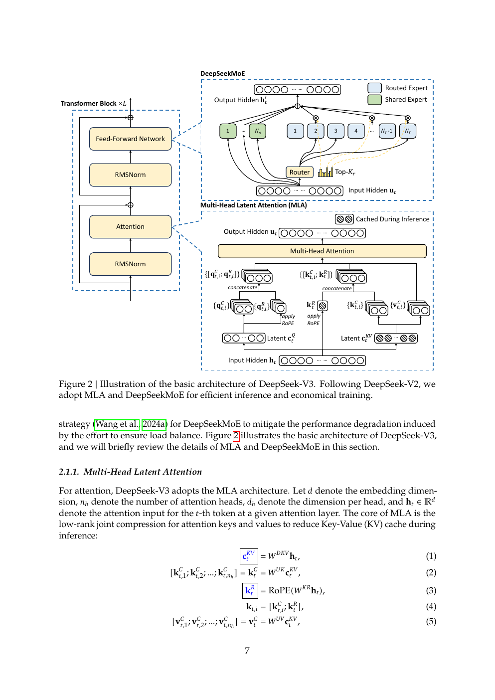
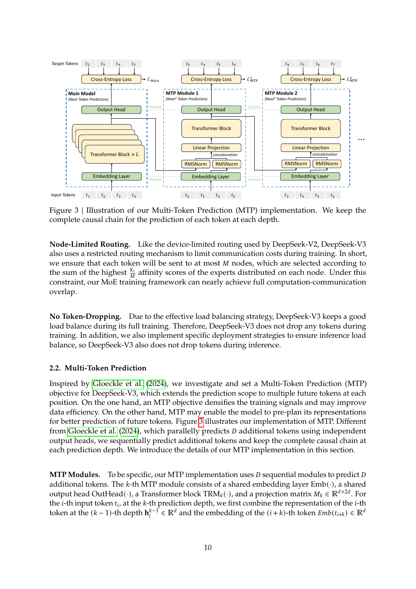
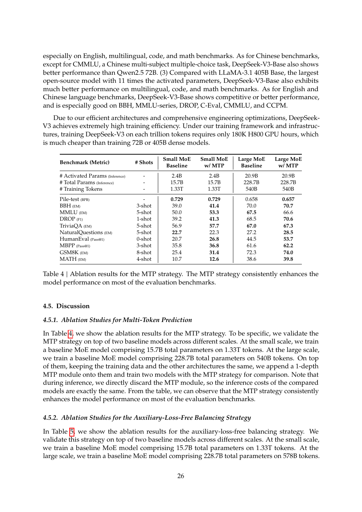
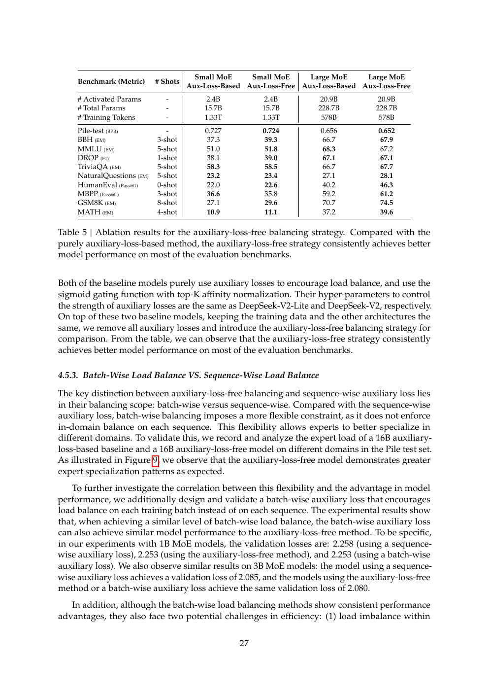
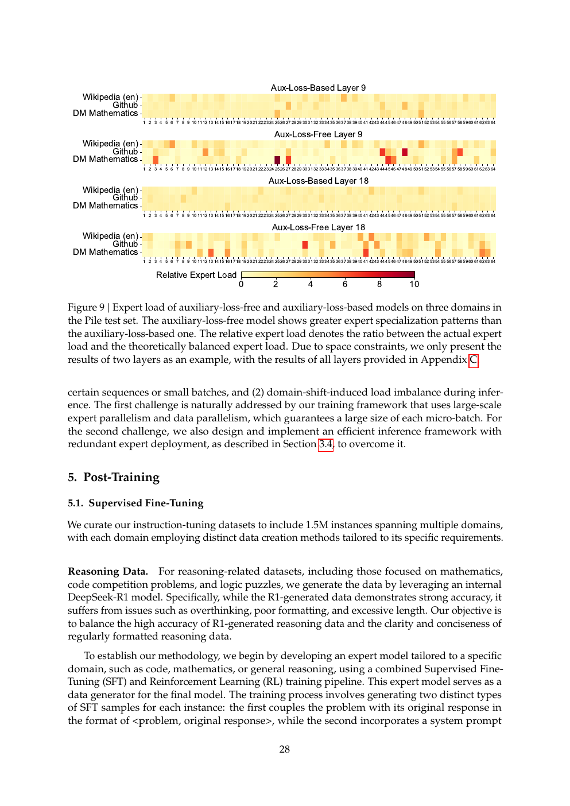
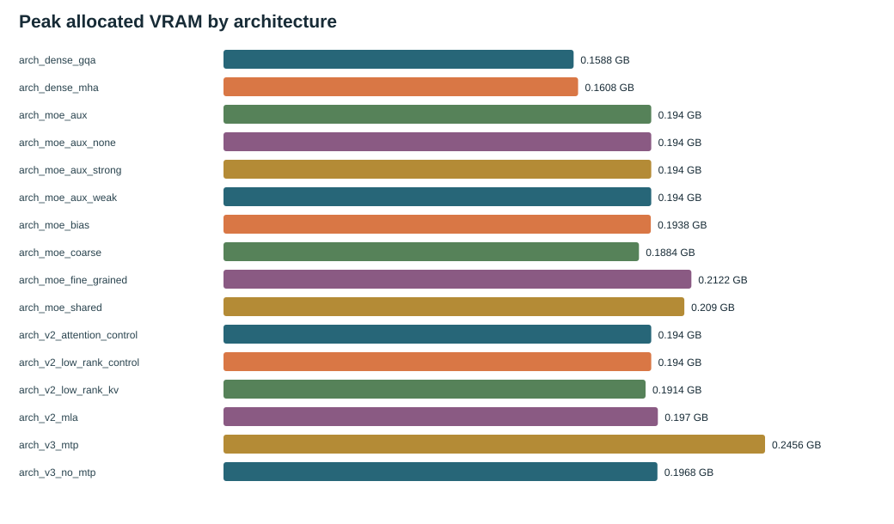

# DeepSeek-V3：把路由均衡和训练效率做成系统设计

中文 | [English](README.md) | [上一篇：DeepSeek-V2](../03-deepseek-v2/README_zh.md) | [主线](../README_zh.md)

论文：*DeepSeek-V3 Technical Report*（2024， [arXiv:2412.19437](https://arxiv.org/abs/2412.19437)）。V3 不是推翻 V2，而是沿着 MLA + DeepSeekMoE 继续解决三个问题：如何在不把 auxiliary loss 加进主目标的情况下保持负载均衡，如何用 MTP 提供更丰富的训练信号，以及如何让大规模 MoE 的通信、精度和并行训练成本可控。

## 1. 论文定位

论文报告一个 671B 总参数、37B activated parameters 的模型，并把算法、框架和硬件联合设计。对读者最重要的贡献是：auxiliary-loss-free load balancing、Multi-Token Prediction、DualPipe/通信重叠、FP8 训练和低成本部署。论文实验不只比较最终 benchmark，也比较 MTP、负载均衡、FP8 稳定性和专家负载。

## 2. 从 V2 到 V3

| V2 已有 | V3 增强 | 要解决的问题 |
| --- | --- | --- |
| MLA + DeepSeekMoE | 保留并扩展 | 维持 KV 与 activated compute 优势 |
| auxiliary loss | router selection bias | 避免均衡损失干扰 LM 主目标 |
| next-token prediction | MTP heads | 增加未来 token 监督并服务推理 |
| MoE all-to-all | DualPipe、通信重叠、跨节点优化 | 让训练规模可行 |
| BF16/传统精度路径 | FP8 mixed precision | 降低存储/通信/计算成本 |

## 3. 方法详解

### Auxiliary-loss-free load balancing

路由器产生 affinity。V3 不把一个显式 load-balancing loss 加到总 loss，而是在 top-k 选择时给每个 expert 一个不参与梯度的 bias：负载不足的 expert 提高 bias，过载 expert 降低 bias；真正用于混合 expert 输出的权重仍来自原始 affinity。这个区分是关键：bias 改变离散选择，不能把它误写成改了可微输出权重。

### Multi-Token Prediction

主 head 仍预测 next token；额外 MTP module 从较早的 hidden state 预测更远的 future token，并把额外 loss 加到主 LM loss。这样做可能提高表示的规划性，也可以在推理中用于 speculative decoding。论文 Figure 3 展示了 hidden state 与 future target 的对齐方式；它不是简单地把 label 再 shift 一次。

### 系统、精度和部署

DualPipe 让 forward/backward 与通信重叠，减少 pipeline bubble；跨节点 all-to-all 使用通信布局和内存优化；FP8 路径通过 fine-grained quantization、高精度累加和选择性保留高精度算子维持训练稳定。论文还讨论 inference kernel、KV cache 和硬件建议。TinySeek 只保留 readable bias/MTP data path，不实现这些生产系统。

## 4. 论文实验与图表

论文 Table 4 报告 MTP 消融，论文 Table 5 报告 auxiliary-loss-free balancing 消融；Figure 9 进一步画出不同域上的 expert load。论文的逻辑是先让结构和系统可训练，再用这些消融说明额外目标和新路由机制的收益。

论文还报告 FP8 与 BF16 loss 曲线、长上下文 NIAH、base/chat benchmark、distillation from R1 和训练成本。阅读这些结果时要保持分层：MTP/路由是算法消融，DualPipe/FP8 是系统可行性，benchmark 是最终综合结果。

## 5. TinySeek 对应实现

- V3 教学阶段：[`model/stages/stage3_deepseek_v3.py`](../../model/stages/stage3_deepseek_v3.py)。
- 正式统一模型：[`model/tinyseek.py`](../../model/tinyseek.py)。
- 课程说明：[`course/s06_v3_routing_mtp/README_zh.md`](../../course/s06_v3_routing_mtp/README_zh.md)。
- 公式与训练目标：[`docs/zh/23_from_v2_to_deepseek_v3.md`](../../docs/zh/23_from_v2_to_deepseek_v3.md)。

TinySeek 的 bias 更新在单设备模型里用 `torch.no_grad` 完成，MTP 只作为额外 loss head；没有 671B 参数、FP8 kernel、DualPipe、跨节点 all-to-all 或生产推理加速。

## 6. TinySeek 补充证据

本仓的 bias routing 对照为 PPL `2.009 -> 2.024`、load CV `0.075 -> 0.081`，没有击败 `aux=0.01`。MTP 对照的 PPL 为 `2.207 +/- 0.017` 对 `2.196 +/- 0.034`，显存 `0.197 -> 0.246 GB`；但它测在已经被否决的 MLA-style 分支上，不能决定选中的 GQA+aux 主分支。

**关系：论文主张以论文证据为主，本仓证据不足/方向不一致。** TinySeek 让读者看懂 bias 与 MTP 的张量路径，但没有复现论文规模的收益。这里最重要的教学结论是不要跨拓扑拼接结果。

## 7. 论文主张与本仓证据

| 论文主张 | 论文证据 | TinySeek 证据 | 关系 | 可迁移边界 |
| --- | --- | --- | --- | --- |
| bias 可在无 aux loss 时保持均衡 | Table 5、Figure 9 | bias load CV 略差于 aux | 方向不一致：不可直接外推 | 超参、规模和分支不同 |
| MTP 带来稳定收益 | Table 4 | 均值略低但方差/分支受限 | 证据不足/不可比较 | 未在选中主分支测量 |
| MLA+MoE 基础架构可扩展 | Figure 2、训练成本和 benchmark | 可读单设备 forward | 仅论文证据 | 缺少系统工程复现 |
| FP8/通信重叠显著降低成本 | FP8、DualPipe sections | 无对应实现 | 仅论文证据 | 不以 GPU 小时替代论文成本 |

## 8. 本章结论

V3 的方法论是“把一个大模型的系统瓶颈拆成可隔离的实验”：路由选择、额外监督、通信、精度和部署分别验证。TinySeek 可以帮助理解其中两个算法接口，却不能因为本地 bias/MTP 结果不稳定就改写论文结论。下一篇 R1 把改动从 Transformer block 转到 reasoning post-training pipeline。

## 9. 入口

- 原文：[arXiv:2412.19437](https://arxiv.org/abs/2412.19437)。
- 下一篇：[DeepSeek-R1](../05-deepseek-r1/README_zh.md)。
- 现有报告：[`architecture_lab_runs/report_zh.md`](../../experiments/architecture_lab_runs/report_zh.md)。
+## 深度解读：V3 是一次系统协同设计

### 1. V3 没有推翻 V2，而是暴露 V2 的规模瓶颈

V3 保留 MLA 和 DeepSeekMoE，说明 V2 的基本方向被验证；新的问题转向超大规模训练：专家跨节点通信、负载均衡损失、低精度数值稳定性和 pipeline bubble。读 V3 时应把新结构与让旧结构能扩到 671B 的工程配套放在一起。

### 2. Auxiliary-loss-free balancing 的因果假设

传统 auxiliary loss 直接把均衡目标加入训练目标，可能让语言模型为了均衡而改变 token 的自然路由。V3 的做法是给每个 expert 一个动态 bias，只影响 top-k 选择，不进入主 loss；每隔一段时间根据 expert load 更新 bias。它试图把选择谁和优化语言建模解耦。这个方法的代价是引入依赖 batch 统计的控制环，稳定性取决于 bias 更新速度、路由粒度和容量设置。

### 3. Table 5 的比较要看三个轴

Table 5 不只是在比较 loss。需要同时看负载均衡、主任务 loss 和训练稳定性：auxiliary-loss-free 是否减少了质量损失，是否仍保持可接受的 expert load，是否避免 token dropping。若只看某一列的 benchmark，无法判断 bias routing 是否真正优于 aux loss。

### 4. MTP 为什么可能帮助推理

MTP 在主 next-token head 之外预测未来多个 token，训练时增加了更远的监督信号；推理时这些预测头还可以用于 speculative decoding。论文 Table 4 的 ablation 支持加入 MTP 有益，但收益可能来自训练正则化、额外 supervision 或推理接受率，不能笼统写成多预测几个 token 所以一定更快。

### 5. FP8、DualPipe 与模型质量不能混为一谈

V3 报告的成本优势来自 FP8 mixed precision、DualPipe、跨节点 all-to-all kernel、内存优化等多项系统技术。它们主要改变训练效率和可扩展性，不直接等价于语言能力提升。论文的 2,788K H800 GPU hours 是整套系统的结果，不能拆成某一个模块的单独贡献。

### 6. 从 V3 过渡到 V3.2

V3 解决如何让 MoE 加 MLA 训练得起，但 MLA 仍面对长上下文的全量 attention 计算。V3.2-Exp 因而把问题推进到 token 选择和稀疏注意力；这不是 V3 失败，而是瓶颈从 cache 容量转移到了 attention FLOPs。
+## 证据地图

| 论文位置 | 实验问题 | 作者结论 | 解读与限制 |
| --- | --- | --- | --- |
| Section 2.1.2 / Table 5 | 无辅助损失是否保留均衡 | bias routing 可接近或超过 aux loss | 依赖更新规则和负载统计 |
| Section 2.2 / Figure 3, Table 4 | MTP 是否带来收益 | MTP 改善评测并支持 speculative decoding | 训练收益与解码收益要分开 |
| Section 3 / Table 1 | 系统优化是否降低总成本 | FP8、DualPipe、通信优化共同降低成本 | 不能归因给单个模块 |
| Section 4 / main results | 671B MoE 是否转化为能力 | V3 Base/Chat 达到强开源水平 | benchmark 不能隔离所有系统因素 |
