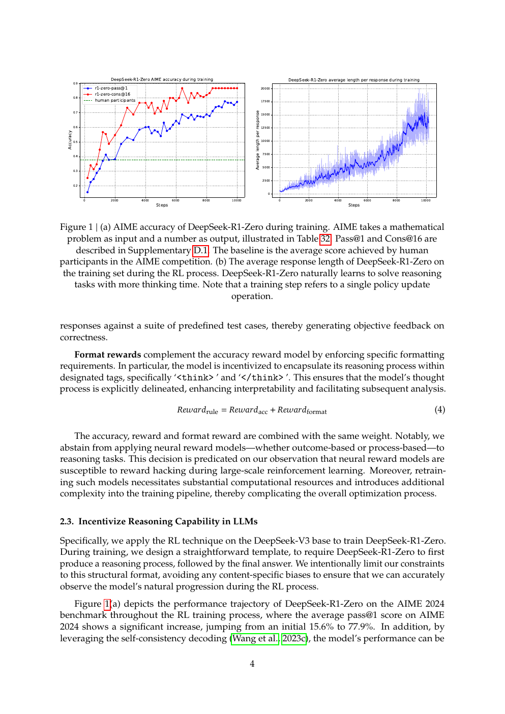
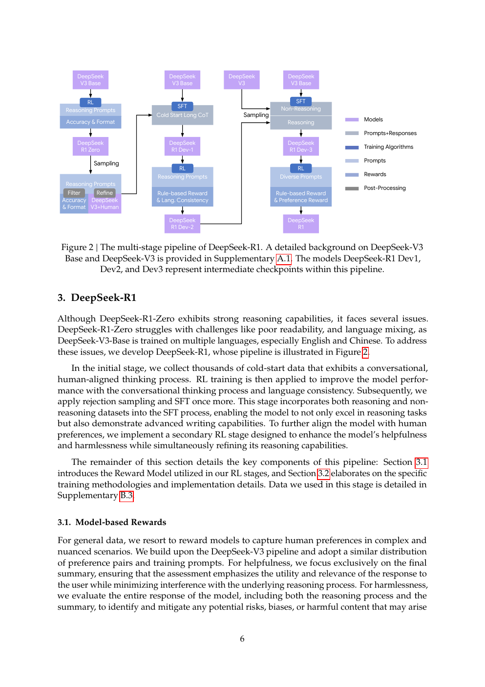
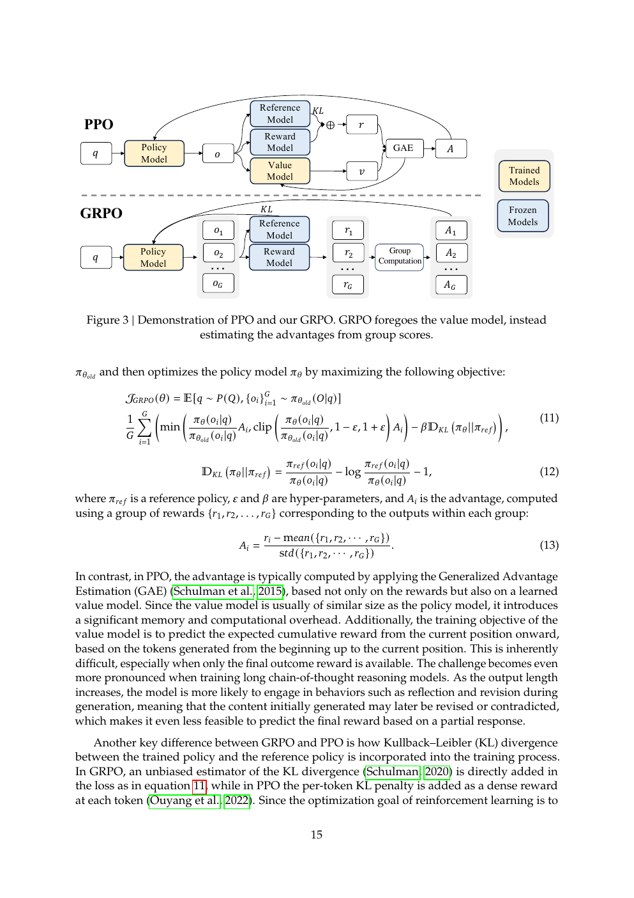
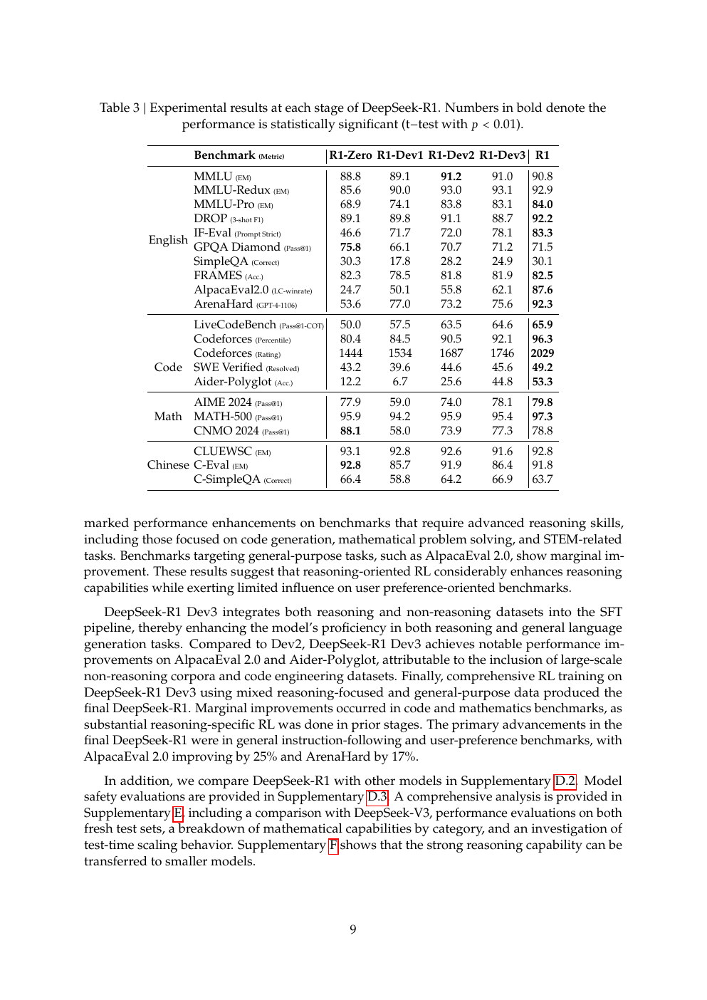
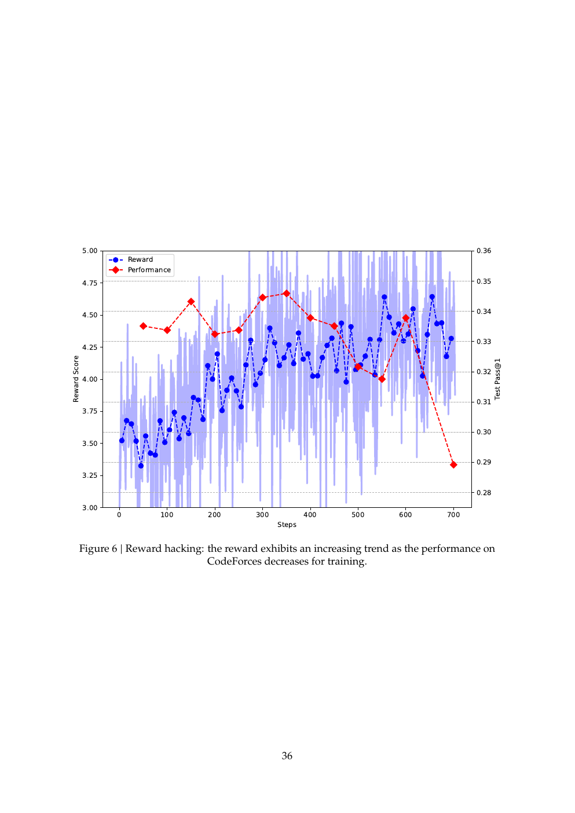
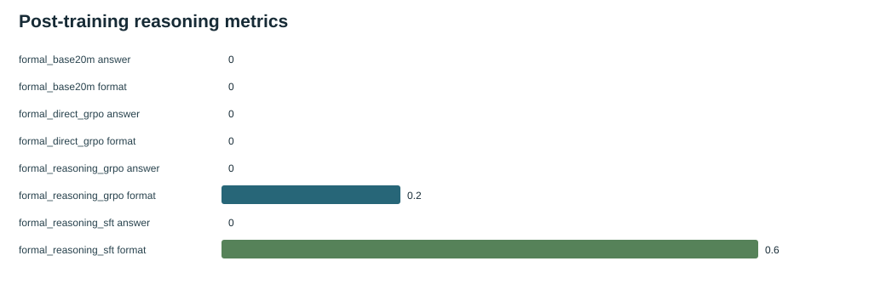

# DeepSeek-R1: post-training a reasoning model

English | [中文](README_zh.md) | [Previous: DeepSeek-V3](../04-deepseek-v3/README.md) | [Paper route](../README.md)

Paper: *DeepSeek-R1: Incentivizing Reasoning Capability in LLMs via Reinforcement Learning* (2025, [arXiv:2501.12948](https://arxiv.org/abs/2501.12948)). R1 changes the post-training pipeline rather than the Transformer block.

## 1. Position

R1-Zero starts from DeepSeek-V3-Base with reasoning prompts and rule-based rewards. The paper observes longer thinking and self-reflection, but also poor readability and language mixing. Full R1 adds cold-start long-CoT data, rejection sampling, mixed reasoning/non-reasoning SFT, two RL stages, and helpfulness/harmlessness reward models.

## 2. Pipeline transition

R1-Zero demonstrates self-evolution; Dev1 adds cold start; Dev2 applies reasoning RL; Dev3 mixes reasoning and general SFT; R1 applies mixed RL. Distillation transfers reasoning traces to smaller dense models.

## 3. Method

GRPO samples a group per prompt, normalizes group rewards into advantages and optimizes sampled-token log probabilities without a PPO value model. Rule rewards score verifiable math/code/logic tasks; reward models score general helpfulness and safety; language-consistency rewards reduce mixed-language CoT. The paper explicitly documents reward hacking.

## 4. Paper experiments

Table 3 shows why the pipeline is staged: cold start improves usability, reasoning RL recovers reasoning quality, mixed SFT improves general behavior, and final RL combines objectives.

## 5. TinySeek implementation

See [`train_sft.py`](../../trainer/train_sft.py), [`train_grpo.py`](../../trainer/train_grpo.py), [`19_posttraining_code_walkthrough.md`](../../docs/19_posttraining_code_walkthrough.md), [`s07`](../../course/s07_cold_start_sft/README.md) and [`s08`](../../course/s08_grpo_and_evaluation/README.md). The teaching path has prompt masking and group-relative rule rewards, not R1's rollout scale, reward models or complete pipeline.

## 6. TinySeek supplemental evidence

On five held-out addition problems, answer accuracy stays `0/5`. Format score moves `0.0 -> 0.6` after cold-start SFT and falls to `0.2` after SFT+GRPO; TinyStories PPL moves `1.718 -> 12.670 -> 12.306`.

This is a teaching boundary, not a contradiction of R1: format compliance and proxy reward are not answer generalization.

## 7. Claim/evidence table

| Paper claim | Paper evidence | TinySeek evidence | Relation | Boundary |
| --- | --- | --- | --- | --- |
| Rule RL can induce reasoning evolution | Figure 1 and R1-Zero experiments | Direct GRPO has no answer gain | Paper-only | Rollout, data and model differ |
| Cold start improves usability | Figure 2 and Table 3 | Format `0.0 -> 0.6`, answers `0/5` | Directionally consistent: supplemental check | Only format direction is checked |
| GRPO removes the value-model cost | Figure 3 | Group-relative teaching update | Directionally consistent: supplemental check | No paper-scale cost/stability |
| Reward hacking needs auditing | Figure 6 | Format degradation after GRPO | Directionally consistent: supplemental check | Small proxy-reward case |

## 8. Conclusion

R1 is a staged post-training recipe: observe pure-RL reasoning, add readable cold start, mix supervised data, then balance reasoning, helpfulness and safety with multiple rewards. TinySeek's value is to keep answer accuracy, format, reward and base-distribution PPL separate.

## 9. Source

Paper: [arXiv:2501.12948](https://arxiv.org/abs/2501.12948). This is the final paper in the route.
+## Deep reading: R1 is more than running GRPO

### 1. What R1-Zero establishes

R1-Zero starts from V3-Base with reasoning prompts and verifiable rewards. Figure 1 supports the observation that thinking length, math performance, and self-checking behavior can emerge during RL without human CoT trajectories. It does not establish that pure RL works for every task; readability, language mixing, and general-task degradation motivate the full R1 pipeline.

### 2. Why cold start is needed

Cold-start SFT supplies readable, structured reasoning traces before further exploration. It is a bias/variance tradeoff: pure RL explores broadly but produces unstable outputs, while cold start narrows the search space and makes later rewards easier to interpret.

### 3. The GRPO accounting

Group-relative advantages remove a separate value model, but rollout sampling, reference-model KL, long-sequence memory, and reward computation remain expensive. Figure 3 supports an algorithmic form, not the claim that total training cost must always be lower.

### 4. Read Table 3 as a pipeline

Cold start improves usability, reasoning RL restores or extends math/code reasoning, mixed SFT preserves general behavior, and mixed RL rebalances helpfulness, harmlessness, and reasoning. The stages trade metrics against one another; R1 is a pipeline result rather than one loss winning every column.

### 5. Reward hacking is a causal warning

Figure 6 shows that proxy reward can rise while correctness, language consistency, or human preference falls. Correctness reward, format reward, reward-model score, and final benchmarks must therefore be reported separately.

### 6. Distillation means transfer, not self-discovery

Reasoning traces from a large model can become supervision for smaller dense models. That is different from expecting a tiny model to discover the same reasoning through a small RL run. TinySeek's 0/5 held-out addition result makes that distinction concrete.
+## Evidence map

| Paper location | Question | Authors' conclusion | Reading boundary |
| --- | --- | --- | --- |
| Figure 1 / R1-Zero | Can RL induce reasoning without CoT labels? | Longer thinking and self-checking emerge | Limited to the task and training setup |
| Figure 2 / pipeline | Does cold start improve usability? | Staging is more controllable | Multiple targets change at each stage |
| Table 3 | Can reasoning and general behavior coexist? | Staging manages real tradeoffs | No column improves monotonically |
| Figure 6 | Is proxy reward reliable? | Reward can diverge from quality | Independent correctness and human evaluation are required |
